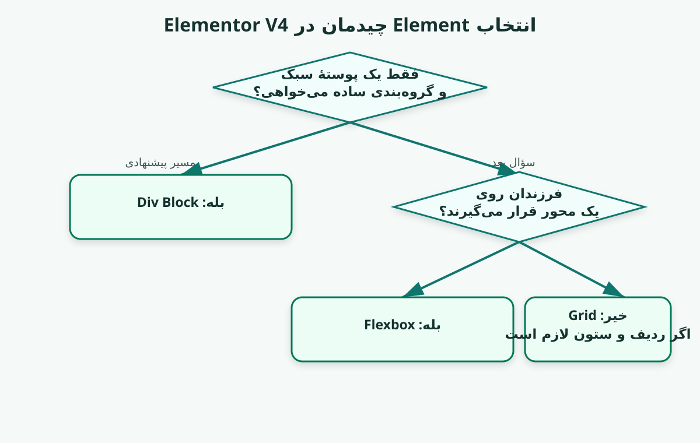
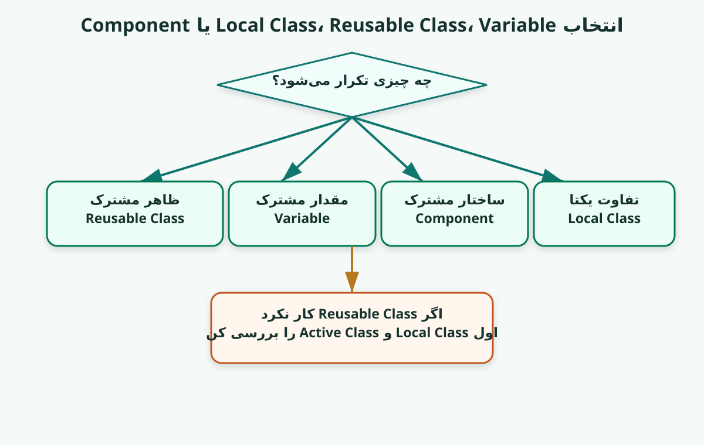
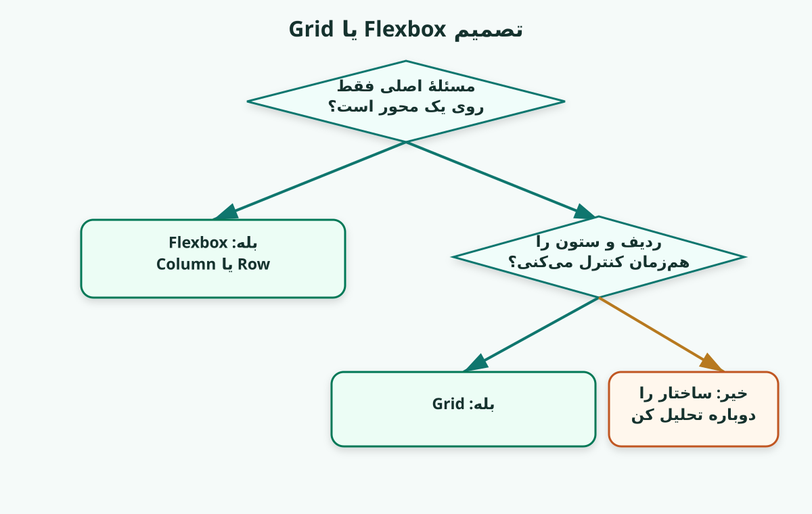
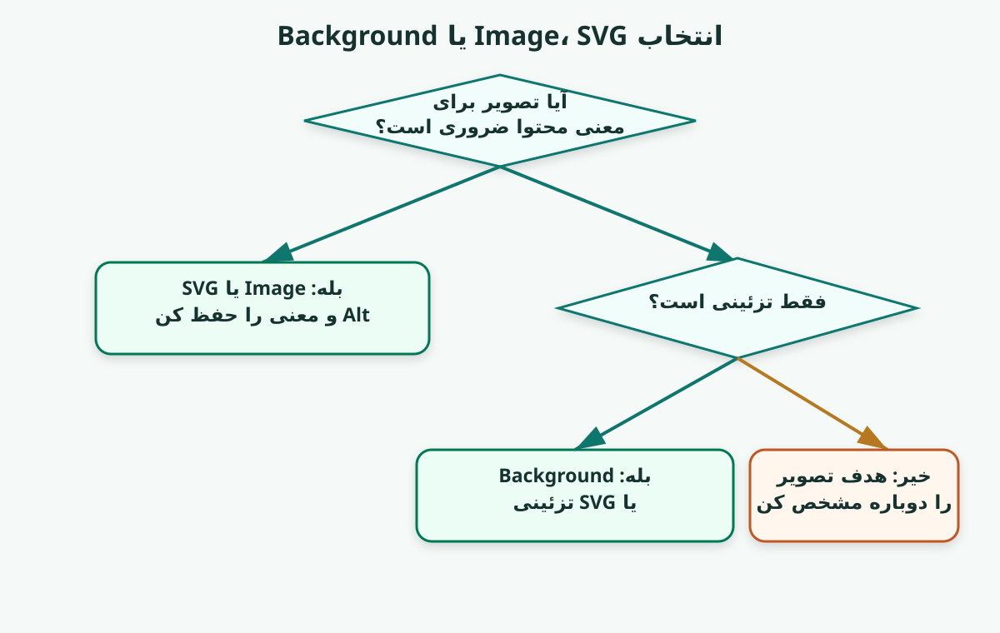
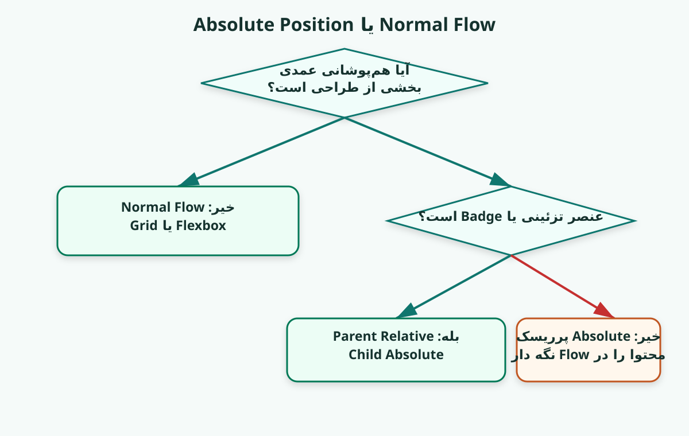
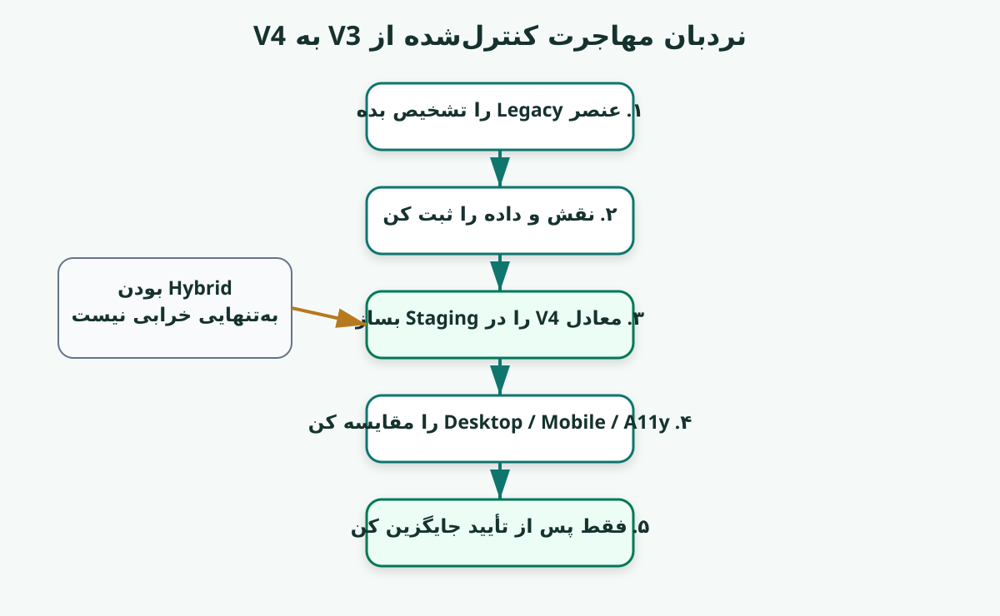
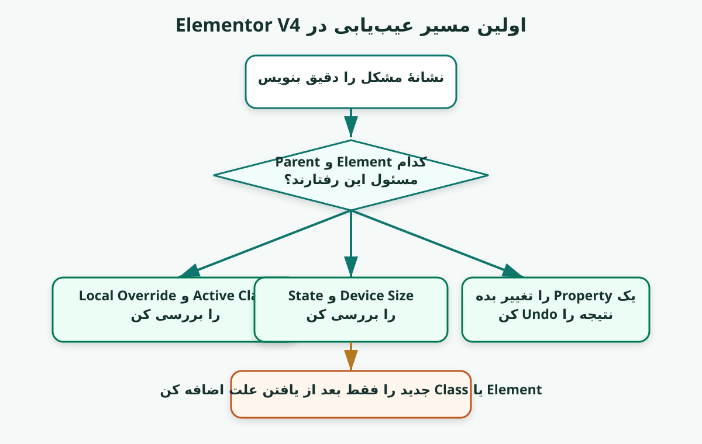

## سیاست Premium UX در نسخهٔ ۱۴.۱

نسخهٔ ۱۴.۱ مسیر HTML-first را حفظ می‌کند، اما ظاهر و تجربهٔ مطالعه را دوباره به سطح نسخه‌های قبلی برمی‌گرداند:

- تم تیرهٔ PersianNew به‌صورت پیش‌فرض فعال است؛
- رنگ، کنتراست، فونت و حال‌وهوای قبلی حذف نشده‌اند؛
- محتوای فارسی آموزشی به کارت، پنل و چک‌لیست تبدیل می‌شود، نه بلوک کدنما؛
- کد واقعی همچنان monospace و LTR باقی می‌ماند؛
- ناوبری درس‌ها، Progress Bar، دکمهٔ تمرکز، دکمهٔ چاپ و تغییر تم اضافه شده‌اند؛
- Visual Cardها و پنل‌های Elementor با UX مناسب جزوه طراحی شده‌اند.

`status: premium_ux_restored`

---

## سیاست HTML-first در نسخهٔ ۱۴

از نسخهٔ ۱۴ به بعد، فایل HTML فقط «نمایش Markdown» نیست؛ خودش محیط اصلی یادگیری است.

اصول این نسخه:

- متن فارسی آموزشی تا حد ممکن از کدبلاک خارج می‌شود؛
- مراحل عملی به چک‌لیست‌های قابل علامت‌زدن تبدیل می‌شوند؛
- مثال‌های Elementor به پنل‌های تصویری General / Style / Classes / State تبدیل می‌شوند؛
- تصمیم‌های مهم به کارت‌های مقایسه و مسیرهای مرحله‌ای تبدیل می‌شوند؛
- کد واقعی همچنان در Code Block چپ‌به‌راست می‌ماند؛
- Markdown برای آرشیو و ویرایش حفظ می‌شود، اما فایل پیشنهادی برای مطالعه HTML است.

`status: html_first_learning_edition`

---

# Elementor V4 از سردرگمی تا طراحی ساختارمند

## نسخهٔ ۱۴.۱ — Pilot Edition برای تبدیل ذهن گیج به ذهن شفاف و ساختارمند

**شعار دوره:** یک مسیر آموزشی واقعاً مناسب برای ذهن گیج و مبتدی و تبدیل آن ذهن به یک ذهن شفاف، واضح و ساختارمند.

---

## این دوره برای چه کسی است؟

این دوره برای کسی نوشته شده که می‌خواهد با **Elementor Editor V4** عالی کار کند، نه اینکه فعلاً به یک توسعه‌دهندهٔ کامل CSS تبدیل شود.

هدف نهایی:

<pre class="edis-rtl-text-block" lang="fa" dir="rtl" style="display:block !important; direction:rtl !important; text-align:right !important; unicode-bidi:plaintext !important; writing-mode:horizontal-tb !important; white-space:pre-wrap !important; overflow-x:auto; tab-size:4;"><code lang="fa" dir="rtl" style="display:block !important; direction:rtl !important; text-align:right !important; unicode-bidi:plaintext !important; writing-mode:horizontal-tb !important; white-space:pre-wrap !important;">
نه حفظ‌کردن ده‌ها گزینه
نه کلیک‌کردن تصادفی
نه ساختن صفحه با آزمون و خطای بی‌پایان

بلکه:

دیدن ساختار
فهمیدن نقش Elementها
انتخاب ابزار مناسب
ساختن Class System تمیز
حل‌کردن Responsive بدون آشفتگی
تشخیص Hybrid V3/V4
عیب‌یابی با یک مسیر روشن
</code></pre>
## نسبت آموزشی دوره

<pre class="edis-rtl-text-block" lang="fa" dir="rtl" style="display:block !important; direction:rtl !important; text-align:right !important; unicode-bidi:plaintext !important; writing-mode:horizontal-tb !important; white-space:pre-wrap !important; overflow-x:auto; tab-size:4;"><code lang="fa" dir="rtl" style="display:block !important; direction:rtl !important; text-align:right !important; unicode-bidi:plaintext !important; writing-mode:horizontal-tb !important; white-space:pre-wrap !important;">
Elementor V4 و Workflow       ████████████████████
منطق طراحی و تصمیم‌گیری       ████████████████
CSS ضروری پشت صحنه            ██████
کدنویسی دستی CSS              ██
</code></pre>
CSS در این دوره فقط به‌اندازه‌ای آموزش داده می‌شود که کنترل‌های Elementor را عمیق بفهمی و هنگام خرابی بتوانی علت را پیدا کنی.

---

## سیاست سخت‌سازی RTL بلوک‌های آموزشی

بلوک‌های فارسی و نمودارهای متنی دیگر به Fence معمولی Markdown متکی نیستند. آن‌ها با عناصر صریح زیر رندر می‌شوند:

- `lang="fa"` برای زبان؛
- `dir="rtl"` برای جهت پایه؛
- `direction: rtl !important` برای مقاومت در برابر Styleهای دیرهنگام Renderer؛
- `text-align: right !important` برای قفل‌کردن تراز؛
- `unicode-bidi: plaintext !important` برای مدیریت بهتر خط‌های ترکیبی فارسی، عدد و عبارت انگلیسی؛
- `white-space: pre-wrap` برای حفظ نمودار و جلوگیری از خروج بی‌دلیل از عرض.

بلوک‌های واقعی CSS، HTML، JSON و JavaScript عمداً LTR باقی می‌مانند.

`status: visual_scaffold_rtl_hardened`

---

## سیاست Visual Card در نسخهٔ ۱۴.۱

در نسخهٔ ۱۴.۱، داربست‌های بصری مهم از ASCII Art خام به **Visual Cardهای HTML** تبدیل شده‌اند.

دلیل تغییر:

- ASCII Art در متن‌های دوجهتهٔ فارسی/لاتین شکننده است؛
- فونت monospace برای متن فارسی آموزشی خوانایی کمتری دارد؛
- Visual Cardها با Flex/Grid، Label، Badge و Box بهتر مفهوم را منتقل می‌کنند؛
- متن فارسی در این Cardها با فونت UI/وزیر نمایش داده می‌شود؛
- کدهای واقعی CSS/HTML/JSON همچنان LTR و monospace باقی می‌مانند.

`status: html_visual_cards_added`

---

## سیاست نمایش PersianNew در HTML Viewer

فایل HTML مستقل این نسخه با CSS اختصاصی `PersianNew_v12_4_HTML_Viewer.css` رندر می‌شود. این CSS از منطق تم PersianNew استفاده می‌کند:

- Wrapper اصلی با `id="write"` هماهنگ شده است؛
- صفحه، جدول‌ها، لیست‌ها و متن‌ها RTL هستند؛
- Code واقعی مانند CSS/HTML/JSON چپ‌به‌راست باقی می‌ماند؛
- بلوک‌های آموزشی فارسی و ASCII با کلاس `edis-rtl-text-block` راست‌به‌چپ و راست‌چین قفل شده‌اند؛
- مسیر فونت‌ها به‌صورت `./fonts/...` تنظیم شده تا اگر فونت‌ها را کنار HTML بگذاری، بارگذاری شوند.

`status: persiannew_html_aligned`

---

## سیاست داربست بصری ASCII

در نسخهٔ ۱۴.۱، هرجا هنرجوی مبتدی باید **ساختار، Flow، Overlap، خراب‌شدن یا تصمیم Layout** را ببیند، یک داربست بصری کوتاه اضافه شده است.

قاعدهٔ استفاده:

- اول تصویر ساده؛
- بعد سؤال؛
- بعد توضیح؛
- بعد خراب‌کردن کنترل‌شده.

<pre class="edis-rtl-text-block edis-ascii-visual" lang="fa" dir="rtl" style="display:block !important; direction:rtl !important; text-align:right !important; unicode-bidi:plaintext !important; writing-mode:horizontal-tb !important; white-space:pre-wrap !important; overflow-x:auto; tab-size:4;"><code lang="fa" dir="rtl" style="display:block !important; direction:rtl !important; text-align:right !important; unicode-bidi:plaintext !important; writing-mode:horizontal-tb !important; white-space:pre-wrap !important;">
قانون بصری نسخهٔ ۱۴.۱

[ ببین ]
    |
    v
[ تصمیم بگیر ]
    |
    v
[ بساز ]
    |
    v
[ خراب کن و نشانه را ببین ]
    |
    v
[ اصلاح کن ]
</code></pre>

`status: visual_scaffold_added`

---

## وضعیت این نسخه: Pilot Edition

نسخهٔ ۱۳ از نظر محتوا و معماری آموزشی آمادهٔ استفاده است، اما زمان‌های درس و بعضی تصمیم‌های حمایتی هنوز **پیشنهادی** هستند تا با رفتار یک هنرجوی واقعی سنجیده شوند.

```text
course_content_status: ready_for_pilot
lesson_time_status: proposed
runtime_elementor_validation: not_performed
real_learner_observation: required_for_next_major_revision
```

در Pilot این شواهد ثبت می‌شوند:

- زمان واقعی هر درس؛
- نقطه‌ای که هنرجو مکث یا رها می‌کند؛
- اصطلاحی که دوباره می‌پرسد؛
- Controlی که پیدا نمی‌کند؛
- خطا در Exit Ticket؛
- مراجعه به کارت نجات؛
- تفاوت اعتماد ذهنی با شواهد واقعی انجام کار.

> زمان، معیار تسلط نیست. عبور از درس با معیارهای سطح ۱ و ۲ تعیین می‌شود.

---

# معماری آموزشی جدید

هر درس فقط سه بلوک اصلی دارد:

<pre class="edis-rtl-text-block" lang="fa" dir="rtl" style="display:block !important; direction:rtl !important; text-align:right !important; unicode-bidi:plaintext !important; writing-mode:horizontal-tb !important; white-space:pre-wrap !important; overflow-x:auto; tab-size:4;"><code lang="fa" dir="rtl" style="display:block !important; direction:rtl !important; text-align:right !important; unicode-bidi:plaintext !important; writing-mode:horizontal-tb !important; white-space:pre-wrap !important;">
A. بفهم
   مفهوم را کوتاه و روشن بفهم

B. بساز و امتحان کن
   همان مفهوم را در پروژهٔ TUYA اجرا کن

C. عمیق‌تر نگاه کن
   Case Study، Refactor و CSS پشت صحنه
</code></pre>
## لایه‌های یادگیری

<pre class="edis-rtl-text-block" lang="fa" dir="rtl" style="display:block !important; direction:rtl !important; text-align:right !important; unicode-bidi:plaintext !important; writing-mode:horizontal-tb !important; white-space:pre-wrap !important; overflow-x:auto; tab-size:4;"><code lang="fa" dir="rtl" style="display:block !important; direction:rtl !important; text-align:right !important; unicode-bidi:plaintext !important; writing-mode:horizontal-tb !important; white-space:pre-wrap !important;">
هستهٔ فهم          اجباری
تثبیت و آزمایش      اجباری و کوتاه
عمق و Case Study    اختیاری یا مرور دوم
</code></pre>
## علامت‌های ثابت دوره

| علامت | معنی |
|---|---|
| 🧭 | قطب‌نمای درس |
| 🧠 | مدل ذهنی |
| 🧱 | ساختار Elementها |
| 🏗 | ادامهٔ پروژهٔ TUYA |
| ❓ | سؤال توقف |
| ⚠️ | تلهٔ اصلی درس |
| 🧪 | عمداً خرابش کن |
| 👀 | انتظار داری ببینی |
| 🔍 | روش بررسی |
| 📂 | Case Study واقعی |
| 🔬 | CSS پشت صحنه؛ اختیاری |
| ✅ | معیار عبور |
| ⏸ | اینجا توقف کن |

---

# زبان ثابت Decision Treeها

<pre class="edis-rtl-text-block" lang="fa" dir="rtl" style="display:block !important; direction:rtl !important; text-align:right !important; unicode-bidi:plaintext !important; writing-mode:horizontal-tb !important; white-space:pre-wrap !important; overflow-x:auto; tab-size:4;"><code lang="fa" dir="rtl" style="display:block !important; direction:rtl !important; text-align:right !important; unicode-bidi:plaintext !important; writing-mode:horizontal-tb !important; white-space:pre-wrap !important;">
◇ سؤال
□ انتخاب
→ مسیر پیشنهادی
⇢ مسیر اختیاری
⚠ انتخاب پرریسک
</code></pre>
نمونه:

<pre class="edis-rtl-text-block" lang="fa" dir="rtl" style="display:block !important; direction:rtl !important; text-align:right !important; unicode-bidi:plaintext !important; writing-mode:horizontal-tb !important; white-space:pre-wrap !important; overflow-x:auto; tab-size:4;"><code lang="fa" dir="rtl" style="display:block !important; direction:rtl !important; text-align:right !important; unicode-bidi:plaintext !important; writing-mode:horizontal-tb !important; white-space:pre-wrap !important;">
◇ فقط یک پوستهٔ سبک لازم داری؟
   ├─ بله → □ Div Block
   └─ خیر
       ◇ فرزندان روی یک محورند؟
          ├─ بله → □ Flexbox
          └─ خیر
              ◇ ردیف و ستون را هم‌زمان کنترل می‌کنی؟
                 ├─ بله → □ Grid
                 └─ خیر → ساختار را دوباره تحلیل کن
</code></pre>
---

# کارت نجات دانش‌آموز گیج

وقتی در Editor گیج شدی، فقط این هفت قدم را انجام بده:

<pre class="edis-rtl-text-block" lang="fa" dir="rtl" style="display:block !important; direction:rtl !important; text-align:right !important; unicode-bidi:plaintext !important; writing-mode:horizontal-tb !important; white-space:pre-wrap !important; overflow-x:auto; tab-size:4;"><code lang="fa" dir="rtl" style="display:block !important; direction:rtl !important; text-align:right !important; unicode-bidi:plaintext !important; writing-mode:horizontal-tb !important; white-space:pre-wrap !important;">
1. ببین دقیقاً کدام Element انتخاب شده است.
2. Parent و Child را در Structure پیدا کن.
3. کلاس هدف ویرایش را بررسی کن.
4. Device Size و State را بررسی کن.
5. فقط یک مقدار را تغییر بده.
6. نتیجه را ببین و Undo کن.
7. قبل از افزودن Element یا Class جدید، علت را توضیح بده.
</code></pre>
نسخهٔ چاپی این کارت در `printables/STUDENT_RESCUE_CARD_FA.md` قرار دارد.

---

## سیاست کیفیت Markdown نسخهٔ ۱۳

برای جلوگیری از تبدیل ناخواستهٔ Headingها به Code Block:

<pre class="edis-rtl-text-block" lang="fa" dir="rtl" style="display:block !important; direction:rtl !important; text-align:right !important; unicode-bidi:plaintext !important; writing-mode:horizontal-tb !important; white-space:pre-wrap !important; overflow-x:auto; tab-size:4;"><code lang="fa" dir="rtl" style="display:block !important; direction:rtl !important; text-align:right !important; unicode-bidi:plaintext !important; writing-mode:horizontal-tb !important; white-space:pre-wrap !important;">
تمام Headingها از ستون صفر شروع می‌شوند.
Code فقط داخل Fenced Code Block قرار می‌گیرد.
هر خط Heading با چهار فاصله یا Tab خطای Release محسوب می‌شود.
</code></pre>
نسخهٔ ۱۳ با Validator خودکار این الگو را رد می‌کند:

```text
^\s{4,}#{1,6}\s
```

---

# سه خط آموزشی هم‌زمان

## خط اول — یادگیری Elementor V4

- General و Style؛
- Element Tree؛
- Div Block، Flexbox و Grid؛
- Local Class و Shared Class؛
- Variables و Components؛
- Responsive، State و Device Size؛
- Debugging و Migration.

## خط دوم — پروژهٔ پیوستهٔ TUYA

تصویر مرجع:

```text
assets/tuya-reference.jpg
```

پروژه در هر درس فقط به‌اندازهٔ همان درس جلو می‌رود. پایان هر درس یک توقف واقعی دارد.

## خط سوم — Case Studyهای Home2 و Solutions

این مثال‌ها از Export واقعی Elementor آمده‌اند. آن‌ها برای مشاهده، تشخیص، مقایسه و Refactor استفاده می‌شوند؛ نه برای قضاوت بی‌مدرک.

---

# سیاست شواهد

| وضعیت | معنی |
|---|---|
| `observed` | مستقیماً در Screenshot دیده شده |
| `exported` | در Export ذخیره شده |
| `proposed` | پیشنهاد آموزشی دوره |
| `good_pattern` | با شواهد موجود الگوی مناسب است |
| `improvement_candidate` | ارزش بررسی دارد، اما خرابی اثبات نشده |
| `context_dependent` | به هدف و Runtime وابسته است |
| `legacy_or_hybrid` | ساختار معتبر ترکیبی V3/V4 |
| `insufficient_evidence` | برای نتیجهٔ نهایی Runtime لازم است |

## هدف Case Study

هر Case Study یکی از این Action Labelها را دارد:

<pre class="edis-rtl-text-block" lang="fa" dir="rtl" style="display:block !important; direction:rtl !important; text-align:right !important; unicode-bidi:plaintext !important; writing-mode:horizontal-tb !important; white-space:pre-wrap !important; overflow-x:auto; tab-size:4;"><code lang="fa" dir="rtl" style="display:block !important; direction:rtl !important; text-align:right !important; unicode-bidi:plaintext !important; writing-mode:horizontal-tb !important; white-space:pre-wrap !important;">
👁 فقط مشاهده کن
🔍 عیب‌یابی کن
🔧 بازسازی کن
⚖️ دو روش را مقایسه کن
</code></pre>
---

# نقشهٔ دوره

| ایستگاه | درس‌ها | خروجی |
|---|---:|---|
| A — جهت‌یابی | ۱ تا ۴ | فهم V4، Tree، Class و پوسته |
| B — Layout | ۵ تا ۹ | دو ستون، رفتار Flex، Wrap و Grid |
| C — محتوا و رسانه | ۱۰ تا ۱۱ | متن، List، Logo و Image |
| D — لایه‌ها و Responsive | ۱۲ تا ۱۵ | Position، Layering، Mobile و RTL |
| E — سیستم طراحی | ۱۶ تا ۱۸ | State، Component و Hybrid Migration |
| F — حرفه‌ای‌سازی | ۱۹ تا ۲۱ | Refactor واقعی، Performance و Boss Fight |

---

# پروژهٔ TUYA در یک نگاه

```text
Platform Section
|
+-- Platform Main
    |
    +-- Platform Copy
    |   |
    |   +-- Intro
    |   +-- Feature List
    |   +-- Logo Strip
    |
    +-- Platform Visual
        |
        +-- Core
        |   +-- Cloud
        |
        +-- Node × 6
```

هیچ Classی قبل از ساخت Element مربوط معرفی نمی‌شود. نام‌ها **Just-in-Time** ایجاد می‌شوند.

---

# درس 1 — V4 چگونه فکر می‌کند؟

## 🧭 قطب‌نمای درس

**در این درس یاد می‌گیری:** تفاوت نگاه V4 با کلیک‌کردن تصادفی و نقش General، Style و Class را.

**در این درس هنوز یاد نمی‌گیری:** تمام تنظیمات Editor یا CSS را.

**در پایان باید بتوانی:** قبل از تغییر ظاهر، Element، کلاس هدف ویرایش، State و Device را بررسی کنی.

### زمان، سنگینی و نوع فعالیت

| مورد | پیشنهاد |
|---|---|
| سنگینی | **🟢 سبک** |
| نوع فعالیت | 👁 مشاهده‌ای + 🧠 مفهومی |
| هستهٔ فهم | ۱۰–۱۵ دقیقه |
| تثبیت و تمرین | ۱۰–۱۵ دقیقه |
| عمق اختیاری | ۱۰–۱۵ دقیقه |

**راهنمای معلم:** برای شروع آرام و ساختن مسیر بررسی.

`status: proposed_until_real_learner_pilot`

### سنجش اعتماد — پیش از شروع

از ۱ تا ۵ علامت بزن:

<pre class="edis-rtl-text-block" lang="fa" dir="rtl" style="display:block !important; direction:rtl !important; text-align:right !important; unicode-bidi:plaintext !important; writing-mode:horizontal-tb !important; white-space:pre-wrap !important; overflow-x:auto; tab-size:4;"><code lang="fa" dir="rtl" style="display:block !important; direction:rtl !important; text-align:right !important; unicode-bidi:plaintext !important; writing-mode:horizontal-tb !important; white-space:pre-wrap !important;">
1 = کاملاً گیج
2 = آشنایی کم
3 = فکر می‌کنم بفهمم
4 = احتمالاً می‌توانم انجام بدهم
5 = می‌توانم در مثال تازه هم تصمیم بگیرم
</code></pre>
عدد پیش از درس: `__ / 5`

---

## A. بفهم

### مسئله

در Editor یک Element را انتخاب می‌کنی، چند گزینه را تغییر می‌دهی، اما نمی‌دانی تغییر روی همان عنصر، Class مشترک یا Mobile اعمال شده است.

### 🧠 مدل ذهنی چهار سؤال

<pre class="edis-rtl-text-block" lang="fa" dir="rtl" style="display:block !important; direction:rtl !important; text-align:right !important; unicode-bidi:plaintext !important; writing-mode:horizontal-tb !important; white-space:pre-wrap !important; overflow-x:auto; tab-size:4;"><code lang="fa" dir="rtl" style="display:block !important; direction:rtl !important; text-align:right !important; unicode-bidi:plaintext !important; writing-mode:horizontal-tb !important; white-space:pre-wrap !important;">
1. چه Elementی انتخاب شده؟
2. چه Classی فعال است؟
3. در چه Stateی هستم؟
4. در چه Device Sizeی هستم؟
</code></pre>
### General و Style

<pre class="edis-rtl-text-block" lang="fa" dir="rtl" style="display:block !important; direction:rtl !important; text-align:right !important; unicode-bidi:plaintext !important; writing-mode:horizontal-tb !important; white-space:pre-wrap !important; overflow-x:auto; tab-size:4;"><code lang="fa" dir="rtl" style="display:block !important; direction:rtl !important; text-align:right !important; unicode-bidi:plaintext !important; writing-mode:horizontal-tb !important; white-space:pre-wrap !important;">
General = این Element چیست و چه محتوایی دارد؟
Style   = این Element چگونه نمایش داده می‌شود؟
</code></pre>
### مثال ساده

یک Button را انتخاب کن:

- در General متن و Link را می‌بینی؛
- در Style ظاهر و Layout را می‌بینی؛
- در Classes مشخص می‌کنی کدام بستهٔ Style ویرایش شود؛
- در State می‌توانی Normal، Hover یا Focus را ویرایش کنی.

### چیزی که فعلاً لازم نیست

نیازی نیست Syntax CSS یا تمام منطق Cascade را حفظ کنی. فقط بدان تغییر همیشه در یک **Context** انجام می‌شود.

---

## B. بساز و امتحان کن

### 🏗 پروژهٔ TUYA — فقط مشاهده

تصویر مرجع را باز کن و هنوز چیزی نساز.

چهار گروه را علامت بزن:

<pre class="edis-rtl-text-block" lang="fa" dir="rtl" style="display:block !important; direction:rtl !important; text-align:right !important; unicode-bidi:plaintext !important; writing-mode:horizontal-tb !important; white-space:pre-wrap !important; overflow-x:auto; tab-size:4;"><code lang="fa" dir="rtl" style="display:block !important; direction:rtl !important; text-align:right !important; unicode-bidi:plaintext !important; writing-mode:horizontal-tb !important; white-space:pre-wrap !important;">
Structure   پوسته و دو ناحیهٔ اصلی
Content     متن، ویژگی‌ها و Logoها
Overlap     Core و Nodeها
Decoration  Background، Shadow و Glow
</code></pre>

### 👁 نقشهٔ دیداری چهار گروه

<div class="visual-card visual-section-map" dir="rtl" lang="fa">
  <div class="visual-card-title">Screenshot را به چهار لایه ببین</div>
  <div class="visual-stage">
    <div class="visual-layer visual-decoration">
      <span class="visual-badge">Decoration</span>
      <span>پس‌زمینه، Shadow، Glow</span>
    </div>
    <div class="visual-two-columns">
      <div class="visual-panel">
        <div class="visual-panel-head">Structure</div>
        <div class="visual-panel-sub">ناحیهٔ متن</div>
        <div class="visual-content-box">Content<br><span>متن + ویژگی‌ها + Logoها</span></div>
      </div>
      <div class="visual-panel">
        <div class="visual-panel-head">Structure</div>
        <div class="visual-panel-sub">ناحیهٔ Visual</div>
        <div class="visual-overlap-box">Overlap<br><span>Core + Nodeها</span></div>
      </div>
    </div>
  </div>
  <p class="visual-note">برداشت مهم: Structure و Content در جریان طبیعی صفحه می‌مانند؛ Overlap فقط داخل ناحیهٔ Visual لازم است.</p>
</div>

### 👁 Flow در برابر Overlap

<div class="visual-card visual-flow-overlap" dir="rtl" lang="fa">
  <div class="visual-card-title">کدام بخش باید Overlay شود؟</div>
  <div class="visual-flow-grid">
    <div class="visual-flow-column">
      <div class="visual-label">Normal Flow</div>
      <div class="visual-flow-row">
        <div class="visual-box visual-copy">ستون متن<br><span>متن طولانی Parent را بلند می‌کند</span></div>
        <div class="visual-box visual-stage-box">ناحیهٔ Visual<br><span>Stage مخصوص هم‌پوشانی</span></div>
      </div>
    </div>
    <div class="visual-overlap-diagram">
      <div class="visual-label">Overlap فقط اینجاست</div>
      <div class="orbit">
        <span class="orbit-node top">Node</span>
        <span class="orbit-node right">Node</span>
        <span class="orbit-node bottom">Node</span>
        <span class="orbit-node left">Node</span>
        <span class="orbit-core">Core</span>
      </div>
    </div>
  </div>
  <p class="visual-note">قانون: اگر عنصر محتوای اصلی است، اول آن را در Flow نگه دار. اگر تزئینی یا شناور است، بعداً Overlay را بررسی کن.</p>
</div>

### ❓ قبل از ادامه

کدام بخش واقعاً به هم‌پوشانی نیاز دارد؟

A) ستون متن  
B) کل سکشن  
C) Nodeهای اطراف Core

<details><summary>پاسخ</summary>

C. ستون‌های اصلی باید در Normal Flow بمانند.
</details>

### 👁 تله را تصویری ببین

<div class="visual-card visual-danger-card" dir="rtl" lang="fa">
  <div class="visual-card-title">تلهٔ خطرناک: تبدیل Screenshot به مختصات</div>
  <div class="bad-absolute-layout">
    <div class="bad-section-label">Section</div>
    <div class="bad-chip bad-text">Text<br><span>top:80 / left:60</span></div>
    <div class="bad-chip bad-feature">Feature<br><span>top:180 / left:60</span></div>
    <div class="bad-chip bad-logo">Logo<br><span>top:330 / left:60</span></div>
    <div class="bad-chip bad-core">Core<br><span>top:90 / right:80</span></div>
    <div class="bad-chip bad-node">Node<br><span>top:20 / right:230</span></div>
  </div>
  <div class="visual-warning-list">
    <span>Parent قد واقعی محتوا را نمی‌فهمد.</span>
    <span>Mobile با چند Offset جدید تعمیر می‌شود.</span>
    <span>متن طولانی با Node یا Logo برخورد می‌کند.</span>
  </div>
</div>

### ⚠️ تلهٔ اصلی

**تله:** ظاهر Screenshot را مستقیماً به مختصات تبدیل کنی.

**نشانه:** می‌خواهی برای همه‌چیز Absolute و Offset بنویسی.

**اولین اصلاح:** ابتدا Parent/Child و Flow را تشخیص بده.

### 🧪 عمداً خرابش کن

هنوز در پروژه چیزی نساز. روی کاغذ همهٔ عناصر را Absolute تصور کن.

### 👁 آزمایش خراب‌شده روی کاغذ

<div class="visual-card visual-break-test" dir="rtl" lang="fa">
  <div class="visual-card-title">اگر همه‌چیز Absolute شود چه می‌شکند؟</div>
  <div class="break-panels">
    <div class="break-panel">
      <div class="break-title">متن طولانی‌تر می‌شود</div>
      <div class="break-section">
        <div class="break-text">Text خیلی طولانی‌تر می‌شود...</div>
        <div class="break-collision">برخورد با Feature / Logo / Visual</div>
      </div>
    </div>
    <div class="break-panel">
      <div class="break-title">Mobile می‌شود</div>
      <div class="break-mobile">
        <div>Text absolute</div>
        <div>Logos absolute</div>
        <div>Core absolute</div>
        <div class="break-out">Nodeها بیرون می‌زنند</div>
      </div>
    </div>
  </div>
</div>

#### 👀 انتظار داری ببینی

- متن طولانی Parent را بلند نمی‌کند؛
- Mobile به Offsetهای جدید نیاز دارد؛
- تغییر Font باعث برخورد عناصر می‌شود.

### Checkpoint

<pre class="edis-rtl-text-block" lang="fa" dir="rtl" style="display:block !important; direction:rtl !important; text-align:right !important; unicode-bidi:plaintext !important; writing-mode:horizontal-tb !important; white-space:pre-wrap !important; overflow-x:auto; tab-size:4;"><code lang="fa" dir="rtl" style="display:block !important; direction:rtl !important; text-align:right !important; unicode-bidi:plaintext !important; writing-mode:horizontal-tb !important; white-space:pre-wrap !important;">
[ ] Structure از Decoration جدا شده
[ ] هنوز مقدار دقیق از Screenshot حدس نزده‌ام
[ ] می‌دانم کدام بخش باید در Flow بماند
</code></pre>
### Exit Ticket — قبل از ادامه

**بازیابی کوتاه:** چهار نقطهٔ شروع بررسی در V4 چیست؟

**انتقال به یک موقعیت تازه:** Border یک Button قرمز است، ولی انتظار آبی داری. سه بررسی اول را به‌ترتیب بنویس.

<details>
<summary>راهنمای خودسنجی اختصاصی همین درس</summary>

### آناتومی پاسخ خوب

- [ ] Element انتخاب‌شده و Parent مربوط را مشخص کرده است.
- [ ] کلاس هدف ویرایش، Device Size و State را به‌ترتیب بررسی کرده است.
- [ ] بدون افزودن Class یا Element جدید، یک تغییر محدود و قابل Undo پیشنهاد داده است.

پاسخ کامل لازم نیست طولانی باشد؛ باید نشان بدهد **چه چیزی را بررسی می‌کنی، چرا، و چگونه نتیجه را اثبات می‌کنی**.
</details>

### سنجش اعتماد — بعد از درس

عدد بعد از درس: `__ / 5`

مدرک اعتماد خود را مشخص کن:

- [ ] فقط احساس می‌کنم فهمیده‌ام؛
- [ ] سؤال بازیابی را پاسخ داده‌ام؛
- [ ] Checkpoint را ساخته‌ام؛
- [ ] سؤال انتقال را روی مثال تازه حل کرده‌ام.

اگر عدد اعتماد بالا رفته ولی هیچ مدرکی علامت نخورده، هنوز **احساس فهم** با **شاهد یادگیری** یکی شده است.


---

## C. عمیق‌تر نگاه کن — اختیاری

### 📂 Case Study — Hybrid بودن را فقط مشاهده کن

**هدف:** 👁 فقط مشاهده کن  
**وضعیت:** `legacy_or_hybrid`

Export واقعی نشان می‌دهد بعضی Subtreeها هم Elementهای V4 و هم Widgetهای 3.x دارند. وجود هر دو به‌تنهایی به معنی خرابی نیست.

### 🔬 پشت صحنهٔ اختیاری

Editor در نهایت HTML و CSS تولید می‌کند، اما این درس فقط Context و Scope تغییر را آموزش می‌دهد.

---

### ✅ تصویر ذهنی درست تا اینجا

<div class="visual-card visual-tree-card" dir="rtl" lang="fa">
  <div class="visual-card-title">Tree درست قبل از ادامه</div>
  <div class="visual-tree">
    <div class="tree-node root">Section</div>
    <div class="tree-branch">
      <div class="tree-node main">Main Layout <span>Normal Flow</span></div>
      <div class="tree-children">
        <div class="tree-node copy">Copy Area <span>متن و Logoها در Flow</span></div>
        <div class="tree-node visual">Visual Area <span>Stage برای Overlay</span>
          <div class="tree-children nested">
            <div class="tree-node core">Core</div>
            <div class="tree-node nodes">Nodes <span>Overlay کنترل‌شده</span></div>
          </div>
        </div>
      </div>
    </div>
  </div>
  <p class="visual-note">اگر این Tree را بتوانی بدون نگاه‌کردن توضیح بدهی، آمادهٔ ادامه‌ای.</p>
</div>

## ✅ معیار عبور اختصاصی این درس

برای رفتن به درس بعد، **سطح ۱ و ۲ اجباری‌اند**. سطح ۳ در ایستگاه جمع‌بندی تثبیت می‌شود.

### سطح ۱ — فهمیدم

- [ ] می‌توانی تفاوت «کلیک تصادفی» و «بررسی ساختارمند» را با یک مثال توضیح بدهی.
- [ ] می‌توانی چهار نقطهٔ شروع بررسی را نام ببری: Element، Parent/Child، کلاس هدف ویرایش، Device/State.

### سطح ۲ — می‌توانم انجام بدهم

- [ ] در Editor یک Element را انتخاب می‌کنی و نام Element، Parent، کلاس هدف ویرایش، Device Size و State را ثبت می‌کنی.
- [ ] قبل از افزودن Class یا Element جدید، فقط یک Property را تغییر می‌دهی و نتیجه را Undo می‌کنی.

### سطح ۳ — می‌توانم منتقل کنم

- [ ] در سناریوی «Border قرمز است ولی آبی انتظار داشتم» می‌توانی اولین سه بررسی را به‌ترتیب بیان کنی.

## ⏸ اینجا توقف کن

در درس بعد Screenshot را به یک Element Tree واقعی تبدیل می‌کنیم؛ هنوز Style نمی‌دهیم.

---

# درس 2 — Element Tree و انتخاب Element مناسب

## 🧭 قطب‌نمای درس

**در این درس یاد می‌گیری:** نقش Div Block، Flexbox و Grid و رابطهٔ Parent/Child را.

**در این درس هنوز یاد نمی‌گیری:** تمام گزینه‌های Grid یا Flex را.

**در پایان باید بتوانی:** برای هر بخش، Element مناسب را براساس نقش انتخاب کنی.

### زمان، سنگینی و نوع فعالیت

| مورد | پیشنهاد |
|---|---|
| سنگینی | **🟡 متوسط** |
| نوع فعالیت | 🧩 ساختاری + 🛠 اجرایی |
| هستهٔ فهم | ۱۵–۲۰ دقیقه |
| تثبیت و تمرین | ۱۵–۲۵ دقیقه |
| عمق اختیاری | ۱۵–۲۰ دقیقه |

**راهنمای معلم:** Tree را با نقش Elementها می‌سازی.

`status: proposed_until_real_learner_pilot`

### سنجش اعتماد — پیش از شروع

از ۱ تا ۵ علامت بزن:

<pre class="edis-rtl-text-block" lang="fa" dir="rtl" style="display:block !important; direction:rtl !important; text-align:right !important; unicode-bidi:plaintext !important; writing-mode:horizontal-tb !important; white-space:pre-wrap !important; overflow-x:auto; tab-size:4;"><code lang="fa" dir="rtl" style="display:block !important; direction:rtl !important; text-align:right !important; unicode-bidi:plaintext !important; writing-mode:horizontal-tb !important; white-space:pre-wrap !important;">
1 = کاملاً گیج
2 = آشنایی کم
3 = فکر می‌کنم بفهمم
4 = احتمالاً می‌توانم انجام بدهم
5 = می‌توانم در مثال تازه هم تصمیم بگیرم
</code></pre>
عدد پیش از درس: `__ / 5`

---


## نقشهٔ تصمیم دیداری



> نسخهٔ ASCII داخل متن باقی مانده است تا جزوه در Rendererهای بدون نمایش تصویر نیز قابل استفاده باشد.

## A. بفهم

### مسئله

بیشتر آشفتگی‌ها از اینجا شروع می‌شوند: Element اشتباه برای نقش اشتباه.

### Decision Tree دیداری

<pre class="edis-rtl-text-block" lang="fa" dir="rtl" style="display:block !important; direction:rtl !important; text-align:right !important; unicode-bidi:plaintext !important; writing-mode:horizontal-tb !important; white-space:pre-wrap !important; overflow-x:auto; tab-size:4;"><code lang="fa" dir="rtl" style="display:block !important; direction:rtl !important; text-align:right !important; unicode-bidi:plaintext !important; writing-mode:horizontal-tb !important; white-space:pre-wrap !important;">
◇ فقط Wrapper سبک لازم داری؟
   ├─ بله → □ Div Block
   └─ خیر
       ◇ فرزندان روی یک محورند؟
          ├─ بله → □ Flexbox
          └─ خیر
              ◇ ردیف و ستون را هم‌زمان کنترل می‌کنی؟
                 ├─ بله → □ Grid
                 └─ خیر → ساختار را دوباره تحلیل کن
</code></pre>
### نقش‌ها

| Element | نقش اصلی |
|---|---|
| Div Block | پوسته و گروه‌بندی سبک |
| Flexbox | چیدمان یک‌بعدی فرزندان |
| Grid | کنترل ردیف و ستون |
| Heading | عنوان معنایی |
| Paragraph | متن مستقل |
| Image | تصویر محتوایی |
| SVG | Icon یا گرافیک برداری |

### Parent و Child

```text
Parent
|
+-- Child A
+-- Child B
    |
    +-- Grandchild
```

Controlهای Layout والد معمولاً روی فرزندان مستقیم اثر می‌گذارند.

---

## B. بساز و امتحان کن

### 🏗 پروژهٔ TUYA — Tree بدون Style

در V4 این ساختار را بساز:

```text
Div Block: Platform Section
|
+-- Flexbox: Platform Main
    |
    +-- Div Block: Platform Copy
    +-- Div Block: Platform Visual
```

فعلاً فقط نام Elementها را در Structure مرتب کن. Class مشترک هنوز نساز.

### چرا؟

- Section فقط پوسته است → Div Block؛
- Main دو فرزند روی یک محور دارد → Flexbox؛
- Copy و Visual فعلاً فقط Wrapper هستند → Div Block.

### ❓ سؤال توقف

برای یک Icon و متن که باید کنار هم باشند، کدام انتخاب اولیه مناسب‌تر است؟

A) Grid سه‌ستونه  
B) Flexbox  
C) Absolute

<details><summary>پاسخ</summary>B.</details>

### ⚠️ تلهٔ اصلی

**تله:** برای هر گروه کوچک یک Flexbox جدید بسازی.

**نشانه:** Tree سریعاً چندلایه می‌شود، بدون اینکه هر لایه وظیفه‌ای داشته باشد.

**قاعده:** هر Wrapper باید دلیل Semantic، Layout، Scope، Position یا Component داشته باشد.

### 🧪 عمداً خرابش کن

سه Wrapper خالی بین Platform Section و Platform Main اضافه کن.

#### 👀 انتظار داری ببینی

- Structure خوانایی کمتری دارد؛
- انتخاب Parent درست سخت‌تر می‌شود؛
- Style ممکن است روی لایهٔ اشتباه اعمال شود؛
- ظاهر شاید هنوز فرق نکند، اما نگهداری سخت‌تر می‌شود.

سپس Wrapperهای بی‌دلیل را حذف کن.

### Checkpoint

<pre class="edis-rtl-text-block" lang="fa" dir="rtl" style="display:block !important; direction:rtl !important; text-align:right !important; unicode-bidi:plaintext !important; writing-mode:horizontal-tb !important; white-space:pre-wrap !important; overflow-x:auto; tab-size:4;"><code lang="fa" dir="rtl" style="display:block !important; direction:rtl !important; text-align:right !important; unicode-bidi:plaintext !important; writing-mode:horizontal-tb !important; white-space:pre-wrap !important;">
[ ] Tree فقط چهار Element اصلی دارد
[ ] Main فرزند مستقیم Section است
[ ] Copy و Visual فرزند مستقیم Main هستند
[ ] هیچ Position یا Style اضافه نشده
</code></pre>
### Exit Ticket — قبل از ادامه

**بازیابی کوتاه:** Parent و Child چه تفاوتی دارند؟

**انتقال به یک موقعیت تازه:** برای Header شامل Logo، Menu و CTA یک Tree سه‌سطحی پیشنهاد بده.

<details>
<summary>راهنمای خودسنجی اختصاصی همین درس</summary>

### آناتومی پاسخ خوب

- [ ] رابطهٔ Parent/Child را درست تشخیص داده است.
- [ ] Div Block، Flexbox یا Grid را براساس نقش انتخاب کرده است.
- [ ] دلیل انتخاب به تعداد محورهای Layout مربوط است، نه ظاهر موقت.

پاسخ کامل لازم نیست طولانی باشد؛ باید نشان بدهد **چه چیزی را بررسی می‌کنی، چرا، و چگونه نتیجه را اثبات می‌کنی**.
</details>

### سنجش اعتماد — بعد از درس

عدد بعد از درس: `__ / 5`

مدرک اعتماد خود را مشخص کن:

- [ ] فقط احساس می‌کنم فهمیده‌ام؛
- [ ] سؤال بازیابی را پاسخ داده‌ام؛
- [ ] Checkpoint را ساخته‌ام؛
- [ ] سؤال انتقال را روی مثال تازه حل کرده‌ام.

اگر عدد اعتماد بالا رفته ولی هیچ مدرکی علامت نخورده، هنوز **احساس فهم** با **شاهد یادگیری** یکی شده است.


---

## C. عمیق‌تر نگاه کن — اختیاری

### 📂 CASE-HOME2-DOM-001

**هدف:** 🔍 عیب‌یابی کن  
**وضعیت:** `improvement_candidate`

در Export، چند Element ساختاری بدون Child دیده شده‌اند. این شواهد حذف فوری نیست.

سؤال‌ها:

<pre class="edis-rtl-text-block" lang="fa" dir="rtl" style="display:block !important; direction:rtl !important; text-align:right !important; unicode-bidi:plaintext !important; writing-mode:horizontal-tb !important; white-space:pre-wrap !important; overflow-x:auto; tab-size:4;"><code lang="fa" dir="rtl" style="display:block !important; direction:rtl !important; text-align:right !important; unicode-bidi:plaintext !important; writing-mode:horizontal-tb !important; white-space:pre-wrap !important;">
آیا Spacer یا Grid Cell هستند؟
آیا Selector یا Background به آن‌ها وابسته است؟
آیا Runtime بدون آن‌ها تغییر می‌کند؟
</code></pre>
نتیجهٔ درست فعلی: `insufficient_evidence`.

### 🔬 پشت صحنه

Flexbox و Grid سیستم‌های Layout هستند؛ Div Block صرفاً یک Element عمومی است. لازم نیست کد آن‌ها را حفظ کنی.

---

## ✅ معیار عبور اختصاصی این درس

برای رفتن به درس بعد، **سطح ۱ و ۲ اجباری‌اند**. سطح ۳ در ایستگاه جمع‌بندی تثبیت می‌شود.

### سطح ۱ — فهمیدم

- [ ] می‌توانی Parent، Child و Sibling را در یک Tree واقعی تشخیص بدهی.
- [ ] می‌توانی تفاوت نقش Div Block، Flexbox و Grid را بدون اشاره به ظاهر موقت توضیح بدهی.

### سطح ۲ — می‌توانم انجام بدهم

- [ ] برای پوسته، چیدمان یک‌محوری و ساختار ردیف‌وستون Element مناسب را انتخاب می‌کنی.
- [ ] Tree اولیهٔ TUYA را بدون Style و بدون Wrapper اضافی می‌سازی.

### سطح ۳ — می‌توانم منتقل کنم

- [ ] برای یک Header شامل Logo، Menu و Button می‌توانی Element Tree پیشنهادی خود را رسم و دلیل انتخاب‌ها را بیان کنی.

## ⏸ اینجا توقف کن

در درس بعد Class را فقط برای Elementهایی که همین حالا ساخته‌ای ایجاد می‌کنیم.

---

# درس 3 — Local Class، Shared Class و کلاس هدف ویرایش

## 🧭 قطب‌نمای درس

**در این درس یاد می‌گیری:** تفاوت Local Class و Shared Class و اهمیت کلاس هدف ویرایش را.

**در این درس هنوز یاد نمی‌گیری:** تمام جزئیات CSS Specificity را.

**در پایان باید بتوانی:** Style مشترک را از تفاوت منحصربه‌فرد جدا کنی.

### زمان، سنگینی و نوع فعالیت

| مورد | پیشنهاد |
|---|---|
| سنگینی | **🔴 سنگین** |
| نوع فعالیت | 🧠 مفهومی + 🛠 اجرایی + 🔍 عیب‌یابی |
| هستهٔ فهم | ۲۰–۳۰ دقیقه |
| تثبیت و تمرین | ۲۵–۴۰ دقیقه |
| عمق اختیاری | ۱۵–۲۵ دقیقه |

**راهنمای معلم:** Class System یکی از مفاهیم مرکزی V4 است.

`status: proposed_until_real_learner_pilot`

### سنجش اعتماد — پیش از شروع

از ۱ تا ۵ علامت بزن:

<pre class="edis-rtl-text-block" lang="fa" dir="rtl" style="display:block !important; direction:rtl !important; text-align:right !important; unicode-bidi:plaintext !important; writing-mode:horizontal-tb !important; white-space:pre-wrap !important; overflow-x:auto; tab-size:4;"><code lang="fa" dir="rtl" style="display:block !important; direction:rtl !important; text-align:right !important; unicode-bidi:plaintext !important; writing-mode:horizontal-tb !important; white-space:pre-wrap !important;">
1 = کاملاً گیج
2 = آشنایی کم
3 = فکر می‌کنم بفهمم
4 = احتمالاً می‌توانم انجام بدهم
5 = می‌توانم در مثال تازه هم تصمیم بگیرم
</code></pre>
عدد پیش از درس: `__ / 5`

---


## نقشهٔ تصمیم دیداری



> نسخهٔ ASCII داخل متن باقی مانده است تا جزوه در Rendererهای بدون نمایش تصویر نیز قابل استفاده باشد.

## A. بفهم

### مدل ذهنی

<pre class="edis-rtl-text-block" lang="fa" dir="rtl" style="display:block !important; direction:rtl !important; text-align:right !important; unicode-bidi:plaintext !important; writing-mode:horizontal-tb !important; white-space:pre-wrap !important; overflow-x:auto; tab-size:4;"><code lang="fa" dir="rtl" style="display:block !important; direction:rtl !important; text-align:right !important; unicode-bidi:plaintext !important; writing-mode:horizontal-tb !important; white-space:pre-wrap !important;">
Shared Class = لباس مشترک چند Element
Local Class    = اصلاح مخصوص همین Element
کلاس هدف ویرایش   = لباسی که همین لحظه ویرایش می‌کنی
</code></pre>
هر Element حداقل یک Local Class دارد. Class مشترک را وقتی می‌سازیم که رفتار واقعاً تکرار می‌شود.

### مثال ساده

سه Button:

<pre class="edis-rtl-text-block" lang="fa" dir="rtl" style="display:block !important; direction:rtl !important; text-align:right !important; unicode-bidi:plaintext !important; writing-mode:horizontal-tb !important; white-space:pre-wrap !important; overflow-x:auto; tab-size:4;"><code lang="fa" dir="rtl" style="display:block !important; direction:rtl !important; text-align:right !important; unicode-bidi:plaintext !important; writing-mode:horizontal-tb !important; white-space:pre-wrap !important;">
button-base      ظاهر مشترک
button-primary   نوع اصلی
Local Class      تفاوت فقط همین Button
</code></pre>
### اولین بررسی هنگام Conflict

<pre class="edis-rtl-text-block" lang="fa" dir="rtl" style="display:block !important; direction:rtl !important; text-align:right !important; unicode-bidi:plaintext !important; writing-mode:horizontal-tb !important; white-space:pre-wrap !important; overflow-x:auto; tab-size:4;"><code lang="fa" dir="rtl" style="display:block !important; direction:rtl !important; text-align:right !important; unicode-bidi:plaintext !important; writing-mode:horizontal-tb !important; white-space:pre-wrap !important;">
Element درست؟
کلاس هدف ویرایش درست؟
Local override وجود دارد؟
State و Device درست؟
</code></pre>
---

## B. بساز و امتحان کن

### 🏗 پروژهٔ TUYA — Classها Just-in-Time

حالا برای چهار Element موجود Class بساز:

```text
Platform Section → c-platform-section
Platform Main    → c-platform-main
Platform Copy    → c-platform-copy
Platform Visual  → c-platform-visual
```

فعلاً Class مربوط به Node، Logo یا Feature Item نساز؛ آن Elementها هنوز وجود ندارند.

### ❓ سؤال توقف

اگر `c-platform-main` روی چند سکشن استفاده شود و فقط یکی Gap متفاوت بخواهد، Gap متفاوت کجا قرار می‌گیرد؟

<details><summary>پاسخ</summary>

در Local Class همان Element، یا در یک Variant Class معنی‌دار؛ نه با تغییر Class مشترک برای همه.
</details>

### ⚠️ تلهٔ اصلی

**تله:** Shared Class کار نمی‌کند، پس فوراً Class جدید بسازی.

**علت محتمل:** Local Class همان Property را Override کرده است.

**اولین بررسی:** کلاس هدف ویرایش و Local Class.

### 🧪 عمداً خرابش کن

روی Shared Class رنگ متن خاکستری بگذار. سپس روی Local Class همان Element رنگ قرمز بگذار.

#### 👀 انتظار داری ببینی

- Element قرمز می‌شود؛
- تغییر Shared Class روی همان Property ظاهراً اثر ندارد؛
- سایر Elementهای دارای Shared Class همچنان مقدار مشترک را می‌گیرند.

Local override را پاک کن و دوباره نتیجه را ببین.

### Checkpoint

<pre class="edis-rtl-text-block" lang="fa" dir="rtl" style="display:block !important; direction:rtl !important; text-align:right !important; unicode-bidi:plaintext !important; writing-mode:horizontal-tb !important; white-space:pre-wrap !important; overflow-x:auto; tab-size:4;"><code lang="fa" dir="rtl" style="display:block !important; direction:rtl !important; text-align:right !important; unicode-bidi:plaintext !important; writing-mode:horizontal-tb !important; white-space:pre-wrap !important;">
[ ] فقط چهار Class ساخته شده
[ ] می‌دانم کدام Class فعال است
[ ] Style مشترک در Shared Class است
[ ] تفاوت یکتا در Local Class است
</code></pre>
### Exit Ticket — قبل از ادامه

**بازیابی کوتاه:** Local Class و Shared Class چه تفاوتی دارند؟

**انتقال به یک موقعیت تازه:** سه Card تغییر کرده‌اند ولی چهارمی نه؛ همه یک Shared Class دارند. اولین بررسی چیست؟

<details>
<summary>راهنمای خودسنجی اختصاصی همین درس</summary>

### آناتومی پاسخ خوب

- [ ] Local، Shared و کلاس هدف ویرایش را از هم جدا کرده است.
- [ ] Property مشترک و تفاوت منحصربه‌فرد را مشخص کرده است.
- [ ] قبل از ساخت Class جدید، Local Override و Priority را بررسی کرده است.

پاسخ کامل لازم نیست طولانی باشد؛ باید نشان بدهد **چه چیزی را بررسی می‌کنی، چرا، و چگونه نتیجه را اثبات می‌کنی**.
</details>

### سنجش اعتماد — بعد از درس

عدد بعد از درس: `__ / 5`

مدرک اعتماد خود را مشخص کن:

- [ ] فقط احساس می‌کنم فهمیده‌ام؛
- [ ] سؤال بازیابی را پاسخ داده‌ام؛
- [ ] Checkpoint را ساخته‌ام؛
- [ ] سؤال انتقال را روی مثال تازه حل کرده‌ام.

اگر عدد اعتماد بالا رفته ولی هیچ مدرکی علامت نخورده، هنوز **احساس فهم** با **شاهد یادگیری** یکی شده است.


---

## C. عمیق‌تر نگاه کن — اختیاری

### 📂 CASE-HOME2-REUSE-001

**هدف:** ⚖️ دو روش را مقایسه کن  
**وضعیت:** `improvement_candidate`

Export نشان می‌دهد چندین SVG، Heading و Paragraph امضای Style یکسان دارند. پیشنهاد:

<pre class="edis-rtl-text-block" lang="fa" dir="rtl" style="display:block !important; direction:rtl !important; text-align:right !important; unicode-bidi:plaintext !important; writing-mode:horizontal-tb !important; white-space:pre-wrap !important; overflow-x:auto; tab-size:4;"><code lang="fa" dir="rtl" style="display:block !important; direction:rtl !important; text-align:right !important; unicode-bidi:plaintext !important; writing-mode:horizontal-tb !important; white-space:pre-wrap !important;">
Local Style تکراری
      در برابر
Shared Class یا Component
</code></pre>
هنوز Runtime و Intent کامل را نداریم؛ پس آن را «خرابی» نمی‌نامیم.

### 🔬 پشت صحنه

`.class` در CSS یعنی Class Selector. لازم نیست کد بنویسی؛ فقط بدان V4 همین مفهوم را از طریق رابط مدیریت می‌کند.

---

## ✅ معیار عبور اختصاصی این درس

برای رفتن به درس بعد، **سطح ۱ و ۲ اجباری‌اند**. سطح ۳ در ایستگاه جمع‌بندی تثبیت می‌شود.

### سطح ۱ — فهمیدم

- [ ] می‌توانی Local Class، Shared Class و کلاس هدف ویرایش را از هم جدا کنی.
- [ ] می‌توانی توضیح بدهی چرا Style مشترک نباید در چند Local Class تکرار شود.

### سطح ۲ — می‌توانم انجام بدهم

- [ ] برای اولین Element ساخته‌شده، Shared Class را همان لحظه و با نام معنایی ایجاد می‌کنی.
- [ ] در یک Conflict واقعی بررسی می‌کنی آیا Local Class همان Property را Override کرده است.

### سطح ۳ — می‌توانم منتقل کنم

- [ ] برای چهار Card مشابه می‌توانی مشخص کنی کدام Style مشترک، کدام Variant و کدام تنظیم منحصربه‌فرد است.

## ⏸ اینجا توقف کن

در درس بعد اولین Class واقعی پروژه، یعنی پوستهٔ خاکستری، Style می‌گیرد.

---

# درس 4 — Box Model، Width و پوستهٔ سکشن

## 🧭 قطب‌نمای درس

**در این درس یاد می‌گیری:** Padding، Margin، Width و Max Width را در نقش پوسته بفهمی.

**در این درس هنوز یاد نمی‌گیری:** تمام واحدهای CSS را.

**در پایان باید بتوانی:** یک سکشن تمام‌عرضِ کنترل‌شده و بدون Overflow بسازی.

### زمان، سنگینی و نوع فعالیت

| مورد | پیشنهاد |
|---|---|
| سنگینی | **🟡 متوسط** |
| نوع فعالیت | 🧩 ساختاری + 🛠 اجرایی |
| هستهٔ فهم | ۱۵–۲۰ دقیقه |
| تثبیت و تمرین | ۲۰–۳۰ دقیقه |
| عمق اختیاری | ۱۵–۲۰ دقیقه |

**راهنمای معلم:** Box Model را روی پوستهٔ واقعی اجرا می‌کنی.

`status: proposed_until_real_learner_pilot`

### سنجش اعتماد — پیش از شروع

از ۱ تا ۵ علامت بزن:

<pre class="edis-rtl-text-block" lang="fa" dir="rtl" style="display:block !important; direction:rtl !important; text-align:right !important; unicode-bidi:plaintext !important; writing-mode:horizontal-tb !important; white-space:pre-wrap !important; overflow-x:auto; tab-size:4;"><code lang="fa" dir="rtl" style="display:block !important; direction:rtl !important; text-align:right !important; unicode-bidi:plaintext !important; writing-mode:horizontal-tb !important; white-space:pre-wrap !important;">
1 = کاملاً گیج
2 = آشنایی کم
3 = فکر می‌کنم بفهمم
4 = احتمالاً می‌توانم انجام بدهم
5 = می‌توانم در مثال تازه هم تصمیم بگیرم
</code></pre>
عدد پیش از درس: `__ / 5`

---

## A. بفهم

### 🧠 مدل جعبه

```text
MARGIN
  BORDER
    PADDING
      CONTENT
```

- Padding: فاصلهٔ داخل Background؛
- Margin: فاصلهٔ بیرون Element؛
- Width: اندازهٔ ترجیحی؛
- Max Width: سقف رشد.

### تصمیم سریع

<pre class="edis-rtl-text-block" lang="fa" dir="rtl" style="display:block !important; direction:rtl !important; text-align:right !important; unicode-bidi:plaintext !important; writing-mode:horizontal-tb !important; white-space:pre-wrap !important; overflow-x:auto; tab-size:4;"><code lang="fa" dir="rtl" style="display:block !important; direction:rtl !important; text-align:right !important; unicode-bidi:plaintext !important; writing-mode:horizontal-tb !important; white-space:pre-wrap !important;">
فاصله داخل رنگ سکشن؟  → Padding
فاصله بیرون سکشن؟     → Margin
جلوگیری از عریض‌شدن؟  → Max Width
</code></pre>
---

## B. بساز و امتحان کن

### 🏗 پروژهٔ TUYA — ساخت پوسته

Element: `Platform Section`  
کلاس هدف ویرایش: `c-platform-section`

تنظیمات پیشنهادی آغازین:

<pre class="edis-rtl-text-block" lang="fa" dir="rtl" style="display:block !important; direction:rtl !important; text-align:right !important; unicode-bidi:plaintext !important; writing-mode:horizontal-tb !important; white-space:pre-wrap !important; overflow-x:auto; tab-size:4;"><code lang="fa" dir="rtl" style="display:block !important; direction:rtl !important; text-align:right !important; unicode-bidi:plaintext !important; writing-mode:horizontal-tb !important; white-space:pre-wrap !important;">
Width: 100%
Max Width: مقدار متناسب با صفحه
Margin Inline: Auto
Padding Inline: سیال و کنترل‌شده
Padding Block: سیال و کنترل‌شده
Background: خاکستری روشن
Border Radius: مقدار متوسط
</code></pre>
اعداد دقیق `proposed` هستند و باید با Preview بررسی شوند.

### ❓ سؤال توقف

برای اینکه Background خاکستری تا اطراف محتوا ادامه پیدا کند، Padding می‌خواهی یا Margin؟

<details><summary>پاسخ</summary>Padding.</details>

### ⚠️ تلهٔ اصلی

**تله:** برای فاصلهٔ داخلی از Margin استفاده کنی.

**نشانه:** Background کوتاه می‌شود و فضای سفید بیرون سکشن می‌بینی.

### 🧪 عمداً خرابش کن

Width را `100vw` و Margin افقی را بزرگ کن.

#### 👀 انتظار داری ببینی

- احتمال اسکرول افقی؛
- خروج سکشن از محدودهٔ صفحه؛
- مشکل در عرض‌های باریک.

Width را به 100% برگردان و Max Width را جدا کنترل کن.

### Checkpoint

<pre class="edis-rtl-text-block" lang="fa" dir="rtl" style="display:block !important; direction:rtl !important; text-align:right !important; unicode-bidi:plaintext !important; writing-mode:horizontal-tb !important; white-space:pre-wrap !important; overflow-x:auto; tab-size:4;"><code lang="fa" dir="rtl" style="display:block !important; direction:rtl !important; text-align:right !important; unicode-bidi:plaintext !important; writing-mode:horizontal-tb !important; white-space:pre-wrap !important;">
[ ] Background خاکستری کل Padding را پوشش می‌دهد
[ ] سکشن در 320px Overflow ندارد
[ ] Max Width رشد را محدود می‌کند
[ ] Margin و Padding نقش درست دارند
</code></pre>
### Exit Ticket — قبل از ادامه

**بازیابی کوتاه:** Padding و Margin چه تفاوتی دارند؟

**انتقال به یک موقعیت تازه:** پس‌زمینهٔ سکشن کوتاه شده، اما فقط فاصلهٔ داخلی می‌خواستی. کدام Control محتمل است اشتباه باشد؟

<details>
<summary>راهنمای خودسنجی اختصاصی همین درس</summary>

### آناتومی پاسخ خوب

- [ ] فضای داخل و بیرون Box را از هم جدا کرده است.
- [ ] Width و Max Width را برای Parent درست تشخیص داده است.
- [ ] راه‌حل پیشنهادی در 320px Overflow ایجاد نمی‌کند.

پاسخ کامل لازم نیست طولانی باشد؛ باید نشان بدهد **چه چیزی را بررسی می‌کنی، چرا، و چگونه نتیجه را اثبات می‌کنی**.
</details>

### سنجش اعتماد — بعد از درس

عدد بعد از درس: `__ / 5`

مدرک اعتماد خود را مشخص کن:

- [ ] فقط احساس می‌کنم فهمیده‌ام؛
- [ ] سؤال بازیابی را پاسخ داده‌ام؛
- [ ] Checkpoint را ساخته‌ام؛
- [ ] سؤال انتقال را روی مثال تازه حل کرده‌ام.

اگر عدد اعتماد بالا رفته ولی هیچ مدرکی علامت نخورده، هنوز **احساس فهم** با **شاهد یادگیری** یکی شده است.


---

## C. عمیق‌تر نگاه کن — اختیاری

### 📂 CASE-HOME2-GRID-001 — Viewport Width

**هدف:** 👁 فقط مشاهده کن  
**وضعیت:** `legacy_or_hybrid`

Hero صفحهٔ Home2 در Export دارای `100vw` و `100vh` است. این مقادیر الزاماً غلط نیستند، اما نیاز به تست Scrollbar، Mobile Browser UI و Runtime دارند.

### 🔬 پشت صحنه

```css
width: 100%;
max-width: ...;
padding: ...;
margin-inline: auto;
```

کد را حفظ نکن؛ رابطهٔ Controlها را بفهم.

---

## ✅ معیار عبور اختصاصی این درس

برای رفتن به درس بعد، **سطح ۱ و ۲ اجباری‌اند**. سطح ۳ در ایستگاه جمع‌بندی تثبیت می‌شود.

### سطح ۱ — فهمیدم

- [ ] می‌توانی Content، Padding، Border و Margin را روی یک Box نشان بدهی.
- [ ] می‌توانی فرق Width و Max Width را در یک Wrapper توضیح بدهی.

### سطح ۲ — می‌توانم انجام بدهم

- [ ] پوستهٔ خاکستری TUYA را با Padding داخلی، Radius و Max Width می‌سازی.
- [ ] در Preview برابر 320px ثابت می‌کنی پوسته اسکرول افقی ایجاد نمی‌کند.

### سطح ۳ — می‌توانم منتقل کنم

- [ ] در سناریوی «پس‌زمینه کوتاه شده ولی فاصلهٔ داخلی می‌خواستم» می‌توانی تشخیص بدهی Margin به‌جای Padding استفاده شده است.

## ⏸ اینجا توقف کن

ایستگاه A کامل شد. یک‌بار Tree، Class و پوسته را بدون راهنما بازسازی کن؛ سپس وارد Layout شو.

---


---

# ایستگاه A — جهت‌یابی، Tree، Class و پوسته

## Guided — با راهنما

از روی Tree زیر، Elementها را در V4 بساز:

```text
Platform Section
|
+-- Platform Main
    |
    +-- Platform Copy
    +-- Platform Visual
```

- پوسته: Div Block
- Main: Flexbox
- Classها را فقط هنگام ساخت هر Element ایجاد کن.
- فعلاً داخل فرزندان فقط Placeholder بگذار.

## Faded — بخشی از راهنما حذف شده

جای خالی را پیش از بازکردن پاسخ کامل کن:

<pre class="edis-rtl-text-block" lang="fa" dir="rtl" style="display:block !important; direction:rtl !important; text-align:right !important; unicode-bidi:plaintext !important; writing-mode:horizontal-tb !important; white-space:pre-wrap !important; overflow-x:auto; tab-size:4;"><code lang="fa" dir="rtl" style="display:block !important; direction:rtl !important; text-align:right !important; unicode-bidi:plaintext !important; writing-mode:horizontal-tb !important; white-space:pre-wrap !important;">
Platform Section = ________
Platform Main    = ________
Copy/Visual      = دو ________ مستقیم
</code></pre>
<details><summary>پاسخ</summary>

Div Block، Flexbox، فرزند.
</details>

## Independent — بدون راهنمای قدم‌به‌قدم

یک سکشن ساده شامل Wrapper، Main Layout و دو ناحیه بساز. فقط از روی تصویر مرجع و معیارهای درس‌های ۱ تا ۴ استفاده کن.

## Transfer — طرح جدید

برای سکشن «متن معرفی + فرم تماس» یک Tree پیشنهادی بکش. هنوز Style نده؛ فقط نقش Elementها را توضیح بده.

# درس 5 — Flexbox و ساخت دو ستون اصلی

## 🧭 قطب‌نمای درس

**در این درس یاد می‌گیری:** چرا Main Layout پروژه Flexbox است و چگونه دو Child را کنار هم می‌چیند.

**در این درس هنوز یاد نمی‌گیری:** Grow و Shrink را.

**در پایان باید بتوانی:** دو ناحیهٔ Copy و Visual را در Normal Flow کنار هم قرار دهی.

### زمان، سنگینی و نوع فعالیت

| مورد | پیشنهاد |
|---|---|
| سنگینی | **🟡 متوسط** |
| نوع فعالیت | 🧠 مفهومی + 🛠 اجرایی |
| هستهٔ فهم | ۲۰–۲۵ دقیقه |
| تثبیت و تمرین | ۲۰–۳۰ دقیقه |
| عمق اختیاری | ۱۵–۲۰ دقیقه |

**راهنمای معلم:** اولین Layout واقعی پروژه ساخته می‌شود.

`status: proposed_until_real_learner_pilot`

### سنجش اعتماد — پیش از شروع

از ۱ تا ۵ علامت بزن:

<pre class="edis-rtl-text-block" lang="fa" dir="rtl" style="display:block !important; direction:rtl !important; text-align:right !important; unicode-bidi:plaintext !important; writing-mode:horizontal-tb !important; white-space:pre-wrap !important; overflow-x:auto; tab-size:4;"><code lang="fa" dir="rtl" style="display:block !important; direction:rtl !important; text-align:right !important; unicode-bidi:plaintext !important; writing-mode:horizontal-tb !important; white-space:pre-wrap !important;">
1 = کاملاً گیج
2 = آشنایی کم
3 = فکر می‌کنم بفهمم
4 = احتمالاً می‌توانم انجام بدهم
5 = می‌توانم در مثال تازه هم تصمیم بگیرم
</code></pre>
عدد پیش از درس: `__ / 5`

---

### 👁 تصویر ذهنی Flexbox اصلی

<pre class="edis-rtl-text-block edis-ascii-visual" lang="fa" dir="rtl" style="display:block !important; direction:rtl !important; text-align:right !important; unicode-bidi:plaintext !important; writing-mode:horizontal-tb !important; white-space:pre-wrap !important; overflow-x:auto; tab-size:4;"><code lang="fa" dir="rtl" style="display:block !important; direction:rtl !important; text-align:right !important; unicode-bidi:plaintext !important; writing-mode:horizontal-tb !important; white-space:pre-wrap !important;">
Flexbox اصلی TUYA

[ Copy Area ]  ---- gap ----  [ Visual Area ]

یک Parent
دو Child مستقیم
یک محور اصلی
</code></pre>

## A. بفهم

### مسئله

Copy و Visual زیر هم هستند، اما در Desktop باید کنار هم باشند.

### مدل ذهنی

```text
Parent Flexbox
|
+-- Item A
+-- Item B
```

Flexbox برای چیدمان یک‌بعدی مناسب است.

### چرا نه Absolute؟

چون ستون‌های اصلی محتوای واقعی‌اند و باید Height والد را بسازند، با متن رشد کنند و در Mobile به‌سادگی تغییر جهت دهند.

---

## B. بساز و امتحان کن

### 🏗 پروژهٔ TUYA

Element: Platform Main  
کلاس هدف ویرایش: `c-platform-main`

مسیر کلی:

```text
Style → Layout → Direction: Row
```

دو Child فعلی باید کنار هم قرار بگیرند.

فعلاً:

<pre class="edis-rtl-text-block" lang="fa" dir="rtl" style="display:block !important; direction:rtl !important; text-align:right !important; unicode-bidi:plaintext !important; writing-mode:horizontal-tb !important; white-space:pre-wrap !important; overflow-x:auto; tab-size:4;"><code lang="fa" dir="rtl" style="display:block !important; direction:rtl !important; text-align:right !important; unicode-bidi:plaintext !important; writing-mode:horizontal-tb !important; white-space:pre-wrap !important;">
Direction: Row
Justify: Start
Align: Stretch یا حالت پیش‌فرض
Gap: موقت و کم
</code></pre>
### چرا هنوز Space Between نه؟

چون اندازهٔ ستون‌ها را تعیین نمی‌کند؛ فقط فضای آزاد را توزیع می‌کند.

### ❓ سؤال توقف

اگر Direction را Column کنی، Copy و Visual چه می‌شوند؟

<details><summary>پاسخ</summary>زیر هم قرار می‌گیرند.</details>

### ⚠️ تلهٔ اصلی

**تله:** برای کنارهم‌گذاشتن ستون‌ها از Margin بزرگ استفاده کنی.

**نشانه:** فاصله فقط در یک عرض درست است.

### 🧪 عمداً خرابش کن

Platform Visual را Absolute کن.

#### 👀 انتظار داری ببینی

- Visual از Flow خارج می‌شود؛
- ممکن است روی Copy بیفتد؛
- ارتفاع Main فقط با Copy محاسبه شود؛
- Mobile نیاز به Offsetهای دستی پیدا کند.

Position را به حالت عادی برگردان.

### Checkpoint

<pre class="edis-rtl-text-block" lang="fa" dir="rtl" style="display:block !important; direction:rtl !important; text-align:right !important; unicode-bidi:plaintext !important; writing-mode:horizontal-tb !important; white-space:pre-wrap !important; overflow-x:auto; tab-size:4;"><code lang="fa" dir="rtl" style="display:block !important; direction:rtl !important; text-align:right !important; unicode-bidi:plaintext !important; writing-mode:horizontal-tb !important; white-space:pre-wrap !important;">
[ ] Copy و Visual کنار هم‌اند
[ ] هر دو Child مستقیم Main هستند
[ ] هیچ‌کدام Absolute نیستند
[ ] Layout با Row ساخته شده
</code></pre>
### Exit Ticket — قبل از ادامه

**بازیابی کوتاه:** Main Axis در Flexbox چیست؟

**انتقال به یک موقعیت تازه:** دو بخش در Mobile باید زیر هم قرار بگیرند. کدام Parent و کدام Control را بررسی می‌کنی؟

<details>
<summary>راهنمای خودسنجی اختصاصی همین درس</summary>

### آناتومی پاسخ خوب

- [ ] Parent دارای دو فرزند مستقیم را مشخص کرده است.
- [ ] Flexbox و Direction را براساس یک‌بعدی‌بودن مسئله انتخاب کرده است.
- [ ] برای ستون‌های اصلی از Absolute یا Margin بزرگ استفاده نکرده است.

پاسخ کامل لازم نیست طولانی باشد؛ باید نشان بدهد **چه چیزی را بررسی می‌کنی، چرا، و چگونه نتیجه را اثبات می‌کنی**.
</details>

### سنجش اعتماد — بعد از درس

عدد بعد از درس: `__ / 5`

مدرک اعتماد خود را مشخص کن:

- [ ] فقط احساس می‌کنم فهمیده‌ام؛
- [ ] سؤال بازیابی را پاسخ داده‌ام؛
- [ ] Checkpoint را ساخته‌ام؛
- [ ] سؤال انتقال را روی مثال تازه حل کرده‌ام.

اگر عدد اعتماد بالا رفته ولی هیچ مدرکی علامت نخورده، هنوز **احساس فهم** با **شاهد یادگیری** یکی شده است.


---

## C. عمیق‌تر نگاه کن — اختیاری

### 📂 CASE-SOL-HYBRID-001

**هدف:** 👁 فقط مشاهده کن  
**وضعیت:** `legacy_or_hybrid`

در یک Subtree، V4 Flexbox و عناصر Legacy کنار هم دیده می‌شوند. Hybrid بودن، Flexbox اصلی را خودبه‌خود نامعتبر نمی‌کند.

### 🔬 پشت صحنه

```css
display: flex;
flex-direction: row;
```

---

## ✅ معیار عبور اختصاصی این درس

برای رفتن به درس بعد، **سطح ۱ و ۲ اجباری‌اند**. سطح ۳ در ایستگاه جمع‌بندی تثبیت می‌شود.

### سطح ۱ — فهمیدم

- [ ] می‌توانی توضیح بدهی چرا Main Layout پروژهٔ TUYA یک مسئلهٔ یک‌بعدی است.
- [ ] می‌توانی Main Axis و Cross Axis را روی Row و Column مشخص کنی.

### سطح ۲ — می‌توانم انجام بدهم

- [ ] Copy و Visual را با یک Flexbox Row و بدون Absolute کنار هم قرار می‌دهی.
- [ ] Direction را به Column تغییر می‌دهی و نتیجه را پیش از اجرا پیش‌بینی می‌کنی.

### سطح ۳ — می‌توانم منتقل کنم

- [ ] برای یک Header جدید می‌توانی تشخیص بدهی Flexbox مناسب است یا Grid و دلیل را بگویی.

## ⏸ اینجا توقف کن

در درس بعد ریل، تراز و فاصلهٔ بین دو ستون را تنظیم می‌کنیم.

---

# درس 6 — Direction، Align، Justify و Gap

## 🧭 قطب‌نمای درس

**در این درس یاد می‌گیری:** محور اصلی و فرعی و نقش Direction، Align، Justify و Gap را.

**در این درس هنوز یاد نمی‌گیری:** اندازهٔ نهایی ستون‌ها را.

**در پایان باید بتوانی:** دو ستون را با محور درست تراز و فاصله‌گذاری کنی.

### زمان، سنگینی و نوع فعالیت

| مورد | پیشنهاد |
|---|---|
| سنگینی | **🟡 متوسط** |
| نوع فعالیت | 🧠 مفهومی + 🛠 اجرایی |
| هستهٔ فهم | ۲۰–۲۵ دقیقه |
| تثبیت و تمرین | ۲۰–۳۰ دقیقه |
| عمق اختیاری | ۱۵–۲۰ دقیقه |

**راهنمای معلم:** محورها و تراز نیازمند مشاهدهٔ دقیق‌اند.

`status: proposed_until_real_learner_pilot`

### سنجش اعتماد — پیش از شروع

از ۱ تا ۵ علامت بزن:

<pre class="edis-rtl-text-block" lang="fa" dir="rtl" style="display:block !important; direction:rtl !important; text-align:right !important; unicode-bidi:plaintext !important; writing-mode:horizontal-tb !important; white-space:pre-wrap !important; overflow-x:auto; tab-size:4;"><code lang="fa" dir="rtl" style="display:block !important; direction:rtl !important; text-align:right !important; unicode-bidi:plaintext !important; writing-mode:horizontal-tb !important; white-space:pre-wrap !important;">
1 = کاملاً گیج
2 = آشنایی کم
3 = فکر می‌کنم بفهمم
4 = احتمالاً می‌توانم انجام بدهم
5 = می‌توانم در مثال تازه هم تصمیم بگیرم
</code></pre>
عدد پیش از درس: `__ / 5`

---

## A. بفهم

### 🧠 مدل ریل

<pre class="edis-rtl-text-block" lang="fa" dir="rtl" style="display:block !important; direction:rtl !important; text-align:right !important; unicode-bidi:plaintext !important; writing-mode:horizontal-tb !important; white-space:pre-wrap !important; overflow-x:auto; tab-size:4;"><code lang="fa" dir="rtl" style="display:block !important; direction:rtl !important; text-align:right !important; unicode-bidi:plaintext !important; writing-mode:horizontal-tb !important; white-space:pre-wrap !important;">
Direction = جهت ریل
Justify   = توزیع روی ریل
Align     = تراز عمود بر ریل
Gap       = فاصلهٔ بین فرزندان
</code></pre>
در Row:

<pre class="edis-rtl-text-block" lang="fa" dir="rtl" style="display:block !important; direction:rtl !important; text-align:right !important; unicode-bidi:plaintext !important; writing-mode:horizontal-tb !important; white-space:pre-wrap !important; overflow-x:auto; tab-size:4;"><code lang="fa" dir="rtl" style="display:block !important; direction:rtl !important; text-align:right !important; unicode-bidi:plaintext !important; writing-mode:horizontal-tb !important; white-space:pre-wrap !important;">
Main Axis  → افقی
Cross Axis ↓ عمودی
</code></pre>
در Column این نقش‌ها می‌چرخند.

---

## B. بساز و امتحان کن

### 🏗 پروژهٔ TUYA

Platform Main:

<pre class="edis-rtl-text-block" lang="fa" dir="rtl" style="display:block !important; direction:rtl !important; text-align:right !important; unicode-bidi:plaintext !important; writing-mode:horizontal-tb !important; white-space:pre-wrap !important; overflow-x:auto; tab-size:4;"><code lang="fa" dir="rtl" style="display:block !important; direction:rtl !important; text-align:right !important; unicode-bidi:plaintext !important; writing-mode:horizontal-tb !important; white-space:pre-wrap !important;">
Direction: Row
Align Items: Center
Justify Content: Start
Gap: مقدار سیال پیشنهادی
</code></pre>
حالا Platform Copy را Flexbox Column کن تا Intro، Feature List و Logo Strip بعداً زیر هم قرار بگیرند.

وقتی Platform Copy واقعاً به Flexbox تبدیل شد، Class موجود `c-platform-copy` را نگه دار؛ Class جدید صرفاً به‌خاطر تبدیل Element نساز.

### ❓ سؤال توقف

در Direction=Column، `justify-content:center` در چه جهتی اثر می‌گذارد؟

<details><summary>پاسخ</summary>در امتداد عمودی Main Axis.</details>

### ⚠️ تلهٔ اصلی

**تله:** فکر کنی Justify همیشه چپ و راست است.

**اولین بررسی:** Direction Parent.

### 🧪 عمداً خرابش کن

Direction Main را Column کن، اما Justify و Align را دست نزن.

#### 👀 انتظار داری ببینی

- Copy و Visual زیر هم می‌روند؛
- Justify و Align جهت دیگری را کنترل می‌کنند؛
- تنظیمی که قبلاً منطقی بود ممکن است عجیب دیده شود.

سپس Row را برگردان.

### Checkpoint

<pre class="edis-rtl-text-block" lang="fa" dir="rtl" style="display:block !important; direction:rtl !important; text-align:right !important; unicode-bidi:plaintext !important; writing-mode:horizontal-tb !important; white-space:pre-wrap !important; overflow-x:auto; tab-size:4;"><code lang="fa" dir="rtl" style="display:block !important; direction:rtl !important; text-align:right !important; unicode-bidi:plaintext !important; writing-mode:horizontal-tb !important; white-space:pre-wrap !important;">
[ ] Main در Row است
[ ] دو ستون عمودی Center شده‌اند
[ ] فاصله با Gap والد ساخته شده
[ ] Copy در Column آمادهٔ محتواست
</code></pre>
### Exit Ticket — قبل از ادامه

**بازیابی کوتاه:** Justify و Align روی کدام محورها کار می‌کنند؟

**انتقال به یک موقعیت تازه:** Direction روی Column است و می‌خواهی Itemها افقی وسط شوند؛ کدام Control را تغییر می‌دهی؟

<details>
<summary>راهنمای خودسنجی اختصاصی همین درس</summary>

### آناتومی پاسخ خوب

- [ ] Direction فعلی و Main/Cross Axis را مشخص کرده است.
- [ ] Justify، Align و Gap را با مسئولیت درست نام برده است.
- [ ] پاسخ با تغییر Row/Column همچنان منطقی می‌ماند.

پاسخ کامل لازم نیست طولانی باشد؛ باید نشان بدهد **چه چیزی را بررسی می‌کنی، چرا، و چگونه نتیجه را اثبات می‌کنی**.
</details>

### سنجش اعتماد — بعد از درس

عدد بعد از درس: `__ / 5`

مدرک اعتماد خود را مشخص کن:

- [ ] فقط احساس می‌کنم فهمیده‌ام؛
- [ ] سؤال بازیابی را پاسخ داده‌ام؛
- [ ] Checkpoint را ساخته‌ام؛
- [ ] سؤال انتقال را روی مثال تازه حل کرده‌ام.

اگر عدد اعتماد بالا رفته ولی هیچ مدرکی علامت نخورده، هنوز **احساس فهم** با **شاهد یادگیری** یکی شده است.


---

## C. عمیق‌تر نگاه کن — اختیاری

### 📂 CASE-HOME2-DOM-001 — Empty Flexbox

**هدف:** 🔍 عیب‌یابی کن

اگر Flexbox خالی فقط برای فاصله ساخته شده باشد، Gap یا Padding ممکن است جایگزین تمیزتری باشد. اما بدون Runtime حذف قطعی نمی‌کنیم.

### 🔬 پشت صحنه

```css
flex-direction: row;
justify-content: flex-start;
align-items: center;
gap: ...;
```

---

## ✅ معیار عبور اختصاصی این درس

برای رفتن به درس بعد، **سطح ۱ و ۲ اجباری‌اند**. سطح ۳ در ایستگاه جمع‌بندی تثبیت می‌شود.

### سطح ۱ — فهمیدم

- [ ] می‌توانی فرق مسئولیت Direction، Justify Content، Align Items و Gap را توضیح بدهی.
- [ ] می‌توانی بگویی چرا با تغییر Row به Column معنای جهت Justify و Align تغییر می‌کند.

### سطح ۲ — می‌توانم انجام بدهم

- [ ] دو ستون TUYA را روی محور فرعی Center می‌کنی و فاصلهٔ آن‌ها را با Gap کنترل می‌کنی.
- [ ] بدون استفاده از Marginهای پراکنده، فاصلهٔ میان فرزندان را تنظیم می‌کنی.

### سطح ۳ — می‌توانم منتقل کنم

- [ ] در سناریوی «Itemها افقی وسط نمی‌شوند» می‌توانی اول Direction و سپس محور مربوط را بررسی کنی.

## ⏸ اینجا توقف کن

در درس بعد مشخص می‌کنیم هر ستون چقدر رشد، کوچک و محدود شود.

---

# درس 7 — Grow، Shrink، Basis، Width و Max Width

## 🧭 قطب‌نمای درس

**در این درس یاد می‌گیری:** رفتار اندازهٔ Flex Itemها را بدون محاسبات پیچیده بفهمی.

**در این درس هنوز یاد نمی‌گیری:** الگوریتم رسمی کامل Flexbox را.

**در پایان باید بتوانی:** Copy منعطف و Visual کنترل‌شده بسازی.

### زمان، سنگینی و نوع فعالیت

| مورد | پیشنهاد |
|---|---|
| سنگینی | **🔴 سنگین** |
| نوع فعالیت | 🧠 مفهومی + 🛠 اجرایی + 🔍 عیب‌یابی |
| هستهٔ فهم | ۲۵–۳۵ دقیقه |
| تثبیت و تمرین | ۳۰–۴۵ دقیقه |
| عمق اختیاری | ۲۰–۳۰ دقیقه |

**راهنمای معلم:** رفتار اندازهٔ Flex Itemها برای مبتدی معمولاً دشوار است.

`status: proposed_until_real_learner_pilot`

### سنجش اعتماد — پیش از شروع

از ۱ تا ۵ علامت بزن:

<pre class="edis-rtl-text-block" lang="fa" dir="rtl" style="display:block !important; direction:rtl !important; text-align:right !important; unicode-bidi:plaintext !important; writing-mode:horizontal-tb !important; white-space:pre-wrap !important; overflow-x:auto; tab-size:4;"><code lang="fa" dir="rtl" style="display:block !important; direction:rtl !important; text-align:right !important; unicode-bidi:plaintext !important; writing-mode:horizontal-tb !important; white-space:pre-wrap !important;">
1 = کاملاً گیج
2 = آشنایی کم
3 = فکر می‌کنم بفهمم
4 = احتمالاً می‌توانم انجام بدهم
5 = می‌توانم در مثال تازه هم تصمیم بگیرم
</code></pre>
عدد پیش از درس: `__ / 5`

---

## A. بفهم

### مدل ساده

<pre class="edis-rtl-text-block" lang="fa" dir="rtl" style="display:block !important; direction:rtl !important; text-align:right !important; unicode-bidi:plaintext !important; writing-mode:horizontal-tb !important; white-space:pre-wrap !important; overflow-x:auto; tab-size:4;"><code lang="fa" dir="rtl" style="display:block !important; direction:rtl !important; text-align:right !important; unicode-bidi:plaintext !important; writing-mode:horizontal-tb !important; white-space:pre-wrap !important;">
Basis  = اندازهٔ شروع
Grow   = سهم از فضای اضافه
Shrink = اجازهٔ کوچک‌شدن
Max    = سقف رشد
</code></pre>
الگوی ذهنی پروژه:

<pre class="edis-rtl-text-block" lang="fa" dir="rtl" style="display:block !important; direction:rtl !important; text-align:right !important; unicode-bidi:plaintext !important; writing-mode:horizontal-tb !important; white-space:pre-wrap !important; overflow-x:auto; tab-size:4;"><code lang="fa" dir="rtl" style="display:block !important; direction:rtl !important; text-align:right !important; unicode-bidi:plaintext !important; writing-mode:horizontal-tb !important; white-space:pre-wrap !important;">
Copy   → رشد می‌کند و می‌تواند کوچک شود
Visual → سقف اندازه دارد و از Parent بیرون نمی‌زند
</code></pre>
### `min-width:0`

بعضی Flex Itemها به‌خاطر محتوای طولانی حاضر نیستند به‌اندازهٔ لازم کوچک شوند. در چنین موقعیتی Min Width صفر می‌تواند اجازهٔ Shrink واقعی بدهد.

---

## B. بساز و امتحان کن

### 🏗 پروژهٔ TUYA

Platform Copy:

<pre class="edis-rtl-text-block" lang="fa" dir="rtl" style="display:block !important; direction:rtl !important; text-align:right !important; unicode-bidi:plaintext !important; writing-mode:horizontal-tb !important; white-space:pre-wrap !important; overflow-x:auto; tab-size:4;"><code lang="fa" dir="rtl" style="display:block !important; direction:rtl !important; text-align:right !important; unicode-bidi:plaintext !important; writing-mode:horizontal-tb !important; white-space:pre-wrap !important;">
Grow: 1
Shrink: 1
Basis: مقدار آغازین پیشنهادی
Min Width: 0
</code></pre>
Platform Visual:

<pre class="edis-rtl-text-block" lang="fa" dir="rtl" style="display:block !important; direction:rtl !important; text-align:right !important; unicode-bidi:plaintext !important; writing-mode:horizontal-tb !important; white-space:pre-wrap !important; overflow-x:auto; tab-size:4;"><code lang="fa" dir="rtl" style="display:block !important; direction:rtl !important; text-align:right !important; unicode-bidi:plaintext !important; writing-mode:horizontal-tb !important; white-space:pre-wrap !important;">
Grow: 0
Shrink: 1
Width: 100% در محدودهٔ خودش
Max Width: سقف کنترل‌شده
</code></pre>
اعداد دقیق را از روی Screenshot حقیقت ندان؛ با Preview تنظیم کن.

### ❓ سؤال توقف

کدام ستون باید معمولاً فضای اضافه را بیشتر بگیرد: Copy یا Visual؟ چرا؟

<details><summary>پاسخ پیشنهادی</summary>

Copy، چون متن انعطاف‌پذیر است و Visual سقف مشخص دارد.
</details>

### ⚠️ تلهٔ اصلی

**تله:** Visual را Width ثابت و Shrink صفر کنی.

**نشانه:** در Tablet صفحه Overflow می‌گیرد.

### 🧪 عمداً خرابش کن

Visual را روی Width بسیار بزرگ و Shrink=0 بگذار.

#### 👀 انتظار داری ببینی

- Copy بیش از حد فشرده می‌شود؛
- Main از Parent بیرون می‌زند؛
- Scroll افقی ممکن است ظاهر شود.

سپس Max Width و Shrink را اصلاح کن.

### Checkpoint

<pre class="edis-rtl-text-block" lang="fa" dir="rtl" style="display:block !important; direction:rtl !important; text-align:right !important; unicode-bidi:plaintext !important; writing-mode:horizontal-tb !important; white-space:pre-wrap !important; overflow-x:auto; tab-size:4;"><code lang="fa" dir="rtl" style="display:block !important; direction:rtl !important; text-align:right !important; unicode-bidi:plaintext !important; writing-mode:horizontal-tb !important; white-space:pre-wrap !important;">
[ ] Copy فضای باقی‌مانده را می‌گیرد
[ ] Visual سقف اندازه دارد
[ ] Copy دارای Min Width صفر است
[ ] عرض باریک Overflow ندارد
</code></pre>
### Exit Ticket — قبل از ادامه

**بازیابی کوتاه:** Grow، Shrink و Basis به‌ترتیب چه می‌گویند؟

**انتقال به یک موقعیت تازه:** یک Input باید فضای خالی را بگیرد و Button نباید مچاله شود؛ تنظیم رفتاری هرکدام را توضیح بده.

<details>
<summary>راهنمای خودسنجی اختصاصی همین درس</summary>

### آناتومی پاسخ خوب

- [ ] Basis، Grow و Shrink را با نقش متفاوت توضیح داده است.
- [ ] عنصر منعطف و عنصر محدود را مشخص کرده است.
- [ ] در صورت Overflow، min-width و محتوای ذاتی را هم بررسی کرده است.

پاسخ کامل لازم نیست طولانی باشد؛ باید نشان بدهد **چه چیزی را بررسی می‌کنی، چرا، و چگونه نتیجه را اثبات می‌کنی**.
</details>

### سنجش اعتماد — بعد از درس

عدد بعد از درس: `__ / 5`

مدرک اعتماد خود را مشخص کن:

- [ ] فقط احساس می‌کنم فهمیده‌ام؛
- [ ] سؤال بازیابی را پاسخ داده‌ام؛
- [ ] Checkpoint را ساخته‌ام؛
- [ ] سؤال انتقال را روی مثال تازه حل کرده‌ام.

اگر عدد اعتماد بالا رفته ولی هیچ مدرکی علامت نخورده، هنوز **احساس فهم** با **شاهد یادگیری** یکی شده است.


---

## C. عمیق‌تر نگاه کن — اختیاری

### 📂 CASE-SOL-ABS-001 — Card Width

**هدف:** ⚖️ دو روش را مقایسه کن  
**وضعیت:** `improvement_candidate`

هشت Card در Export روی Desktop عرض 24% و ارتفاع 20vw دارند. این ساختار برای مقایسهٔ Width درصدی، Flex behavior و Grid tracks مناسب است؛ خرابی Runtime اثبات نشده.

### 🔬 پشت صحنه

```css
flex: 1 1 ...;
min-width: 0;
max-width: ...;
```

---

## ✅ معیار عبور اختصاصی این درس

برای رفتن به درس بعد، **سطح ۱ و ۲ اجباری‌اند**. سطح ۳ در ایستگاه جمع‌بندی تثبیت می‌شود.

### سطح ۱ — فهمیدم

- [ ] می‌توانی Grow، Shrink و Basis را به زبان اندازهٔ شروع، سهم رشد و توان جمع‌شدن توضیح بدهی.
- [ ] می‌توانی نقش Width، Max Width و min-width:0 را در Flex Item تشخیص بدهی.

### سطح ۲ — می‌توانم انجام بدهم

- [ ] Copy را منعطف و Visual را محدود می‌کنی تا در عرض متوسط Overflow ایجاد نشود.
- [ ] با متن طولانی ثابت می‌کنی Copy می‌تواند Shrink شود و Parent را عریض نمی‌کند.

### سطح ۳ — می‌توانم منتقل کنم

- [ ] برای Search Bar شامل Input و Button می‌توانی بگویی کدام Item باید Grow کند و کدام نباید Shrink شود.

## ⏸ اینجا توقف کن

در درس بعد ردیف Logoها را می‌سازیم و Wrap را به‌صورت واقعی تجربه می‌کنیم.

---

# درس 8 — Wrap و ساخت Logo Strip

## 🧭 قطب‌نمای درس

**در این درس یاد می‌گیری:** Wrap را برای آیتم‌های تکراری و رفتار ردیف Logoها بفهمی.

**در این درس هنوز یاد نمی‌گیری:** Grid کامل یا Responsive نهایی را.

**در پایان باید بتوانی:** Logoها را بدون Marginهای تکی و بدون Overflow در ردیف منعطف بچینی.

### زمان، سنگینی و نوع فعالیت

| مورد | پیشنهاد |
|---|---|
| سنگینی | **🟡 متوسط** |
| نوع فعالیت | 🛠 اجرایی + 🔍 عیب‌یابی |
| هستهٔ فهم | ۱۵–۲۰ دقیقه |
| تثبیت و تمرین | ۲۰–۳۰ دقیقه |
| عمق اختیاری | ۱۵–۲۰ دقیقه |

**راهنمای معلم:** Wrap را با عرض واقعی و محتوای تکراری می‌آزمایی.

`status: proposed_until_real_learner_pilot`

### سنجش اعتماد — پیش از شروع

از ۱ تا ۵ علامت بزن:

<pre class="edis-rtl-text-block" lang="fa" dir="rtl" style="display:block !important; direction:rtl !important; text-align:right !important; unicode-bidi:plaintext !important; writing-mode:horizontal-tb !important; white-space:pre-wrap !important; overflow-x:auto; tab-size:4;"><code lang="fa" dir="rtl" style="display:block !important; direction:rtl !important; text-align:right !important; unicode-bidi:plaintext !important; writing-mode:horizontal-tb !important; white-space:pre-wrap !important;">
1 = کاملاً گیج
2 = آشنایی کم
3 = فکر می‌کنم بفهمم
4 = احتمالاً می‌توانم انجام بدهم
5 = می‌توانم در مثال تازه هم تصمیم بگیرم
</code></pre>
عدد پیش از درس: `__ / 5`

---

## A. بفهم

### مسئله

چهار Logo در Desktop در یک ردیف جا می‌شوند، اما در عرض باریک باید به خط بعد بروند.

### مدل ذهنی

```text
nowrap:
[A][B][C][D]------------------>

wrap:
[A][B]
[C][D]
```

Wrap به فرزندان اجازه می‌دهد وقتی فضای کافی نیست، خط جدید بسازند.

### فرق Wrap و Hide

Wrap ساختار را حفظ می‌کند؛ Hide محتوا را حذف می‌کند. Responsive خوب معمولاً ابتدا از Wrap و تغییر اندازه استفاده می‌کند، نه حذف محتوا.

---

## B. بساز و امتحان کن

### 🏗 پروژهٔ TUYA — ساخت Logo Strip

داخل Platform Copy یک Flexbox بساز:

<pre class="edis-rtl-text-block" lang="fa" dir="rtl" style="display:block !important; direction:rtl !important; text-align:right !important; unicode-bidi:plaintext !important; writing-mode:horizontal-tb !important; white-space:pre-wrap !important; overflow-x:auto; tab-size:4;"><code lang="fa" dir="rtl" style="display:block !important; direction:rtl !important; text-align:right !important; unicode-bidi:plaintext !important; writing-mode:horizontal-tb !important; white-space:pre-wrap !important;">
Logo Strip
Class: c-logo-strip
Direction: Row
Wrap: Wrap
Align: Center
Gap: مقدار متوسط
</code></pre>
سپس برای هر Logo یک Div Block سبک بساز:

<pre class="edis-rtl-text-block" lang="fa" dir="rtl" style="display:block !important; direction:rtl !important; text-align:right !important; unicode-bidi:plaintext !important; writing-mode:horizontal-tb !important; white-space:pre-wrap !important; overflow-x:auto; tab-size:4;"><code lang="fa" dir="rtl" style="display:block !important; direction:rtl !important; text-align:right !important; unicode-bidi:plaintext !important; writing-mode:horizontal-tb !important; white-space:pre-wrap !important;">
Logo Frame
Class: c-logo-frame
|
+-- Image یا SVG
</code></pre>
Class `c-logo-frame` را همین حالا بساز، چون اولین Frame واقعی ایجاد شده است.

### ❓ سؤال توقف

اگر Logoها از عرض Parent بیشتر شوند و Wrap خاموش باشد، چه چیزی محتمل است؟

<details><summary>پاسخ</summary>فشردگی نامناسب یا Overflow افقی.</details>

### ⚠️ تلهٔ اصلی

**تله:** به تک‌تک Logoها Margin بدهی.

**نشانه:** Logo اول و آخر نیز فاصلهٔ اضافی از لبه دارند و Responsive سخت می‌شود.

**راه بهتر:** Gap روی Parent.

### 🧪 عمداً خرابش کن

Wrap را خاموش کن و Preview را به 320px نزدیک کن.

#### 👀 انتظار داری ببینی

- Logoها در یک خط می‌مانند؛
- یکی از Logoها بیش از حد کوچک می‌شود یا ردیف بیرون می‌زند؛
- ممکن است Scroll افقی ایجاد شود.

Wrap را دوباره فعال کن و عرض Frameها را بررسی کن.

### 🔍 روش بررسی

- Parent درست انتخاب شده؟
- Wrap روی Logo Strip است؟
- Frameها Min Width غیرمنطقی ندارند؟
- Image از Frame عریض‌تر نیست؟

### Checkpoint

<pre class="edis-rtl-text-block" lang="fa" dir="rtl" style="display:block !important; direction:rtl !important; text-align:right !important; unicode-bidi:plaintext !important; writing-mode:horizontal-tb !important; white-space:pre-wrap !important; overflow-x:auto; tab-size:4;"><code lang="fa" dir="rtl" style="display:block !important; direction:rtl !important; text-align:right !important; unicode-bidi:plaintext !important; writing-mode:horizontal-tb !important; white-space:pre-wrap !important;">
[ ] Logo Strip یک Flexbox مستقل است
[ ] فاصله با Gap ساخته شده
[ ] Logoها در عرض باریک Wrap می‌شوند
[ ] هر Logo داخل Frame مشترک است
</code></pre>
### Exit Ticket — قبل از ادامه

**بازیابی کوتاه:** Wrap چه مشکلی را حل می‌کند؟

**انتقال به یک موقعیت تازه:** Badgeهای یک Card در 320px از صفحه بیرون می‌زنند. قبل از افزودن Breakpoint چه چیزی را بررسی می‌کنی؟

<details>
<summary>راهنمای خودسنجی اختصاصی همین درس</summary>

### آناتومی پاسخ خوب

- [ ] Wrap و Gap را از هم جدا کرده است.
- [ ] نشانهٔ Overflow یا فشردگی را پیش‌بینی کرده است.
- [ ] قبل از افزودن Breakpoint، رفتار Flex و Width را بررسی کرده است.

پاسخ کامل لازم نیست طولانی باشد؛ باید نشان بدهد **چه چیزی را بررسی می‌کنی، چرا، و چگونه نتیجه را اثبات می‌کنی**.
</details>

### سنجش اعتماد — بعد از درس

عدد بعد از درس: `__ / 5`

مدرک اعتماد خود را مشخص کن:

- [ ] فقط احساس می‌کنم فهمیده‌ام؛
- [ ] سؤال بازیابی را پاسخ داده‌ام؛
- [ ] Checkpoint را ساخته‌ام؛
- [ ] سؤال انتقال را روی مثال تازه حل کرده‌ام.

اگر عدد اعتماد بالا رفته ولی هیچ مدرکی علامت نخورده، هنوز **احساس فهم** با **شاهد یادگیری** یکی شده است.


---

## C. عمیق‌تر نگاه کن — اختیاری

### 📂 CASE-SOL-REUSE-001 — Buttonها و آیتم‌های تکراری

**هدف:** ⚖️ دو روش را مقایسه کن  
**وضعیت:** `improvement_candidate`

Export نشان می‌دهد چند Button و Card امضای Style تکراری دارند. Wrap فقط چیدمان را حل می‌کند؛ Shared Class تکرار Style را حل می‌کند. این دو مسئله را با هم اشتباه نگیر.

### 🔬 پشت صحنه

```css
display: flex;
flex-wrap: wrap;
gap: ...;
```

---

## ✅ معیار عبور اختصاصی این درس

برای رفتن به درس بعد، **سطح ۱ و ۲ اجباری‌اند**. سطح ۳ در ایستگاه جمع‌بندی تثبیت می‌شود.

### سطح ۱ — فهمیدم

- [ ] می‌توانی توضیح بدهی Wrap چه زمانی Line جدید می‌سازد و Gap چه چیزی را فاصله می‌دهد.
- [ ] می‌توانی فرق اندازهٔ ذاتی Logo و قاب Logo را بیان کنی.

### سطح ۲ — می‌توانم انجام بدهم

- [ ] Logo Strip را با Flexbox، Wrap و Gap می‌سازی.
- [ ] در 320px ثابت می‌کنی Logoها Wrap می‌شوند و اسکرول افقی باقی نمی‌ماند.

### سطح ۳ — می‌توانم منتقل کنم

- [ ] برای فهرست Tagها یا Badgeهای یک Card می‌توانی تصمیم بگیری Wrap لازم است یا نه.

## ⏸ اینجا توقف کن

ایستگاه B نزدیک است. در درس بعد Grid را یاد می‌گیری تا بدانی چه زمانی Flexbox انتخاب اشتباهی است.

---

# درس 9 — Grid و زمان درست استفاده از آن

## 🧭 قطب‌نمای درس

**در این درس یاد می‌گیری:** تفاوت مسئلهٔ یک‌محوری و دوبعدی را تشخیص بدهی.

**در این درس هنوز یاد نمی‌گیری:** تمام Propertyهای CSS Grid را.

**در پایان باید بتوانی:** بین Flexbox و Grid براساس ساختار تصمیم بگیری.

### زمان، سنگینی و نوع فعالیت

| مورد | پیشنهاد |
|---|---|
| سنگینی | **🔴 سنگین** |
| نوع فعالیت | 🧠 مفهومی + ⚖ مقایسه‌ای + 🛠 اجرایی |
| هستهٔ فهم | ۲۵–۳۵ دقیقه |
| تثبیت و تمرین | ۳۰–۴۵ دقیقه |
| عمق اختیاری | ۲۰–۳۰ دقیقه |

**راهنمای معلم:** انتخاب Flex یا Grid نیازمند انتقال تصمیم است.

`status: proposed_until_real_learner_pilot`

### سنجش اعتماد — پیش از شروع

از ۱ تا ۵ علامت بزن:

<pre class="edis-rtl-text-block" lang="fa" dir="rtl" style="display:block !important; direction:rtl !important; text-align:right !important; unicode-bidi:plaintext !important; writing-mode:horizontal-tb !important; white-space:pre-wrap !important; overflow-x:auto; tab-size:4;"><code lang="fa" dir="rtl" style="display:block !important; direction:rtl !important; text-align:right !important; unicode-bidi:plaintext !important; writing-mode:horizontal-tb !important; white-space:pre-wrap !important;">
1 = کاملاً گیج
2 = آشنایی کم
3 = فکر می‌کنم بفهمم
4 = احتمالاً می‌توانم انجام بدهم
5 = می‌توانم در مثال تازه هم تصمیم بگیرم
</code></pre>
عدد پیش از درس: `__ / 5`

---


## نقشهٔ تصمیم دیداری



> نسخهٔ ASCII داخل متن باقی مانده است تا جزوه در Rendererهای بدون نمایش تصویر نیز قابل استفاده باشد.

## A. بفهم

### مسئله

گاهی Itemها فقط در یک ردیف یا ستون حرکت می‌کنند؛ گاهی باید ردیف و ستون با هم هماهنگ باشند.

### Decision Tree

<pre class="edis-rtl-text-block" lang="fa" dir="rtl" style="display:block !important; direction:rtl !important; text-align:right !important; unicode-bidi:plaintext !important; writing-mode:horizontal-tb !important; white-space:pre-wrap !important; overflow-x:auto; tab-size:4;"><code lang="fa" dir="rtl" style="display:block !important; direction:rtl !important; text-align:right !important; unicode-bidi:plaintext !important; writing-mode:horizontal-tb !important; white-space:pre-wrap !important;">
◇ فقط ترتیب روی یک محور مهم است؟
   ├─ بله → □ Flexbox
   └─ خیر
       ◇ ستون‌ها و ردیف‌ها باید Track مشترک داشته باشند؟
          ├─ بله → □ Grid
          └─ خیر → ساختار را دوباره بررسی کن
</code></pre>
### مدل دیداری

```text
Flex:
[A] [B] [C] [D]

Grid:
[A] [B]
[C] [D]
```

Grid برای «چند Item شبیه Card با ستون‌های منظم» اغلب طبیعی‌تر است.

---

## B. بساز و امتحان کن

### 🏗 پروژهٔ TUYA — تصمیم آگاهانه

Layout اصلی TUYA را به Grid تبدیل نکن. فقط تحلیل کن:

```text
Copy | Visual
```

این ساختار هنوز یک‌محوری است و تغییر Row به Column در Mobile مهم است؛ Flexbox انتخاب مناسب باقی می‌ماند.

تمرین مستقل: یک بخش چهار Card آزمایشی بساز و آن را با Grid دو ستونه نمایش بده.

### ❓ سؤال توقف

برای چهار Card که باید ستون‌های هم‌عرض و ردیف‌های منظم داشته باشند، Flexbox یا Grid؟

<details><summary>پاسخ پیشنهادی</summary>Grid.</details>

### ⚠️ تلهٔ اصلی

**تله:** هر Layout چندستونه را Grid بدانی.

**قاعده:** تعداد ستون به‌تنهایی معیار نیست؛ نوع رابطهٔ آیتم‌ها مهم است.

### 🧪 عمداً خرابش کن

Card Grid را با یک Flexbox بدون Wrap بساز و متن یکی از Cardها را بسیار طولانی کن.

#### 👀 انتظار داری ببینی

- Trackها هماهنگی کمتری دارند؛
- توزیع Width ممکن است تابع Content شود؛
- کنترل ردیف و ستون سخت‌تر می‌شود.

سپس همان ساختار را با Grid مقایسه کن.

### Checkpoint

<pre class="edis-rtl-text-block" lang="fa" dir="rtl" style="display:block !important; direction:rtl !important; text-align:right !important; unicode-bidi:plaintext !important; writing-mode:horizontal-tb !important; white-space:pre-wrap !important; overflow-x:auto; tab-size:4;"><code lang="fa" dir="rtl" style="display:block !important; direction:rtl !important; text-align:right !important; unicode-bidi:plaintext !important; writing-mode:horizontal-tb !important; white-space:pre-wrap !important;">
[ ] TUYA Main همچنان Flexbox است
[ ] یک Grid آزمایشی ساخته‌ام
[ ] دلیل انتخاب هرکدام را می‌توانم توضیح بدهم
</code></pre>
### Exit Ticket — قبل از ادامه

**بازیابی کوتاه:** تفاوت اصلی Flexbox و Grid چیست؟

**انتقال به یک موقعیت تازه:** برای Gallery شش‌تایی، Navigation و Hero دو ستونه ابزار مناسب هرکدام را انتخاب کن.

<details>
<summary>راهنمای خودسنجی اختصاصی همین درس</summary>

### آناتومی پاسخ خوب

- [ ] یک‌بعدی یا دوبعدی‌بودن مسئله را مشخص کرده است.
- [ ] انتخاب Flex یا Grid به نیاز Layout متصل است.
- [ ] برای مثال تازه نیز دلیل انتخاب را بیان کرده است.

پاسخ کامل لازم نیست طولانی باشد؛ باید نشان بدهد **چه چیزی را بررسی می‌کنی، چرا، و چگونه نتیجه را اثبات می‌کنی**.
</details>

### سنجش اعتماد — بعد از درس

عدد بعد از درس: `__ / 5`

مدرک اعتماد خود را مشخص کن:

- [ ] فقط احساس می‌کنم فهمیده‌ام؛
- [ ] سؤال بازیابی را پاسخ داده‌ام؛
- [ ] Checkpoint را ساخته‌ام؛
- [ ] سؤال انتقال را روی مثال تازه حل کرده‌ام.

اگر عدد اعتماد بالا رفته ولی هیچ مدرکی علامت نخورده، هنوز **احساس فهم** با **شاهد یادگیری** یکی شده است.


---

## C. عمیق‌تر نگاه کن — اختیاری

### 📂 CASE-HOME2-GRID-001

**هدف:** ⚖️ دو روش را مقایسه کن  
**وضعیت:** `legacy_or_hybrid`

Hero صفحهٔ Home2 در Export یک Legacy Grid Container با دو ستون دارد و داخل همان Subtree Elementهای V4 نیز دیده می‌شوند.

پرسش‌ها:

- آیا Grid واقعاً برای Trackهای Hero لازم است؟
- آیا V4 Grid معادل تمیزتری می‌دهد؟
- آیا Flexbox با دو Child کافی است؟

بدون Runtime پاسخ قطعی نداریم.

### 🔬 پشت صحنه

Grid ردیف و ستون را به‌عنوان Track مدیریت می‌کند. لازم نیست Syntax آن را حفظ کنی؛ در V4 کنترل‌های Track را بفهم.

---

## ✅ معیار عبور اختصاصی این درس

برای رفتن به درس بعد، **سطح ۱ و ۲ اجباری‌اند**. سطح ۳ در ایستگاه جمع‌بندی تثبیت می‌شود.

### سطح ۱ — فهمیدم

- [ ] می‌توانی Flexbox یک‌بعدی را از Grid دوبعدی جدا کنی.
- [ ] می‌توانی توضیح بدهی چرا «ظاهر چندستونه» به‌تنهایی دلیل انتخاب Grid نیست.

### سطح ۲ — می‌توانم انجام بدهم

- [ ] یک نمونهٔ Card Grid را با Row و Column کنترل می‌کنی.
- [ ] Main Layout TUYA را با Grid بازسازی آزمایشی می‌کنی و تفاوت را با Flex ثبت می‌کنی.

### سطح ۳ — می‌توانم منتقل کنم

- [ ] برای Gallery، Header و Pricing Cards می‌توانی ابزار مناسب را جداگانه انتخاب کنی.

## ⏸ اینجا توقف کن

ایستگاه B تمام شد. Main Layout، اندازه‌ها، Wrap و تفاوت Grid/Flex را یک‌بار بدون راهنما بازسازی کن.

---


---

# ایستگاه B — Layout، اندازه، Wrap و Grid

## Guided — با راهنما

Main Layout TUYA را با Flexbox Row بساز، Copy را منعطف و Visual را محدود کن. Logo Strip باید Wrap شود.

## Faded — تنظیمات ناقص

```text
Main Direction: ________
Copy Grow: ________
Copy min-width: ________
Logo Strip Wrap: ________
```

پیش از دیدن پاسخ، در Editor مقدارها را امتحان و نتیجه را ثبت کن.

<details><summary>پاسخ راهنما</summary>

Row، 1، 0، فعال.
</details>

## Independent — بدون راهنما

همان Layout را یک‌بار حذف و از نو بساز. این بار فقط Checkpointها را ببین، نه مراحل درس.

## Transfer — انتخاب Flex یا Grid

یک سکشن Pricing سه‌ستونه و یک Header شامل Logo/Menu/Button را تحلیل کن. برای هرکدام Flex یا Grid را انتخاب و دلیل را بنویس.

# درس 10 — Heading، Paragraph، List و Typography

## 🧭 قطب‌نمای درس

**در این درس یاد می‌گیری:** Element محتوایی درست و سلسله‌مراتب متن را انتخاب کنی.

**در این درس هنوز یاد نمی‌گیری:** Typography پیشرفته یا طراحی Font System کامل را.

**در پایان باید بتوانی:** ستون متن TUYA را معنایی، خوانا و قابل‌تغییر بسازی.

### زمان، سنگینی و نوع فعالیت

| مورد | پیشنهاد |
|---|---|
| سنگینی | **🟡 متوسط** |
| نوع فعالیت | 🧠 مفهومی + 🛠 اجرایی |
| هستهٔ فهم | ۲۰–۲۵ دقیقه |
| تثبیت و تمرین | ۲۰–۳۰ دقیقه |
| عمق اختیاری | ۱۵–۲۰ دقیقه |

**راهنمای معلم:** معنا و محتوا را از ظاهر جدا می‌کنی.

`status: proposed_until_real_learner_pilot`

### سنجش اعتماد — پیش از شروع

از ۱ تا ۵ علامت بزن:

<pre class="edis-rtl-text-block" lang="fa" dir="rtl" style="display:block !important; direction:rtl !important; text-align:right !important; unicode-bidi:plaintext !important; writing-mode:horizontal-tb !important; white-space:pre-wrap !important; overflow-x:auto; tab-size:4;"><code lang="fa" dir="rtl" style="display:block !important; direction:rtl !important; text-align:right !important; unicode-bidi:plaintext !important; writing-mode:horizontal-tb !important; white-space:pre-wrap !important;">
1 = کاملاً گیج
2 = آشنایی کم
3 = فکر می‌کنم بفهمم
4 = احتمالاً می‌توانم انجام بدهم
5 = می‌توانم در مثال تازه هم تصمیم بگیرم
</code></pre>
عدد پیش از درس: `__ / 5`

---

## A. بفهم

### مسئله

ظاهر متن ممکن است درست باشد، اما اگر Element اشتباه انتخاب شود، ساختار، دسترسی‌پذیری و نگهداری ضعیف می‌شود.

### انتخاب Element

<pre class="edis-rtl-text-block" lang="fa" dir="rtl" style="display:block !important; direction:rtl !important; text-align:right !important; unicode-bidi:plaintext !important; writing-mode:horizontal-tb !important; white-space:pre-wrap !important; overflow-x:auto; tab-size:4;"><code lang="fa" dir="rtl" style="display:block !important; direction:rtl !important; text-align:right !important; unicode-bidi:plaintext !important; writing-mode:horizontal-tb !important; white-space:pre-wrap !important;">
عنوان بخش؟        → Heading
متن مستقل؟        → Paragraph
مجموعهٔ واقعی؟    → List یا آیتم‌های تکراری معنایی
عمل یا ناوبری؟    → Button/Link
</code></pre>
### Typography مهم برای Elementor

- Font Family؛
- Font Size؛
- Weight؛
- Line Height؛
- Text Width؛
- Alignment.

لازم نیست تمام Propertyهای CSS را بدانی؛ باید اثر هر Control را روی خوانایی ببینی.

---

## B. بساز و امتحان کن

### 🏗 پروژهٔ TUYA — Intro و Feature List

داخل Platform Copy:

1. Paragraph برای متن معرفی بساز؛
2. Class `c-platform-intro` را همان لحظه ایجاد کن؛
3. Div Block برای Feature List بساز؛
4. اولین Feature Item را با Flexbox Row بساز؛
5. یک Dot یا SVG کوچک و یک Paragraph داخل آن قرار بده؛
6. حالا Classهای `c-feature-item` و `c-feature-text` را بساز؛
7. Item را تکثیر کن.

### چرا Bullet را داخل متن تایپ نمی‌کنیم؟

چون Icon و Text باید مستقل Align، Gap و Style شوند.

### ❓ سؤال توقف

متن معرفیٔ مستقل Heading است یا Paragraph؟

<details><summary>پاسخ</summary>Paragraph.</details>

### ⚠️ تلهٔ اصلی

**تله:** برای کنترل خط‌شکنی، داخل Paragraph چند `<br>` دستی بگذاری.

**نشانه:** Desktop خوب است، ولی Mobile یا ترجمه بد می‌شکند.

### 🧪 عمداً خرابش کن

داخل هر خط ویژگی یک Break دستی اضافه کن و عرض Copy را کم کن.

#### 👀 انتظار داری ببینی

- شکست‌ها در محل نامناسب می‌مانند؛
- فاصله‌های عجیب یا سطرهای کوتاه ایجاد می‌شوند؛
- متن ترجمه‌شده احتمالاً نامتعادل می‌شود.

Breakهای غیرمعنایی را حذف کن.

### Checkpoint

<pre class="edis-rtl-text-block" lang="fa" dir="rtl" style="display:block !important; direction:rtl !important; text-align:right !important; unicode-bidi:plaintext !important; writing-mode:horizontal-tb !important; white-space:pre-wrap !important; overflow-x:auto; tab-size:4;"><code lang="fa" dir="rtl" style="display:block !important; direction:rtl !important; text-align:right !important; unicode-bidi:plaintext !important; writing-mode:horizontal-tb !important; white-space:pre-wrap !important;">
[ ] Intro با Paragraph ساخته شده
[ ] Featureها Itemهای تکراری مستقل‌اند
[ ] Dot و Text با Flexbox تراز شده‌اند
[ ] Break دستی غیرضروری ندارم
</code></pre>
### Exit Ticket — قبل از ادامه

**بازیابی کوتاه:** Heading و Paragraph براساس چه چیزی انتخاب می‌شوند؟

**انتقال به یک موقعیت تازه:** یک Paragraph با چند `<br>` در Mobile بد Wrap می‌شود؛ راه تصمیم‌گیری تو چیست؟

<details>
<summary>راهنمای خودسنجی اختصاصی همین درس</summary>

### آناتومی پاسخ خوب

- [ ] Element معنایی را براساس نقش محتوا انتخاب کرده است.
- [ ] Heading hierarchy و Paragraph را با ظاهر یکی نگرفته است.
- [ ] Hard Break را فقط با دلیل معنایی یا Art Direction پذیرفته است.

پاسخ کامل لازم نیست طولانی باشد؛ باید نشان بدهد **چه چیزی را بررسی می‌کنی، چرا، و چگونه نتیجه را اثبات می‌کنی**.
</details>

### سنجش اعتماد — بعد از درس

عدد بعد از درس: `__ / 5`

مدرک اعتماد خود را مشخص کن:

- [ ] فقط احساس می‌کنم فهمیده‌ام؛
- [ ] سؤال بازیابی را پاسخ داده‌ام؛
- [ ] Checkpoint را ساخته‌ام؛
- [ ] سؤال انتقال را روی مثال تازه حل کرده‌ام.

اگر عدد اعتماد بالا رفته ولی هیچ مدرکی علامت نخورده، هنوز **احساس فهم** با **شاهد یادگیری** یکی شده است.


---

## C. عمیق‌تر نگاه کن — اختیاری

### 📂 CASE-CONTENT-BR-001

**هدف:** 🔍 عیب‌یابی کن  
**وضعیت:** `context_dependent`

در Export چند Heading و Paragraph دارای Break صریح‌اند. Break هنری در Heading ممکن است قابل دفاع باشد؛ Break دستی در Paragraph معمولاً شکننده‌تر است.

### واژه‌ها را اشتباه نگیر

<pre class="edis-rtl-text-block" lang="fa" dir="rtl" style="display:block !important; direction:rtl !important; text-align:right !important; unicode-bidi:plaintext !important; writing-mode:horizontal-tb !important; white-space:pre-wrap !important; overflow-x:auto; tab-size:4;"><code lang="fa" dir="rtl" style="display:block !important; direction:rtl !important; text-align:right !important; unicode-bidi:plaintext !important; writing-mode:horizontal-tb !important; white-space:pre-wrap !important;">
Element     کل واحد HTML
Tag         علامت شروع/پایان
Class       نام Style قابل استفاده
Heading     نقش محتوایی
</code></pre>
### 🔬 پشت صحنه

Line Height و Width متن روی Wrap اثر می‌گذارند. نیازی به نوشتن دستی CSS نیست.

---

## ✅ معیار عبور اختصاصی این درس

برای رفتن به درس بعد، **سطح ۱ و ۲ اجباری‌اند**. سطح ۳ در ایستگاه جمع‌بندی تثبیت می‌شود.

### سطح ۱ — فهمیدم

- [ ] می‌توانی Heading، Paragraph و List را براساس معنی محتوا انتخاب کنی، نه فقط ظاهر.
- [ ] می‌توانی توضیح بدهی چرا Hard Line Break در Paragraph می‌تواند Responsive را شکننده کند.

### سطح ۲ — می‌توانم انجام بدهم

- [ ] Intro، Feature List و متن‌های TUYA را با Element معنایی مناسب می‌سازی.
- [ ] با متن طولانی و Zoom بررسی می‌کنی که محتوا بدون برخورد Wrap می‌شود.

### سطح ۳ — می‌توانم منتقل کنم

- [ ] برای یک بخش FAQ می‌توانی سلسله‌مراتب Heading و Paragraph مناسب را پیشنهاد بدهی.

## ⏸ اینجا توقف کن

در درس بعد رسانه‌ها، Logoها و قاب Visual را کامل می‌کنیم.

---

# درس 11 — Image، SVG، Background، Aspect Ratio و Object Fit

## 🧭 قطب‌نمای درس

**در این درس یاد می‌گیری:** برای هر رسانه Element و رفتار نمایشی مناسب انتخاب کنی.

**در این درس هنوز یاد نمی‌گیری:** بهینه‌سازی پیشرفته فرمت‌های تصویر را.

**در پایان باید بتوانی:** Logoها را سالم نمایش بدهی و Visual Stage را مربع نگه داری.

### زمان، سنگینی و نوع فعالیت

| مورد | پیشنهاد |
|---|---|
| سنگینی | **🟡 متوسط** |
| نوع فعالیت | 🧠 مفهومی + 🛠 اجرایی + ♿ دسترسی‌پذیری |
| هستهٔ فهم | ۲۰–۳۰ دقیقه |
| تثبیت و تمرین | ۲۵–۴۰ دقیقه |
| عمق اختیاری | ۱۵–۲۵ دقیقه |

**راهنمای معلم:** رسانه، Fit و معنی محتوا هم‌زمان بررسی می‌شوند.

`status: proposed_until_real_learner_pilot`

### سنجش اعتماد — پیش از شروع

از ۱ تا ۵ علامت بزن:

<pre class="edis-rtl-text-block" lang="fa" dir="rtl" style="display:block !important; direction:rtl !important; text-align:right !important; unicode-bidi:plaintext !important; writing-mode:horizontal-tb !important; white-space:pre-wrap !important; overflow-x:auto; tab-size:4;"><code lang="fa" dir="rtl" style="display:block !important; direction:rtl !important; text-align:right !important; unicode-bidi:plaintext !important; writing-mode:horizontal-tb !important; white-space:pre-wrap !important;">
1 = کاملاً گیج
2 = آشنایی کم
3 = فکر می‌کنم بفهمم
4 = احتمالاً می‌توانم انجام بدهم
5 = می‌توانم در مثال تازه هم تصمیم بگیرم
</code></pre>
عدد پیش از درس: `__ / 5`

---


## نقشهٔ تصمیم دیداری



> نسخهٔ ASCII داخل متن باقی مانده است تا جزوه در Rendererهای بدون نمایش تصویر نیز قابل استفاده باشد.

## A. بفهم

### Decision Tree رسانه

<pre class="edis-rtl-text-block" lang="fa" dir="rtl" style="display:block !important; direction:rtl !important; text-align:right !important; unicode-bidi:plaintext !important; writing-mode:horizontal-tb !important; white-space:pre-wrap !important; overflow-x:auto; tab-size:4;"><code lang="fa" dir="rtl" style="display:block !important; direction:rtl !important; text-align:right !important; unicode-bidi:plaintext !important; writing-mode:horizontal-tb !important; white-space:pre-wrap !important;">
◇ تصویر معنی محتوایی دارد؟
   ├─ بله → □ Image + Alt
   └─ خیر
       ◇ تزئین Background است؟
          ├─ بله → □ Background
          └─ خیر → □ SVG/Icon مناسب
</code></pre>
### Cover و Contain

<pre class="edis-rtl-text-block" lang="fa" dir="rtl" style="display:block !important; direction:rtl !important; text-align:right !important; unicode-bidi:plaintext !important; writing-mode:horizontal-tb !important; white-space:pre-wrap !important; overflow-x:auto; tab-size:4;"><code lang="fa" dir="rtl" style="display:block !important; direction:rtl !important; text-align:right !important; unicode-bidi:plaintext !important; writing-mode:horizontal-tb !important; white-space:pre-wrap !important;">
Cover   → قاب را پر می‌کند؛ ممکن است Crop کند
Contain → کل تصویر را نشان می‌دهد؛ ممکن است فضای خالی بماند
</code></pre>
Logo معمولاً Contain؛ عکس Card معمولاً Cover.

### Aspect Ratio

Ratio باعث می‌شود Box با تغییر Width شکل خود را حفظ کند.

---

## B. بساز و امتحان کن

### 🏗 پروژهٔ TUYA — Logoها

برای Imageهای Logo:

<pre class="edis-rtl-text-block" lang="fa" dir="rtl" style="display:block !important; direction:rtl !important; text-align:right !important; unicode-bidi:plaintext !important; writing-mode:horizontal-tb !important; white-space:pre-wrap !important; overflow-x:auto; tab-size:4;"><code lang="fa" dir="rtl" style="display:block !important; direction:rtl !important; text-align:right !important; unicode-bidi:plaintext !important; writing-mode:horizontal-tb !important; white-space:pre-wrap !important;">
Width: 100% داخل Frame
Height: کنترل‌شده
Object Fit: Contain
</code></pre>
حالا Platform Visual را آماده کن:

<pre class="edis-rtl-text-block" lang="fa" dir="rtl" style="display:block !important; direction:rtl !important; text-align:right !important; unicode-bidi:plaintext !important; writing-mode:horizontal-tb !important; white-space:pre-wrap !important; overflow-x:auto; tab-size:4;"><code lang="fa" dir="rtl" style="display:block !important; direction:rtl !important; text-align:right !important; unicode-bidi:plaintext !important; writing-mode:horizontal-tb !important; white-space:pre-wrap !important;">
Width: 100%
Max Width: کنترل‌شده
Aspect Ratio: 1 / 1
</code></pre>
هنوز Core و Node نساز؛ فقط Stage مربع را ببین.

### ❓ سؤال توقف

برای Logo برند، Cover یا Contain؟

<details><summary>پاسخ</summary>Contain.</details>

### ⚠️ تلهٔ اصلی

**تله:** Width و Height Image را طوری تنظیم کنی که نسبت طبیعی کشیده شود.

**نشانه:** Logo یا چهره دفرمه می‌شود.

### 🧪 عمداً خرابش کن

Logo را روی `object-fit: cover` بگذار و Frame را مربع کن.

#### 👀 انتظار داری ببینی

- بخشی از Logo ممکن است Crop شود؛
- نام برند ناقص دیده شود؛
- فضای Frame پر می‌شود، اما محتوا آسیب می‌بیند.

Contain را برگردان.

Aspect Ratio Stage را حذف کن و Width را تغییر بده.

#### 👀 انتظار دوم

Stage ممکن است بیضی یا نامتناسب شود و مختصات Nodeهای آینده قابل اتکا نباشد.

### Checkpoint

<pre class="edis-rtl-text-block" lang="fa" dir="rtl" style="display:block !important; direction:rtl !important; text-align:right !important; unicode-bidi:plaintext !important; writing-mode:horizontal-tb !important; white-space:pre-wrap !important; overflow-x:auto; tab-size:4;"><code lang="fa" dir="rtl" style="display:block !important; direction:rtl !important; text-align:right !important; unicode-bidi:plaintext !important; writing-mode:horizontal-tb !important; white-space:pre-wrap !important;">
[ ] Logoها کامل دیده می‌شوند
[ ] Visual Stage مربع باقی می‌ماند
[ ] Image محتوایی Alt مناسب دارد
[ ] Background تزئینی با Image محتوایی اشتباه نشده
</code></pre>
### Exit Ticket — قبل از ادامه

**بازیابی کوتاه:** Cover و Contain چه تفاوتی دارند؟

**انتقال به یک موقعیت تازه:** برای Logo، عکس محصول و Pattern تزئینی ابزار رسانه‌ای مناسب را انتخاب کن.

<details>
<summary>راهنمای خودسنجی اختصاصی همین درس</summary>

### آناتومی پاسخ خوب

- [ ] محتوایی یا تزئینی‌بودن رسانه را تشخیص داده است.
- [ ] Image/SVG/Background و Cover/Contain را با دلیل انتخاب کرده است.
- [ ] Alt، Aspect Ratio یا Object Position مرتبط را در نظر گرفته است.

پاسخ کامل لازم نیست طولانی باشد؛ باید نشان بدهد **چه چیزی را بررسی می‌کنی، چرا، و چگونه نتیجه را اثبات می‌کنی**.
</details>

### سنجش اعتماد — بعد از درس

عدد بعد از درس: `__ / 5`

مدرک اعتماد خود را مشخص کن:

- [ ] فقط احساس می‌کنم فهمیده‌ام؛
- [ ] سؤال بازیابی را پاسخ داده‌ام؛
- [ ] Checkpoint را ساخته‌ام؛
- [ ] سؤال انتقال را روی مثال تازه حل کرده‌ام.

اگر عدد اعتماد بالا رفته ولی هیچ مدرکی علامت نخورده، هنوز **احساس فهم** با **شاهد یادگیری** یکی شده است.


---

## C. عمیق‌تر نگاه کن — اختیاری

### 📂 CASE-SOL-IMAGE-001

**هدف:** ⚖️ دو روش را مقایسه کن  
**وضعیت:** `context_dependent`

چهار Image Card دارای Cover، ارتفاع 15vw و Min/Max Height هستند. تمرین:

<pre class="edis-rtl-text-block" lang="fa" dir="rtl" style="display:block !important; direction:rtl !important; text-align:right !important; unicode-bidi:plaintext !important; writing-mode:horizontal-tb !important; white-space:pre-wrap !important; overflow-x:auto; tab-size:4;"><code lang="fa" dir="rtl" style="display:block !important; direction:rtl !important; text-align:right !important; unicode-bidi:plaintext !important; writing-mode:horizontal-tb !important; white-space:pre-wrap !important;">
روش فعلی چند محدودیتی
         در برابر
Media Frame با Aspect Ratio
</code></pre>
نتیجه فقط پس از تست Desktop، Tablet و Mobile معتبر است.

### 🔬 پشت صحنه

```css
aspect-ratio: 1;
object-fit: contain;
```

---

## ✅ معیار عبور اختصاصی این درس

برای رفتن به درس بعد، **سطح ۱ و ۲ اجباری‌اند**. سطح ۳ در ایستگاه جمع‌بندی تثبیت می‌شود.

### سطح ۱ — فهمیدم

- [ ] می‌توانی Image، SVG و Background را براساس محتوایی یا تزئینی بودن انتخاب کنی.
- [ ] می‌توانی Cover، Contain، Aspect Ratio و Object Position را از هم جدا کنی.

### سطح ۲ — می‌توانم انجام بدهم

- [ ] قاب Logoها را با Contain و Visual Stage را با Aspect Ratio پایدار می‌سازی.
- [ ] برای Image محتوایی Alt مناسب تعیین می‌کنی و تصویر تزئینی را درست علامت می‌زنی.

### سطح ۳ — می‌توانم منتقل کنم

- [ ] برای عکس محصول، Logo برند و Pattern پس‌زمینه می‌توانی سه انتخاب متفاوت و دلیل هرکدام را بیان کنی.

## ⏸ اینجا توقف کن

ایستگاه C کامل شد. ستون محتوا، Logoها و Stage مربع را بدون راهنما بازسازی کن.

---


---

# ایستگاه C — محتوا و رسانه

## Guided — با راهنما

Intro، Feature List و Logo Strip را با Elementهای معنایی بساز. Logoها در قاب‌های یکسان با Contain قرار بگیرند.

## Faded — تصمیم‌های حذف‌شده

برای هر مورد انتخاب کن:

<pre class="edis-rtl-text-block" lang="fa" dir="rtl" style="display:block !important; direction:rtl !important; text-align:right !important; unicode-bidi:plaintext !important; writing-mode:horizontal-tb !important; white-space:pre-wrap !important; overflow-x:auto; tab-size:4;"><code lang="fa" dir="rtl" style="display:block !important; direction:rtl !important; text-align:right !important; unicode-bidi:plaintext !important; writing-mode:horizontal-tb !important; white-space:pre-wrap !important;">
عنوان بخش: Heading یا Paragraph؟
پنج ویژگی: پنج Paragraph یا List؟
Logo برند: Cover یا Contain؟
دایرهٔ Visual: Width/Height جدا یا Aspect Ratio؟
</code></pre>
## Independent — محتوای واقعی

Placeholderها را با محتوای واقعی جایگزین کن و Long Text، Logo عریض و Zoom را تست کن.

## Transfer — رسانهٔ جدید

برای Card محصول شامل عکس، Logo سازنده و Pattern تزئینی، نوع Element و Fit مناسب هر رسانه را تعیین کن.

# درس 12 — Position، Relative و Absolute

## 🧭 قطب‌نمای درس

**در این درس یاد می‌گیری:** Absolute را فقط برای هم‌پوشانی هدفمند و داخل Containing Block درست استفاده کنی.

**در این درس هنوز یاد نمی‌گیری:** تمام جزئیات Positioned Layout را.

**در پایان باید بتوانی:** Core و Node پایه را بدون خراب‌کردن Main Flow بسازی.

### زمان، سنگینی و نوع فعالیت

| مورد | پیشنهاد |
|---|---|
| سنگینی | **🔴 سنگین** |
| نوع فعالیت | 🧠 مفهومی + 🛠 اجرایی + 🔍 عیب‌یابی |
| هستهٔ فهم | ۳۰–۴۰ دقیقه |
| تثبیت و تمرین | ۳۰–۴۵ دقیقه |
| عمق اختیاری | ۲۰–۳۰ دقیقه |

**راهنمای معلم:** Containing Block و خروج از Flow نیازمند تمرکز‌اند.

`status: proposed_until_real_learner_pilot`

### سنجش اعتماد — پیش از شروع

از ۱ تا ۵ علامت بزن:

<pre class="edis-rtl-text-block" lang="fa" dir="rtl" style="display:block !important; direction:rtl !important; text-align:right !important; unicode-bidi:plaintext !important; writing-mode:horizontal-tb !important; white-space:pre-wrap !important; overflow-x:auto; tab-size:4;"><code lang="fa" dir="rtl" style="display:block !important; direction:rtl !important; text-align:right !important; unicode-bidi:plaintext !important; writing-mode:horizontal-tb !important; white-space:pre-wrap !important;">
1 = کاملاً گیج
2 = آشنایی کم
3 = فکر می‌کنم بفهمم
4 = احتمالاً می‌توانم انجام بدهم
5 = می‌توانم در مثال تازه هم تصمیم بگیرم
</code></pre>
عدد پیش از درس: `__ / 5`

---


## نقشهٔ تصمیم دیداری



> نسخهٔ ASCII داخل متن باقی مانده است تا جزوه در Rendererهای بدون نمایش تصویر نیز قابل استفاده باشد.

### 👁 تصویر ذهنی Position

<pre class="edis-rtl-text-block edis-ascii-visual" lang="fa" dir="rtl" style="display:block !important; direction:rtl !important; text-align:right !important; unicode-bidi:plaintext !important; writing-mode:horizontal-tb !important; white-space:pre-wrap !important; overflow-x:auto; tab-size:4;"><code lang="fa" dir="rtl" style="display:block !important; direction:rtl !important; text-align:right !important; unicode-bidi:plaintext !important; writing-mode:horizontal-tb !important; white-space:pre-wrap !important;">
Position درست در پروژه

Visual Stage: relative
|
+-- Core: absolute داخل Stage
+-- Nodeها: absolute داخل Stage

متن و Featureها: Normal Flow
نه Absolute
</code></pre>

## A. بفهم

### مدل ذهنی

<pre class="edis-rtl-text-block" lang="fa" dir="rtl" style="display:block !important; direction:rtl !important; text-align:right !important; unicode-bidi:plaintext !important; writing-mode:horizontal-tb !important; white-space:pre-wrap !important; overflow-x:auto; tab-size:4;"><code lang="fa" dir="rtl" style="display:block !important; direction:rtl !important; text-align:right !important; unicode-bidi:plaintext !important; writing-mode:horizontal-tb !important; white-space:pre-wrap !important;">
Relative Parent = اتاق مرجع
Absolute Child  = شیئی که داخل همان اتاق مختصات می‌گیرد
</code></pre>
### تصمیم سریع

<pre class="edis-rtl-text-block" lang="fa" dir="rtl" style="display:block !important; direction:rtl !important; text-align:right !important; unicode-bidi:plaintext !important; writing-mode:horizontal-tb !important; white-space:pre-wrap !important; overflow-x:auto; tab-size:4;"><code lang="fa" dir="rtl" style="display:block !important; direction:rtl !important; text-align:right !important; unicode-bidi:plaintext !important; writing-mode:horizontal-tb !important; white-space:pre-wrap !important;">
محتوای عادی و متغیر؟       → Normal Flow
تزئین یا Overlay هدفمند؟    → Absolute ممکن است مناسب باشد
Parent مختصات را نگه می‌دارد؟ → Relative
</code></pre>
Absolute از Flow خارج می‌شود؛ بنابراین برای Heading و Paragraph معمولاً انتخاب اول نیست.

---

## B. بساز و امتحان کن

### 🏗 پروژهٔ TUYA — Visual Stage و Core

Platform Visual:

```text
Position: Relative
```

داخل آن یک Div Block بساز:

<pre class="edis-rtl-text-block" lang="fa" dir="rtl" style="display:block !important; direction:rtl !important; text-align:right !important; unicode-bidi:plaintext !important; writing-mode:horizontal-tb !important; white-space:pre-wrap !important; overflow-x:auto; tab-size:4;"><code lang="fa" dir="rtl" style="display:block !important; direction:rtl !important; text-align:right !important; unicode-bidi:plaintext !important; writing-mode:horizontal-tb !important; white-space:pre-wrap !important;">
Platform Core
Class: c-platform-core
Position: Absolute
Inset/Offsets: داخل Stage
Border Radius: 50%
Background: White
</code></pre>
Cloud مرکزی را داخل Core قرار بده و با Flex/Grid داخلی Center کن.

اولین Node را بساز:

```text
Platform Node
Class: c-platform-node
Position: Absolute
```

Style مشترک Node در Shared Class؛ مختصات خاص در Local Class.

### ❓ سؤال توقف

چرا مختصات شش Node را در `c-platform-node` مشترک نمی‌گذاریم؟

<details><summary>پاسخ</summary>چون هر Node موقعیت منحصربه‌فرد دارد.</details>

### ⚠️ تلهٔ اصلی

**تله:** Relative را روی Parent اشتباه بگذاری.

**نشانه:** Node نسبت به سکشن یا صفحه جابه‌جا می‌شود، نه Visual Stage.

### 🧪 عمداً خرابش کن

Position Relative را از Platform Visual بردار.

#### 👀 انتظار داری ببینی

- Node و Core مرجع دیگری پیدا می‌کنند؛
- با تغییر Layout جابه‌جایی غیرمنتظره رخ می‌دهد؛
- مختصات ظاهراً «بی‌منطق» می‌شوند.

Relative را برگردان.

### Checkpoint

<pre class="edis-rtl-text-block" lang="fa" dir="rtl" style="display:block !important; direction:rtl !important; text-align:right !important; unicode-bidi:plaintext !important; writing-mode:horizontal-tb !important; white-space:pre-wrap !important; overflow-x:auto; tab-size:4;"><code lang="fa" dir="rtl" style="display:block !important; direction:rtl !important; text-align:right !important; unicode-bidi:plaintext !important; writing-mode:horizontal-tb !important; white-space:pre-wrap !important;">
[ ] Visual Stage مرجع Position است
[ ] Core داخل Stage قرار دارد
[ ] Cloud داخل Core مرکز است
[ ] Node پایه Style مشترک و Position محلی دارد
</code></pre>
### Exit Ticket — قبل از ادامه

**بازیابی کوتاه:** Relative چه نقشی برای Absolute دارد؟

**انتقال به یک موقعیت تازه:** در یک Card، Badge گوشه و توضیح محصول داریم. کدام می‌تواند Absolute باشد و چرا؟

<details>
<summary>راهنمای خودسنجی اختصاصی همین درس</summary>

### آناتومی پاسخ خوب

- [ ] مشخص کرده عنصر باید در Flow بماند یا Overlay است.
- [ ] Containing Block و Parent Relative را نام برده است.
- [ ] اثر Absolute بر فضای طبیعی و متن متغیر را توضیح داده است.

پاسخ کامل لازم نیست طولانی باشد؛ باید نشان بدهد **چه چیزی را بررسی می‌کنی، چرا، و چگونه نتیجه را اثبات می‌کنی**.
</details>

### سنجش اعتماد — بعد از درس

عدد بعد از درس: `__ / 5`

مدرک اعتماد خود را مشخص کن:

- [ ] فقط احساس می‌کنم فهمیده‌ام؛
- [ ] سؤال بازیابی را پاسخ داده‌ام؛
- [ ] Checkpoint را ساخته‌ام؛
- [ ] سؤال انتقال را روی مثال تازه حل کرده‌ام.

اگر عدد اعتماد بالا رفته ولی هیچ مدرکی علامت نخورده، هنوز **احساس فهم** با **شاهد یادگیری** یکی شده است.


---

## C. عمیق‌تر نگاه کن — اختیاری

### 📂 CASE-SOL-ABS-001

**هدف:** 🔧 بازسازی کن  
**وضعیت:** `improvement_candidate`

در هشت Card، Icon، Heading و Paragraph با Offset ثابت Absolute شده‌اند.

Refactor پیشنهادی:

<pre class="edis-rtl-text-block" lang="fa" dir="rtl" style="display:block !important; direction:rtl !important; text-align:right !important; unicode-bidi:plaintext !important; writing-mode:horizontal-tb !important; white-space:pre-wrap !important; overflow-x:auto; tab-size:4;"><code lang="fa" dir="rtl" style="display:block !important; direction:rtl !important; text-align:right !important; unicode-bidi:plaintext !important; writing-mode:horizontal-tb !important; white-space:pre-wrap !important;">
Card: Flexbox Column
Icon: Overlay یا Item عادی
Heading: Normal Flow
Paragraph: Normal Flow
</code></pre>
خرابی فعلی بدون Runtime اثبات نشده، اما الگوی متن Absolute در برابر ترجمه و Zoom شکننده است.

### 🔬 پشت صحنه

```css
parent { position: relative; }
child  { position: absolute; }
```

---

## ✅ معیار عبور اختصاصی این درس

برای رفتن به درس بعد، **سطح ۱ و ۲ اجباری‌اند**. سطح ۳ در ایستگاه جمع‌بندی تثبیت می‌شود.

### سطح ۱ — فهمیدم

- [ ] می‌توانی Normal Flow، Relative و Absolute را با اثرشان بر فضای صفحه توضیح بدهی.
- [ ] می‌توانی Containing Block عنصر Absolute را پیدا کنی.

### سطح ۲ — می‌توانم انجام بدهم

- [ ] Visual Stage را Relative و Nodeهای تزئینی را Absolute می‌کنی.
- [ ] Heading و Paragraph را در Normal Flow نگه می‌داری.

### سطح ۳ — می‌توانم منتقل کنم

- [ ] در یک Card می‌توانی تشخیص بدهی Badge تزئینی یا متن اصلی کدام‌یک می‌تواند Absolute باشد.

## ⏸ اینجا توقف کن

در درس بعد ترتیب لایه‌ها، Shadow و Overflow را کنترل می‌کنیم.

---

# درس 13 — Z-index، Overflow و Layering

## 🧭 قطب‌نمای درس

**در این درس یاد می‌گیری:** ترتیب بصری لایه‌ها و اثر Overflow را بفهمی.

**در این درس هنوز یاد نمی‌گیری:** تمام جزئیات Stacking Context را.

**در پایان باید بتوانی:** Core، Cloud، Glow و Nodeها را بدون عددهای تصادفی مدیریت کنی.

### زمان، سنگینی و نوع فعالیت

| مورد | پیشنهاد |
|---|---|
| سنگینی | **🔴 سنگین** |
| نوع فعالیت | 🧠 مفهومی + 🔍 عیب‌یابی |
| هستهٔ فهم | ۳۰–۴۰ دقیقه |
| تثبیت و تمرین | ۳۰–۴۵ دقیقه |
| عمق اختیاری | ۲۰–۳۰ دقیقه |

**راهنمای معلم:** Stacking Context با عدد Z-index حل نمی‌شود.

`status: proposed_until_real_learner_pilot`

### سنجش اعتماد — پیش از شروع

از ۱ تا ۵ علامت بزن:

<pre class="edis-rtl-text-block" lang="fa" dir="rtl" style="display:block !important; direction:rtl !important; text-align:right !important; unicode-bidi:plaintext !important; writing-mode:horizontal-tb !important; white-space:pre-wrap !important; overflow-x:auto; tab-size:4;"><code lang="fa" dir="rtl" style="display:block !important; direction:rtl !important; text-align:right !important; unicode-bidi:plaintext !important; writing-mode:horizontal-tb !important; white-space:pre-wrap !important;">
1 = کاملاً گیج
2 = آشنایی کم
3 = فکر می‌کنم بفهمم
4 = احتمالاً می‌توانم انجام بدهم
5 = می‌توانم در مثال تازه هم تصمیم بگیرم
</code></pre>
عدد پیش از درس: `__ / 5`

---

## A. بفهم

### مدل لایه‌ها

```text
Stage base   0
Core/Glow    1
Cloud        2
Nodes        3
```

عدد دقیق مهم نیست؛ رابطهٔ روشن مهم است.

### Overflow

<pre class="edis-rtl-text-block" lang="fa" dir="rtl" style="display:block !important; direction:rtl !important; text-align:right !important; unicode-bidi:plaintext !important; writing-mode:horizontal-tb !important; white-space:pre-wrap !important; overflow-x:auto; tab-size:4;"><code lang="fa" dir="rtl" style="display:block !important; direction:rtl !important; text-align:right !important; unicode-bidi:plaintext !important; writing-mode:horizontal-tb !important; white-space:pre-wrap !important;">
Visible → بیرون‌زدگی دیده می‌شود
Hidden  → بیرون‌زدگی بریده می‌شود
Auto    → در صورت نیاز Scroll ایجاد می‌شود
</code></pre>
Node و Glow ممکن است کمی از Box بیرون بزنند؛ Hidden می‌تواند آن‌ها را Clip کند.

---

## B. بساز و امتحان کن

### 🏗 پروژهٔ TUYA — تکمیل لایه‌ها

شش Node را Duplicate کن. برای هرکدام Local Position جدا تنظیم کن.

ترتیب پیشنهادی:

```text
Core: 1
Cloud: 2
Nodes: 3
```

Glow را با Shadow روی Core بساز.

### ❓ سؤال توقف

اگر `z-index:99999` روی Node اثر نکند، اولین احتمال چیست؟

<details><summary>پاسخ پیشنهادی</summary>Node در Stacking Context متفاوت یا Parent نامناسب قرار دارد.</details>

### ⚠️ تلهٔ اصلی

**تله:** برای هر Conflict فقط عدد Z-index را بزرگ‌تر کنی.

**اولین بررسی:** Parentها، Context و Sibling بودن عناصر.

### 🧪 عمداً خرابش کن

Overflow Platform Visual را Hidden کن و Nodeها را کمی بیرون ببر.

#### 👀 انتظار داری ببینی

- بخشی از Nodeها بریده می‌شود؛
- Shadow یا Glow ناقص می‌شود؛
- ظاهر ممکن است در یک عرض خوب و در عرض دیگر بد باشد.

Overflow مناسب را برگردان.

سپس روی یکی از Parentها Transform یا Opacity قرار بده و Layering را دوباره ببین.

### Checkpoint

<pre class="edis-rtl-text-block" lang="fa" dir="rtl" style="display:block !important; direction:rtl !important; text-align:right !important; unicode-bidi:plaintext !important; writing-mode:horizontal-tb !important; white-space:pre-wrap !important; overflow-x:auto; tab-size:4;"><code lang="fa" dir="rtl" style="display:block !important; direction:rtl !important; text-align:right !important; unicode-bidi:plaintext !important; writing-mode:horizontal-tb !important; white-space:pre-wrap !important;">
[ ] شش Node دیده می‌شوند
[ ] Glow بریده نمی‌شود
[ ] Z-index Scale کوچک و مستند است
[ ] عددهای بسیار بزرگ تصادفی ندارم
</code></pre>
### Exit Ticket — قبل از ادامه

**بازیابی کوتاه:** Stacking Context چیست؟

**انتقال به یک موقعیت تازه:** z-index بسیار بزرگ روی Badge اثر ندارد. کدام Ancestorها را بررسی می‌کنی؟

<details>
<summary>راهنمای خودسنجی اختصاصی همین درس</summary>

### آناتومی پاسخ خوب

- [ ] فقط افزایش عدد Z-index را پیشنهاد نداده است.
- [ ] Stacking Context، Ancestor و Overflow را بررسی کرده است.
- [ ] رابطهٔ Core، Cloud، Glow و Nodeها را به‌صورت لایه‌ای توضیح داده است.

پاسخ کامل لازم نیست طولانی باشد؛ باید نشان بدهد **چه چیزی را بررسی می‌کنی، چرا، و چگونه نتیجه را اثبات می‌کنی**.
</details>

### سنجش اعتماد — بعد از درس

عدد بعد از درس: `__ / 5`

مدرک اعتماد خود را مشخص کن:

- [ ] فقط احساس می‌کنم فهمیده‌ام؛
- [ ] سؤال بازیابی را پاسخ داده‌ام؛
- [ ] Checkpoint را ساخته‌ام؛
- [ ] سؤال انتقال را روی مثال تازه حل کرده‌ام.

اگر عدد اعتماد بالا رفته ولی هیچ مدرکی علامت نخورده، هنوز **احساس فهم** با **شاهد یادگیری** یکی شده است.


---

## C. عمیق‌تر نگاه کن — اختیاری

### 📂 CASE-SOL-IMAGE-001 — Overlay Badge

**هدف:** 👁 فقط مشاهده کن  
**وضعیت:** `good_pattern` با شرط Runtime

Parent Relative و Badge Absolute می‌تواند برای Overlay تزئینی الگوی مناسبی باشد. تفاوت آن با متن Absolute این است که Badge Decoration است، نه محتوای اصلی.

### 🔬 پشت صحنه

Z-index فقط در Context مربوط مقایسه می‌شود. جزئیات کامل برای این دوره ضروری نیست؛ Tree و Parent را بررسی کن.

---

## ✅ معیار عبور اختصاصی این درس

برای رفتن به درس بعد، **سطح ۱ و ۲ اجباری‌اند**. سطح ۳ در ایستگاه جمع‌بندی تثبیت می‌شود.

### سطح ۱ — فهمیدم

- [ ] می‌توانی توضیح بدهی چرا z-index بزرگ همیشه برنده نمی‌شود.
- [ ] می‌توانی Overflow، Clipping و Stacking Context را از هم جدا کنی.

### سطح ۲ — می‌توانم انجام بدهم

- [ ] ترتیب Core، Glow، Cloud و Nodeهای TUYA را بدون عددهای تصادفی تنظیم می‌کنی.
- [ ] علت Clip شدن Node را پیدا می‌کنی و به‌جای پنهان‌کردن مشکل، Context را اصلاح می‌کنی.

### سطح ۳ — می‌توانم منتقل کنم

- [ ] در سناریوی «z-index:9999 کار نمی‌کند» می‌توانی Ancestorهای Contextساز را بررسی کنی.

## ⏸ اینجا توقف کن

در درس بعد کل سکشن را برای Device Sizeهای مختلف تطبیق می‌دهیم.

---

# درس 14 — Responsive Inheritance و Breakpointها

## 🧭 قطب‌نمای درس

**در این درس یاد می‌گیری:** Responsive را به‌عنوان تغییر کنترل‌شدهٔ همان ساختار بفهمی.

**در این درس هنوز یاد نمی‌گیری:** ساخت Section جدا برای هر دستگاه را.

**در پایان باید بتوانی:** TUYA را بدون Duplicate از Desktop به Mobile تبدیل کنی.

### زمان، سنگینی و نوع فعالیت

| مورد | پیشنهاد |
|---|---|
| سنگینی | **🔴 سنگین** |
| نوع فعالیت | 🛠 اجرایی + 🔍 عیب‌یابی + 📱 چندعرضی |
| هستهٔ فهم | ۳۰–۴۰ دقیقه |
| تثبیت و تمرین | ۴۰–۶۰ دقیقه |
| عمق اختیاری | ۲۰–۳۰ دقیقه |

**راهنمای معلم:** چند Viewport و یک DOM را هم‌زمان تست می‌کنی.

`status: proposed_until_real_learner_pilot`

### سنجش اعتماد — پیش از شروع

از ۱ تا ۵ علامت بزن:

<pre class="edis-rtl-text-block" lang="fa" dir="rtl" style="display:block !important; direction:rtl !important; text-align:right !important; unicode-bidi:plaintext !important; writing-mode:horizontal-tb !important; white-space:pre-wrap !important; overflow-x:auto; tab-size:4;"><code lang="fa" dir="rtl" style="display:block !important; direction:rtl !important; text-align:right !important; unicode-bidi:plaintext !important; writing-mode:horizontal-tb !important; white-space:pre-wrap !important;">
1 = کاملاً گیج
2 = آشنایی کم
3 = فکر می‌کنم بفهمم
4 = احتمالاً می‌توانم انجام بدهم
5 = می‌توانم در مثال تازه هم تصمیم بگیرم
</code></pre>
عدد پیش از درس: `__ / 5`

---

### 👁 تصویر ذهنی Responsive

<pre class="edis-rtl-text-block edis-ascii-visual" lang="fa" dir="rtl" style="display:block !important; direction:rtl !important; text-align:right !important; unicode-bidi:plaintext !important; writing-mode:horizontal-tb !important; white-space:pre-wrap !important; overflow-x:auto; tab-size:4;"><code lang="fa" dir="rtl" style="display:block !important; direction:rtl !important; text-align:right !important; unicode-bidi:plaintext !important; writing-mode:horizontal-tb !important; white-space:pre-wrap !important;">
Desktop
[ Copy Area ]   [ Visual Area ]

Mobile
[ Copy Area ]
[ Visual Area ]

همان DOM
فقط Direction و اندازه تغییر می‌کند
</code></pre>

## A. بفهم

### مدل ذهنی

```text
Base/Desktop value
      ↓
Tablet override if needed
      ↓
Mobile override if needed
```

Responsive یعنی همان DOM و همان Component با تنظیمات مناسب فضای موجود.

### Workflow

```text
Build base
Resize slowly
Observe first failure
Change minimum necessary control
Retest content and states
```

Breakpoint را براساس شکست محتوا انتخاب کن، نه صرفاً نام دستگاه.

---

## B. بساز و امتحان کن

### 🏗 پروژهٔ TUYA — Mobile Layout

در Device Size باریک:

<pre class="edis-rtl-text-block" lang="fa" dir="rtl" style="display:block !important; direction:rtl !important; text-align:right !important; unicode-bidi:plaintext !important; writing-mode:horizontal-tb !important; white-space:pre-wrap !important; overflow-x:auto; tab-size:4;"><code lang="fa" dir="rtl" style="display:block !important; direction:rtl !important; text-align:right !important; unicode-bidi:plaintext !important; writing-mode:horizontal-tb !important; white-space:pre-wrap !important;">
Platform Main Direction: Column
Align Items: Stretch یا Center برحسب طراحی
Copy Width: 100%
Visual Width: 100%
Visual Max Width: کنترل‌شده
Gap: کمتر از Desktop
Padding: متناسب‌تر
</code></pre>
ترتیب DOM را حفظ کن: Copy سپس Visual، مگر اینکه دلیل محتوایی روشن برای تغییر داشته باشی.

### ❓ سؤال توقف

آیا برای Mobile باید یک سکشن TUYA دوم بسازی؟

<details><summary>پاسخ</summary>خیر؛ ابتدا همان ساختار را Responsive کن.</details>

### ⚠️ تلهٔ اصلی

**تله:** بدون بررسی Inheritance، روی هر Device همهٔ مقادیر را دوباره وارد کنی.

**نشانه:** نگهداری سخت و Conflict زیاد.

### 🧪 عمداً خرابش کن

Main را در Mobile همچنان Row نگه دار و Visual را Shrink=0 کن.

#### 👀 انتظار داری ببینی

- Copy بسیار باریک می‌شود؛
- Visual بیرون می‌زند؛
- متن سطرهای نامناسب پیدا می‌کند؛
- Scroll افقی محتمل است.

Direction را Column و اندازه‌ها را منطقی کن.

### تست ضروری

<pre class="edis-rtl-text-block" lang="fa" dir="rtl" style="display:block !important; direction:rtl !important; text-align:right !important; unicode-bidi:plaintext !important; writing-mode:horizontal-tb !important; white-space:pre-wrap !important; overflow-x:auto; tab-size:4;"><code lang="fa" dir="rtl" style="display:block !important; direction:rtl !important; text-align:right !important; unicode-bidi:plaintext !important; writing-mode:horizontal-tb !important; white-space:pre-wrap !important;">
320px
375px
Tablet portrait
Tablet landscape
Zoom 200%
متن طولانی‌تر
</code></pre>
### Checkpoint

<pre class="edis-rtl-text-block" lang="fa" dir="rtl" style="display:block !important; direction:rtl !important; text-align:right !important; unicode-bidi:plaintext !important; writing-mode:horizontal-tb !important; white-space:pre-wrap !important; overflow-x:auto; tab-size:4;"><code lang="fa" dir="rtl" style="display:block !important; direction:rtl !important; text-align:right !important; unicode-bidi:plaintext !important; writing-mode:horizontal-tb !important; white-space:pre-wrap !important;">
[ ] یک DOM برای همهٔ Deviceها دارم
[ ] Mobile بدون Scroll افقی است
[ ] Nodeها با Stage مقیاس می‌شوند
[ ] Logoها Wrap می‌شوند
[ ] Inheritance را آگاهانه استفاده کرده‌ام
</code></pre>
### Exit Ticket — قبل از ادامه

**بازیابی کوتاه:** Responsive Inheritance یعنی چه؟

**انتقال به یک موقعیت تازه:** Hero در 700px می‌شکند. چگونه تصمیم می‌گیری Width/Wrap کافی است یا Breakpoint لازم داری؟

<details>
<summary>راهنمای خودسنجی اختصاصی همین درس</summary>

### آناتومی پاسخ خوب

- [ ] نقطهٔ شکست محتوا و Device Size را مشخص کرده است.
- [ ] ابتدا Width، Wrap و Direction را بررسی کرده است.
- [ ] یک DOM را حفظ کرده و Duplicate Section پیشنهاد نداده است.

پاسخ کامل لازم نیست طولانی باشد؛ باید نشان بدهد **چه چیزی را بررسی می‌کنی، چرا، و چگونه نتیجه را اثبات می‌کنی**.
</details>

### سنجش اعتماد — بعد از درس

عدد بعد از درس: `__ / 5`

مدرک اعتماد خود را مشخص کن:

- [ ] فقط احساس می‌کنم فهمیده‌ام؛
- [ ] سؤال بازیابی را پاسخ داده‌ام؛
- [ ] Checkpoint را ساخته‌ام؛
- [ ] سؤال انتقال را روی مثال تازه حل کرده‌ام.

اگر عدد اعتماد بالا رفته ولی هیچ مدرکی علامت نخورده، هنوز **احساس فهم** با **شاهد یادگیری** یکی شده است.


---

## C. عمیق‌تر نگاه کن — اختیاری

### 📂 CASE-HOME2-GRID-001 — `100vh`

**هدف:** ⚖️ دو روش را مقایسه کن

Min Height برابر 100vh در Export دیده شده است. در Mobile باید رفتار نوار مرورگر و گزینه‌های Viewport جدید در Runtime مقایسه شوند؛ نتیجهٔ قطعی از Export ممکن نیست.

### 📂 CASE-SOL-ABS-001 — Card Mobile

متن Absolute با Offset ثابت را با متن در Normal Flow در عرض باریک مقایسه کن.

### 🔬 پشت صحنه

V4 کنترل Responsive را در رابط ارائه می‌کند؛ نیازی نیست Media Query دستی بنویسی.

---

## ✅ معیار عبور اختصاصی این درس

برای رفتن به درس بعد، **سطح ۱ و ۲ اجباری‌اند**. سطح ۳ در ایستگاه جمع‌بندی تثبیت می‌شود.

### سطح ۱ — فهمیدم

- [ ] می‌توانی Responsive Inheritance و Override در Device Sizeهای مختلف را توضیح بدهی.
- [ ] می‌توانی Breakpoint را براساس شکست محتوا انتخاب کنی، نه نام دستگاه.

### سطح ۲ — می‌توانم انجام بدهم

- [ ] Main Layout TUYA را بدون Duplicate از Row به Column تبدیل می‌کنی.
- [ ] Desktop، Tablet، Mobile و Zoom را با یک DOM آزمایش می‌کنی.

### سطح ۳ — می‌توانم منتقل کنم

- [ ] در یک Hero جدید می‌توانی مشخص کنی مشکل با Wrap/Width حل می‌شود یا Breakpoint جدید لازم است.

## ⏸ اینجا توقف کن

ایستگاه D نیمه‌کامل است. در درس بعد جهت RTL و Start/End را روی همین Layout بررسی می‌کنیم.

---

# درس 15 — RTL، Start و End

## 🧭 قطب‌نمای درس

**در این درس یاد می‌گیری:** جهت نوشتار و مفهوم Start/End را در Layout بفهمی.

**در این درس هنوز یاد نمی‌گیری:** تمام جزئیات Unicode Bidirectional Algorithm را.

**در پایان باید بتوانی:** Layout را بدون وابستگی بی‌دلیل به Left/Right برای فارسی و انگلیسی آماده کنی.

### زمان، سنگینی و نوع فعالیت

| مورد | پیشنهاد |
|---|---|
| سنگینی | **🟡 متوسط** |
| نوع فعالیت | 🧠 مفهومی + 🛠 اجرایی + RTL |
| هستهٔ فهم | ۲۰–۲۵ دقیقه |
| تثبیت و تمرین | ۲۵–۳۵ دقیقه |
| عمق اختیاری | ۱۵–۲۰ دقیقه |

**راهنمای معلم:** جهت منطقی را روی دو زبان بررسی می‌کنی.

`status: proposed_until_real_learner_pilot`

### سنجش اعتماد — پیش از شروع

از ۱ تا ۵ علامت بزن:

<pre class="edis-rtl-text-block" lang="fa" dir="rtl" style="display:block !important; direction:rtl !important; text-align:right !important; unicode-bidi:plaintext !important; writing-mode:horizontal-tb !important; white-space:pre-wrap !important; overflow-x:auto; tab-size:4;"><code lang="fa" dir="rtl" style="display:block !important; direction:rtl !important; text-align:right !important; unicode-bidi:plaintext !important; writing-mode:horizontal-tb !important; white-space:pre-wrap !important;">
1 = کاملاً گیج
2 = آشنایی کم
3 = فکر می‌کنم بفهمم
4 = احتمالاً می‌توانم انجام بدهم
5 = می‌توانم در مثال تازه هم تصمیم بگیرم
</code></pre>
عدد پیش از درس: `__ / 5`

---

## A. بفهم

### مسئله

طرح در انگلیسی درست است، اما در فارسی فاصله، Icon یا Alignment وارونه می‌شود.

### مدل ذهنی

<pre class="edis-rtl-text-block" lang="fa" dir="rtl" style="display:block !important; direction:rtl !important; text-align:right !important; unicode-bidi:plaintext !important; writing-mode:horizontal-tb !important; white-space:pre-wrap !important; overflow-x:auto; tab-size:4;"><code lang="fa" dir="rtl" style="display:block !important; direction:rtl !important; text-align:right !important; unicode-bidi:plaintext !important; writing-mode:horizontal-tb !important; white-space:pre-wrap !important;">
Inline Start / End  → ابتدا و انتهای خط
Block Start / End   → ابتدا و انتهای جریان بلوکی
</code></pre>
Start و End با Direction تغییر می‌کنند؛ Left و Right فیزیکی‌اند.

### مثال

```text
LTR: Start = left
RTL: Start = right
```

برای Spacing و Position مرتبط با جریان متن، Logical Direction معمولاً مقاوم‌تر است.

---

## B. بساز و امتحان کن

### 🏗 پروژهٔ TUYA — RTL Audit

Direction صفحه را RTL کن و موارد زیر را بررسی کن:

```text
Platform Main
Feature Item
Logo Strip
Paragraph alignment
Node positions
```

نکته: Nodeهای شعاعی Decoration هستند و مختصاتشان ممکن است نیاز به تصمیم طراحی جدا داشته باشد. آن‌ها را کورکورانه Mirror نکن.

### ❓ سؤال توقف

`margin-inline-start` در RTL به کدام سمت فیزیکی اشاره می‌کند؟

<details><summary>پاسخ</summary>معمولاً سمت راست.</details>

### ⚠️ تلهٔ اصلی

**تله:** تمام Offsetها را با Left/Right ثابت بسازی.

**نشانه:** نسخهٔ فارسی به Overrideهای متعدد نیاز دارد.

### 🧪 عمداً خرابش کن

Feature Dot را با Margin Left ثابت فاصله بده و Direction را RTL کن.

#### 👀 انتظار داری ببینی

- فاصله در سمت نادرست قرار می‌گیرد؛
- Icon و Text ممکن است به هم بچسبند؛
- نیاز به Override جدا ایجاد می‌شود.

از Gap یا Logical Spacing استفاده کن.

### Checkpoint

<pre class="edis-rtl-text-block" lang="fa" dir="rtl" style="display:block !important; direction:rtl !important; text-align:right !important; unicode-bidi:plaintext !important; writing-mode:horizontal-tb !important; white-space:pre-wrap !important; overflow-x:auto; tab-size:4;"><code lang="fa" dir="rtl" style="display:block !important; direction:rtl !important; text-align:right !important; unicode-bidi:plaintext !important; writing-mode:horizontal-tb !important; white-space:pre-wrap !important;">
[ ] متن فارسی Alignment منطقی دارد
[ ] Feature Item در RTL سالم است
[ ] Logo Strip به Direction وابستگی شکننده ندارد
[ ] Nodeها با تصمیم طراحی بررسی شده‌اند
</code></pre>
### Exit Ticket — قبل از ادامه

**بازیابی کوتاه:** Start و End چه مزیتی نسبت به Left و Right دارند؟

**انتقال به یک موقعیت تازه:** دکمه‌ای در RTL درست و در LTR اشتباه است. دنبال چه نوع تنظیمی می‌گردی؟

<details>
<summary>راهنمای خودسنجی اختصاصی همین درس</summary>

### آناتومی پاسخ خوب

- [ ] Start/End را از Left/Right جدا کرده است.
- [ ] Writing Direction و Logical Property مرتبط را مشخص کرده است.
- [ ] پاسخ در RTL و LTR آزمایش‌پذیر است.

پاسخ کامل لازم نیست طولانی باشد؛ باید نشان بدهد **چه چیزی را بررسی می‌کنی، چرا، و چگونه نتیجه را اثبات می‌کنی**.
</details>

### سنجش اعتماد — بعد از درس

عدد بعد از درس: `__ / 5`

مدرک اعتماد خود را مشخص کن:

- [ ] فقط احساس می‌کنم فهمیده‌ام؛
- [ ] سؤال بازیابی را پاسخ داده‌ام؛
- [ ] Checkpoint را ساخته‌ام؛
- [ ] سؤال انتقال را روی مثال تازه حل کرده‌ام.

اگر عدد اعتماد بالا رفته ولی هیچ مدرکی علامت نخورده، هنوز **احساس فهم** با **شاهد یادگیری** یکی شده است.


---

## C. عمیق‌تر نگاه کن — اختیاری

### 📂 Case Study — Hard-coded physical offsets

**هدف:** 🔍 عیب‌یابی کن

هرجا Offset یا Margin فیزیکی ذخیره شده، سؤال کن آیا آن مقدار باید با زبان تغییر کند یا نه. همهٔ Left/Rightها اشتباه نیستند؛ بعضی Decorationها فیزیکی‌اند.

### 🔬 پشت صحنه

```css
margin-inline-start: ...;
inset-inline-end: ...;
```

کد را حفظ نکن؛ مفهوم Start/End را در پنل و طراحی دنبال کن.

---

## ✅ معیار عبور اختصاصی این درس

برای رفتن به درس بعد، **سطح ۱ و ۲ اجباری‌اند**. سطح ۳ در ایستگاه جمع‌بندی تثبیت می‌شود.

### سطح ۱ — فهمیدم

- [ ] می‌توانی Start/End را از Left/Right جدا کنی.
- [ ] می‌توانی توضیح بدهی چرا Logical Properties برای سایت دو‌زبانه مقاوم‌ترند.

### سطح ۲ — می‌توانم انجام بدهم

- [ ] پروژهٔ TUYA را در RTL و LTR بدون جابه‌جایی دستی Left/Right بررسی می‌کنی.
- [ ] یک Property فیزیکی پرریسک را پیدا و با مفهوم منطقی جایگزین می‌کنی.

### سطح ۳ — می‌توانم منتقل کنم

- [ ] در سناریوی «Button در فارسی درست و در انگلیسی سمت اشتباه است» می‌توانی محل بررسی را مشخص کنی.

## ⏸ اینجا توقف کن

ایستگاه D کامل شد. قبل از ادامه، Desktop، Mobile و RTL را یک‌بار بدون یادداشت بررسی کن.

---


---

# ایستگاه D — Position، Layering، Responsive و RTL

## Guided — با راهنما

Visual Stage را Relative، Core و Nodeها را با Position آگاهانه تنظیم کن؛ سپس Main Layout را در Mobile به Column تبدیل کن.

## Faded — مسیر Debug ناقص

<pre class="edis-rtl-text-block" lang="fa" dir="rtl" style="display:block !important; direction:rtl !important; text-align:right !important; unicode-bidi:plaintext !important; writing-mode:horizontal-tb !important; white-space:pre-wrap !important; overflow-x:auto; tab-size:4;"><code lang="fa" dir="rtl" style="display:block !important; direction:rtl !important; text-align:right !important; unicode-bidi:plaintext !important; writing-mode:horizontal-tb !important; white-space:pre-wrap !important;">
Node در جای اشتباه است:
1. Element انتخاب‌شده؟
2. ________ positioned است؟
3. Insets متعلق به کدام محور؟
4. Overflow کجا اعمال شده؟
</code></pre>
<details><summary>پاسخ راهنما</summary>

Parent/Containing Block.
</details>

## Independent — تست چهارگانه

بدون تغییر Structure، پروژه را در Desktop، Mobile، RTL و LTR آزمایش و هر شکست را با مسیر کارت نجات ثبت کن.

## Transfer — Overlay تازه

یک Card با Badge گوشه طراحی کن. Badge می‌تواند Absolute باشد، اما Title و Description باید در Flow بمانند. دلیل را توضیح بده.

# درس 16 — State، Hover، Focus و دسترسی‌پذیری

## 🧭 قطب‌نمای درس

**در این درس یاد می‌گیری:** Stateهای مهم و تفاوت Hover با Focus را بفهمی.

**در این درس هنوز یاد نمی‌گیری:** ساخت Interaction پیچیده با JavaScript را.

**در پایان باید بتوانی:** عناصر تعاملی را برای Mouse، Keyboard و Zoom قابل استفاده کنی.

### زمان، سنگینی و نوع فعالیت

| مورد | پیشنهاد |
|---|---|
| سنگینی | **🔴 سنگین** |
| نوع فعالیت | ♿ دسترسی‌پذیری + 🛠 اجرایی + 🔍 عیب‌یابی |
| هستهٔ فهم | ۲۵–۳۵ دقیقه |
| تثبیت و تمرین | ۳۰–۴۵ دقیقه |
| عمق اختیاری | ۲۰–۳۰ دقیقه |

**راهنمای معلم:** Hover، Focus و Keyboard باید جدا سنجیده شوند.

`status: proposed_until_real_learner_pilot`

### سنجش اعتماد — پیش از شروع

از ۱ تا ۵ علامت بزن:

<pre class="edis-rtl-text-block" lang="fa" dir="rtl" style="display:block !important; direction:rtl !important; text-align:right !important; unicode-bidi:plaintext !important; writing-mode:horizontal-tb !important; white-space:pre-wrap !important; overflow-x:auto; tab-size:4;"><code lang="fa" dir="rtl" style="display:block !important; direction:rtl !important; text-align:right !important; unicode-bidi:plaintext !important; writing-mode:horizontal-tb !important; white-space:pre-wrap !important;">
1 = کاملاً گیج
2 = آشنایی کم
3 = فکر می‌کنم بفهمم
4 = احتمالاً می‌توانم انجام بدهم
5 = می‌توانم در مثال تازه هم تصمیم بگیرم
</code></pre>
عدد پیش از درس: `__ / 5`

---

## A. بفهم

### مدل ذهنی

<pre class="edis-rtl-text-block" lang="fa" dir="rtl" style="display:block !important; direction:rtl !important; text-align:right !important; unicode-bidi:plaintext !important; writing-mode:horizontal-tb !important; white-space:pre-wrap !important; overflow-x:auto; tab-size:4;"><code lang="fa" dir="rtl" style="display:block !important; direction:rtl !important; text-align:right !important; unicode-bidi:plaintext !important; writing-mode:horizontal-tb !important; white-space:pre-wrap !important;">
Normal → حالت پایه
Hover  → Pointing device روی Element
Focus  → عنصر فعال برای Keyboard
Active → هنگام فعال‌سازی
</code></pre>
Hover جای Focus را نمی‌گیرد.

### Accessibility ضروری برای Elementor

- Heading hierarchy؛
- Alt Text؛
- Focus قابل مشاهده؛
- Contrast مناسب؛
- Target قابل کلیک؛
- Zoom 200%؛
- عدم وابستگی اطلاعات به رنگ یا Hover تنها.

---

## B. بساز و امتحان کن

### 🏗 پروژهٔ TUYA — Audit

پروژهٔ TUYA بیشتر اطلاعاتی است، اما این موارد را بررسی کن:

- Logo لینک‌دار Focus واضح دارد؛
- اگر سکشن CTA دارد، Button در Hover و Focus قابل تشخیص است؛
- Imageهای محتوایی Alt مناسب دارند؛
- Nodeهای تزئینی برای Screen Reader مزاحمت ایجاد نمی‌کنند؛
- Zoom 200% باعث هم‌پوشانی متن و Visual نمی‌شود.

### ❓ سؤال توقف

اگر Button فقط در Hover تغییر کند، کاربر Keyboard چه چیزی را از دست می‌دهد؟

<details><summary>پاسخ</summary>نشانهٔ واضح Focus و بازخورد تعامل.</details>

### ⚠️ تلهٔ اصلی

**تله:** Outline Focus را حذف کنی چون ظاهرش را دوست نداری.

**راه درست:** Focus Style جایگزین و واضح طراحی کن.

### 🧪 عمداً خرابش کن

Focus Style Button آزمایشی را حذف کن و فقط با Tab حرکت کن.

#### 👀 انتظار داری ببینی

- نمی‌دانی کدام Element فعال است؛
- مسیر Keyboard مبهم می‌شود؛
- Hover با Keyboard فعال نمی‌شود.

Focus واضح را برگردان.

### Checkpoint

<pre class="edis-rtl-text-block" lang="fa" dir="rtl" style="display:block !important; direction:rtl !important; text-align:right !important; unicode-bidi:plaintext !important; writing-mode:horizontal-tb !important; white-space:pre-wrap !important; overflow-x:auto; tab-size:4;"><code lang="fa" dir="rtl" style="display:block !important; direction:rtl !important; text-align:right !important; unicode-bidi:plaintext !important; writing-mode:horizontal-tb !important; white-space:pre-wrap !important;">
[ ] مسیر Tab قابل دنبال‌کردن است
[ ] Focus پشت Sticky یا Overlay پنهان نمی‌شود
[ ] Zoom 200% محتوا را غیرقابل استفاده نمی‌کند
[ ] Alt و Decoration از هم تفکیک شده‌اند
</code></pre>
### Exit Ticket — قبل از ادامه

**بازیابی کوتاه:** Focus چه تفاوتی با Hover دارد؟

**انتقال به یک موقعیت تازه:** Menu فقط با Hover باز می‌شود. برای Keyboard و Touch چه چیزی کم است؟

<details>
<summary>راهنمای خودسنجی اختصاصی همین درس</summary>

### آناتومی پاسخ خوب

- [ ] State دقیق Normal/Hover/Focus را مشخص کرده است.
- [ ] Keyboard و Touch را در کنار Mouse در نظر گرفته است.
- [ ] Focus قابل دیدن و مسیر تعامل مستقل از Hover را بررسی کرده است.

پاسخ کامل لازم نیست طولانی باشد؛ باید نشان بدهد **چه چیزی را بررسی می‌کنی، چرا، و چگونه نتیجه را اثبات می‌کنی**.
</details>

### سنجش اعتماد — بعد از درس

عدد بعد از درس: `__ / 5`

مدرک اعتماد خود را مشخص کن:

- [ ] فقط احساس می‌کنم فهمیده‌ام؛
- [ ] سؤال بازیابی را پاسخ داده‌ام؛
- [ ] Checkpoint را ساخته‌ام؛
- [ ] سؤال انتقال را روی مثال تازه حل کرده‌ام.

اگر عدد اعتماد بالا رفته ولی هیچ مدرکی علامت نخورده، هنوز **احساس فهم** با **شاهد یادگیری** یکی شده است.


---

## C. عمیق‌تر نگاه کن — اختیاری

### 📂 CASE-SOL-REUSE-001 — Button State

**هدف:** 🔧 بازسازی کن

Buttonهای تکراری فرصت مناسبی برای Class پایه، Variant و State مشترک هستند.

```text
button-base
button-primary
Hover/Focus state
Local content/link
```

### 🔬 پشت صحنه

`:hover` و `:focus-visible` مفاهیم CSS پشت Stateهای رابط هستند؛ نیازی به نوشتن دستی آن‌ها نداری.

---

## ✅ معیار عبور اختصاصی این درس

برای رفتن به درس بعد، **سطح ۱ و ۲ اجباری‌اند**. سطح ۳ در ایستگاه جمع‌بندی تثبیت می‌شود.

### سطح ۱ — فهمیدم

- [ ] می‌توانی Normal، Hover و Focus را به‌عنوان Stateهای متفاوت توضیح بدهی.
- [ ] می‌توانی بگویی چرا Hover تنها مسیر نمایش اطلاعات نیست.

### سطح ۲ — می‌توانم انجام بدهم

- [ ] برای عنصر تعاملی Focus واضح و Hover مکمل می‌سازی.
- [ ] صفحه را فقط با Keyboard طی می‌کنی و Focus پنهان یا Trap را ثبت می‌کنی.

### سطح ۳ — می‌توانم منتقل کنم

- [ ] برای Card کلیک‌پذیر می‌توانی تفاوت Style Hover و رفتار دسترسی‌پذیر Keyboard را توضیح بدهی.

## ⏸ اینجا توقف کن

در درس بعد Classها، Variableها و Componentها را به یک Design System کوچک تبدیل می‌کنیم.

---

# درس 17 — Classes، Variables و Components در Design System V4

## 🧭 قطب‌نمای درس

**در این درس یاد می‌گیری:** مرز میان Class، Variable و Component را تشخیص بدهی.

**در این درس هنوز یاد نمی‌گیری:** Design System سازمانی کامل را.

**در پایان باید بتوانی:** الگوهای تکراری TUYA را بدون Class Explosion سازمان بدهی.

### زمان، سنگینی و نوع فعالیت

| مورد | پیشنهاد |
|---|---|
| سنگینی | **🔴 سنگین** |
| نوع فعالیت | 🧠 مفهومی + 🧩 سیستم طراحی + 🛠 اجرایی |
| هستهٔ فهم | ۳۰–۴۰ دقیقه |
| تثبیت و تمرین | ۳۵–۵۰ دقیقه |
| عمق اختیاری | ۲۰–۳۰ دقیقه |

**راهنمای معلم:** نوع تکرار، ابزار مناسب را تعیین می‌کند.

`status: proposed_until_real_learner_pilot`

### سنجش اعتماد — پیش از شروع

از ۱ تا ۵ علامت بزن:

<pre class="edis-rtl-text-block" lang="fa" dir="rtl" style="display:block !important; direction:rtl !important; text-align:right !important; unicode-bidi:plaintext !important; writing-mode:horizontal-tb !important; white-space:pre-wrap !important; overflow-x:auto; tab-size:4;"><code lang="fa" dir="rtl" style="display:block !important; direction:rtl !important; text-align:right !important; unicode-bidi:plaintext !important; writing-mode:horizontal-tb !important; white-space:pre-wrap !important;">
1 = کاملاً گیج
2 = آشنایی کم
3 = فکر می‌کنم بفهمم
4 = احتمالاً می‌توانم انجام بدهم
5 = می‌توانم در مثال تازه هم تصمیم بگیرم
</code></pre>
عدد پیش از درس: `__ / 5`

---

## A. بفهم

### Decision Tree

<pre class="edis-rtl-text-block" lang="fa" dir="rtl" style="display:block !important; direction:rtl !important; text-align:right !important; unicode-bidi:plaintext !important; writing-mode:horizontal-tb !important; white-space:pre-wrap !important; overflow-x:auto; tab-size:4;"><code lang="fa" dir="rtl" style="display:block !important; direction:rtl !important; text-align:right !important; unicode-bidi:plaintext !important; writing-mode:horizontal-tb !important; white-space:pre-wrap !important;">
◇ فقط یک مقدار مشترک است؟
   ├─ بله → □ Variable، اگر نوع آن پشتیبانی شود
   └─ خیر
       ◇ مجموعه‌ای از Styleها تکرار می‌شود؟
          ├─ بله → □ Shared Class
          └─ خیر
              ◇ Structure + Style + رفتار تکرار می‌شود؟
                 ├─ بله → □ Component
                 └─ خیر → Local adjustment
</code></pre>
### مدل ذهنی

<pre class="edis-rtl-text-block" lang="fa" dir="rtl" style="display:block !important; direction:rtl !important; text-align:right !important; unicode-bidi:plaintext !important; writing-mode:horizontal-tb !important; white-space:pre-wrap !important; overflow-x:auto; tab-size:4;"><code lang="fa" dir="rtl" style="display:block !important; direction:rtl !important; text-align:right !important; unicode-bidi:plaintext !important; writing-mode:horizontal-tb !important; white-space:pre-wrap !important;">
Variable  = یک مقدار
Class     = یک بستهٔ Style
Component = یک ساختار قابل استفادهٔ مجدد
</code></pre>
همهٔ تکرارها Component نمی‌خواهند؛ همهٔ تفاوت‌ها نیز Local Class جدید نمی‌خواهند.

---

## B. بساز و امتحان کن

### 🏗 پروژهٔ TUYA — پاک‌سازی

اکنون Elementهای واقعی ساخته شده‌اند. Classها را بررسی کن:

```text
c-platform-section
c-platform-main
c-platform-copy
c-platform-visual
c-platform-intro
c-feature-item
c-feature-text
c-logo-strip
c-logo-frame
c-platform-core
c-platform-node
```

هر Class باید مسئولیت روشن داشته باشد.

تصمیم‌ها:

- Feature Item اگر در سایت تکرار می‌شود → Component Candidate؛
- Nodeها Style مشترک دارند → Shared Class؛
- مختصات هر Node → Local Class؛
- رنگ Accent مشترک → Variable، اگر Field مربوط پشتیبانی شود.

### ❓ سؤال توقف

شش Node ساختار و ظاهر مشترک دارند، اما موقعیت متفاوت. چه چیزی مشترک و چه چیزی Local است؟

<details><summary>پاسخ</summary>ظاهر مشترک در Shared Class؛ مختصات در Local Class.</details>

### ⚠️ تلهٔ اصلی

**تله:** برای هر تفاوت کوچک یک Class جدید بسازی.

**نشانه:** نام‌ها زیاد و هدف Classها مبهم می‌شود.

### 🧪 عمداً خرابش کن

برای هر Node یک Shared Class کامل و جدا بساز و Background، Radius و Shadow را شش‌بار تکرار کن.

#### 👀 انتظار داری ببینی

- تغییر مشترک باید شش‌بار انجام شود؛
- احتمال ناهماهنگی بالا می‌رود؛
- Class Manager شلوغ می‌شود.

سپس Style مشترک را به `c-platform-node` برگردان.

### Checkpoint

<pre class="edis-rtl-text-block" lang="fa" dir="rtl" style="display:block !important; direction:rtl !important; text-align:right !important; unicode-bidi:plaintext !important; writing-mode:horizontal-tb !important; white-space:pre-wrap !important; overflow-x:auto; tab-size:4;"><code lang="fa" dir="rtl" style="display:block !important; direction:rtl !important; text-align:right !important; unicode-bidi:plaintext !important; writing-mode:horizontal-tb !important; white-space:pre-wrap !important;">
[ ] هر Class مسئولیت روشن دارد
[ ] Style تکراری یک منبع مشترک دارد
[ ] Local Class فقط تفاوت یکتا را نگه می‌دارد
[ ] Component فقط برای Structure تکراری ساخته شده
</code></pre>
### Exit Ticket — قبل از ادامه

**بازیابی کوتاه:** Class، Variable و Component چه نوع تکراری را حل می‌کنند؟

**انتقال به یک موقعیت تازه:** چهار Button ساختار و Style مشترک دارند ولی متن متفاوت است؛ چه چیزهایی را مشترک می‌کنی؟

<details>
<summary>راهنمای خودسنجی اختصاصی همین درس</summary>

### آناتومی پاسخ خوب

- [ ] نوع تکرار را تشخیص داده: Style، Value، Structure یا تفاوت یکتا.
- [ ] Shared Class، Variable، Component یا Local Class را مطابق همان تکرار انتخاب کرده است.
- [ ] از Class یا Component اضافی بدون مسئولیت خودداری کرده است.

پاسخ کامل لازم نیست طولانی باشد؛ باید نشان بدهد **چه چیزی را بررسی می‌کنی، چرا، و چگونه نتیجه را اثبات می‌کنی**.
</details>

### سنجش اعتماد — بعد از درس

عدد بعد از درس: `__ / 5`

مدرک اعتماد خود را مشخص کن:

- [ ] فقط احساس می‌کنم فهمیده‌ام؛
- [ ] سؤال بازیابی را پاسخ داده‌ام؛
- [ ] Checkpoint را ساخته‌ام؛
- [ ] سؤال انتقال را روی مثال تازه حل کرده‌ام.

اگر عدد اعتماد بالا رفته ولی هیچ مدرکی علامت نخورده، هنوز **احساس فهم** با **شاهد یادگیری** یکی شده است.


---

## C. عمیق‌تر نگاه کن — اختیاری

### 📂 CASE-HOME2-REUSE-001 و CASE-SOL-REUSE-001

**هدف:** 🔧 بازسازی کن  
**وضعیت:** `improvement_candidate`

Export دارای امضاهای Style تکراری برای SVG، Heading، Paragraph، Button و Card است. تمرین:

1. یک گروه واقعی را انتخاب کن؛
2. Shared Style را فهرست کن؛
3. Shared Class بساز؛
4. اگر Structure نیز تکراری است، Component Candidate را ارزیابی کن؛
5. Runtime را مقایسه کن.

### 🔬 پشت صحنه

Variableها و Classها در نهایت CSS مشترک تولید می‌کنند، اما در دوره فقط Scope و Reuse مهم است.

---

## ✅ معیار عبور اختصاصی این درس

برای رفتن به درس بعد، **سطح ۱ و ۲ اجباری‌اند**. سطح ۳ در ایستگاه جمع‌بندی تثبیت می‌شود.

### سطح ۱ — فهمیدم

- [ ] می‌توانی Classes، Variables و Components در Design System V4 را براساس نوع تکرار انتخاب کنی.
- [ ] می‌توانی Shared Style را از Shared Value و Shared Structure جدا کنی.

### سطح ۲ — می‌توانم انجام بدهم

- [ ] Nodeهای TUYA را با Class مشترک، مقدارهای مشترک پشتیبانی‌شده و ساختار تکراری منظم می‌کنی.
- [ ] تغییر یک منبع مشترک را روی همهٔ مصرف‌کننده‌ها بررسی می‌کنی.

### سطح ۳ — می‌توانم منتقل کنم

- [ ] برای Button System می‌توانی Base Class، Variant، Variable و Component را از هم تفکیک کنی.

## ⏸ اینجا توقف کن

در درس بعد صفحات Hybrid را بدون ترس و بدون مهاجرت شتاب‌زده تحلیل می‌کنیم.

---

# درس 18 — صفحات Hybrid V3/V4 و نردبان مهاجرت

## 🧭 قطب‌نمای درس

**در این درس یاد می‌گیری:** Hybrid را تشخیص بدهی و مهاجرت کنترل‌شده انجام دهی.

**در این درس هنوز یاد نمی‌گیری:** تبدیل خودکار کل سایت یا حذف فوری V3 را.

**در پایان باید بتوانی:** یک بخش Legacy را در Staging به V4 بازسازی و مقایسه کنی.

### زمان، سنگینی و نوع فعالیت

| مورد | پیشنهاد |
|---|---|
| سنگینی | **🟣 پروژه‌ای** |
| نوع فعالیت | 🔍 تحلیل + 🔧 مهاجرت + ⚖ مقایسه |
| هستهٔ فهم | ۳۰–۴۵ دقیقه |
| تثبیت و تمرین | ۶۰–۹۰ دقیقه |
| عمق اختیاری | ۳۰–۴۵ دقیقه |

**راهنمای معلم:** بهتر است در دو جلسه انجام شود.

`status: proposed_until_real_learner_pilot`

### سنجش اعتماد — پیش از شروع

از ۱ تا ۵ علامت بزن:

<pre class="edis-rtl-text-block" lang="fa" dir="rtl" style="display:block !important; direction:rtl !important; text-align:right !important; unicode-bidi:plaintext !important; writing-mode:horizontal-tb !important; white-space:pre-wrap !important; overflow-x:auto; tab-size:4;"><code lang="fa" dir="rtl" style="display:block !important; direction:rtl !important; text-align:right !important; unicode-bidi:plaintext !important; writing-mode:horizontal-tb !important; white-space:pre-wrap !important;">
1 = کاملاً گیج
2 = آشنایی کم
3 = فکر می‌کنم بفهمم
4 = احتمالاً می‌توانم انجام بدهم
5 = می‌توانم در مثال تازه هم تصمیم بگیرم
</code></pre>
عدد پیش از درس: `__ / 5`

---


## نقشهٔ تصمیم دیداری



> نسخهٔ ASCII داخل متن باقی مانده است تا جزوه در Rendererهای بدون نمایش تصویر نیز قابل استفاده باشد.

### 👁 نردبان کوچک مهاجرت Hybrid

<pre class="edis-rtl-text-block edis-ascii-visual" lang="fa" dir="rtl" style="display:block !important; direction:rtl !important; text-align:right !important; unicode-bidi:plaintext !important; writing-mode:horizontal-tb !important; white-space:pre-wrap !important; overflow-x:auto; tab-size:4;"><code lang="fa" dir="rtl" style="display:block !important; direction:rtl !important; text-align:right !important; unicode-bidi:plaintext !important; writing-mode:horizontal-tb !important; white-space:pre-wrap !important;">
Legacy سالم را یک‌باره حذف نکن

1. نقش را ثبت کن
2. معادل V4 را در Staging بساز
3. Desktop را مقایسه کن
4. Mobile را مقایسه کن
5. Accessibility را بررسی کن
6. بعد جایگزین کن
</code></pre>

## A. بفهم

### اصل مهم

```text
Hybrid ≠ Invalid
Legacy ≠ Immediately wrong
V4 refactor = controlled project
```

V3 و V4 می‌توانند در یک صفحه هم‌زیستی داشته باشند. هدف دوره شناخت و Refactor آگاهانه است.

### نردبان مهاجرت

<pre class="edis-rtl-text-block" lang="fa" dir="rtl" style="display:block !important; direction:rtl !important; text-align:right !important; unicode-bidi:plaintext !important; writing-mode:horizontal-tb !important; white-space:pre-wrap !important; overflow-x:auto; tab-size:4;"><code lang="fa" dir="rtl" style="display:block !important; direction:rtl !important; text-align:right !important; unicode-bidi:plaintext !important; writing-mode:horizontal-tb !important; white-space:pre-wrap !important;">
1. عنصر Legacy را تشخیص بده
2. نقش واقعی آن را مشخص کن
3. معادل V4 را انتخاب کن
4. در Staging یک نمونه بساز
5. Content و Dynamic Data را منتقل کن
6. Desktop را مقایسه کن
7. Tablet و Mobile را مقایسه کن
8. Accessibility را بررسی کن
9. فقط پس از تأیید جایگزین کن
</code></pre>
---

## B. بساز و امتحان کن

### 🏗 پروژهٔ TUYA — تمرین مهاجرت مستقل

پروژهٔ TUYA از ابتدا V4 است. برای تمرین، یک Legacy Icon List کوچک در صفحهٔ آزمایشی بساز یا از Export موجود استفاده کن.

معادل V4 پیشنهادی:

```text
Flexbox Column
|
+-- Feature Item × N
    |
    +-- SVG
    +-- Paragraph
```

### ❓ سؤال توقف

آیا وجود یک Widget V3 در صفحه دلیل کافی برای بازسازی فوری کل صفحه است؟

<details><summary>پاسخ</summary>خیر.</details>

### ⚠️ تلهٔ اصلی

**تله:** مهاجرت را فقط براساس برچسب نسخه انجام بدهی، بدون بررسی محتوا، Dynamic Data و Runtime.

### 🧪 عمداً خرابش کن

یک بخش Legacy را قبل از ثبت Screenshot و Responsive values حذف کن.

#### 👀 انتظار داری ببینی

- مرجع مقایسه از دست می‌رود؛
- جزئیات محتوا یا رفتار فراموش می‌شود؛
- بازگشت سخت‌تر می‌شود.

Undo کن و Migration Checklist را اجرا کن.

### Checkpoint

<pre class="edis-rtl-text-block" lang="fa" dir="rtl" style="display:block !important; direction:rtl !important; text-align:right !important; unicode-bidi:plaintext !important; writing-mode:horizontal-tb !important; white-space:pre-wrap !important; overflow-x:auto; tab-size:4;"><code lang="fa" dir="rtl" style="display:block !important; direction:rtl !important; text-align:right !important; unicode-bidi:plaintext !important; writing-mode:horizontal-tb !important; white-space:pre-wrap !important;">
[ ] Legacy و V4 را تشخیص می‌دهم
[ ] Hybrid را رد نمی‌کنم
[ ] Refactor در Staging انجام می‌شود
[ ] قبل/بعد در چند Width مقایسه شده
</code></pre>
### Exit Ticket — قبل از ادامه

**بازیابی کوتاه:** Hybrid بودن یک صفحه به چه معناست؟

**انتقال به یک موقعیت تازه:** یک Icon List قدیمی سالم است. قبل از تبدیل آن به V4 چه مراحل و تست‌هایی لازم است؟

<details>
<summary>راهنمای خودسنجی اختصاصی همین درس</summary>

### آناتومی پاسخ خوب

- [ ] عنصر Legacy و نقش آن را قبل از مهاجرت ثبت کرده است.
- [ ] بازسازی را در Staging انجام داده و نسخهٔ قبلی را فوراً حذف نکرده است.
- [ ] Desktop، Mobile، محتوا، Dynamic Data و Accessibility را مقایسه کرده است.

پاسخ کامل لازم نیست طولانی باشد؛ باید نشان بدهد **چه چیزی را بررسی می‌کنی، چرا، و چگونه نتیجه را اثبات می‌کنی**.
</details>

### سنجش اعتماد — بعد از درس

عدد بعد از درس: `__ / 5`

مدرک اعتماد خود را مشخص کن:

- [ ] فقط احساس می‌کنم فهمیده‌ام؛
- [ ] سؤال بازیابی را پاسخ داده‌ام؛
- [ ] Checkpoint را ساخته‌ام؛
- [ ] سؤال انتقال را روی مثال تازه حل کرده‌ام.

اگر عدد اعتماد بالا رفته ولی هیچ مدرکی علامت نخورده، هنوز **احساس فهم** با **شاهد یادگیری** یکی شده است.


---

## C. عمیق‌تر نگاه کن — اختیاری

### 📂 CASE-SOL-HYBRID-001

**هدف:** 🔧 بازسازی کن  
**وضعیت:** `legacy_or_hybrid`

Subtree شامل e-flexbox، e-heading، e-paragraph، e-button و e-svg در کنار container، heading، text-editor و icon-list است.

تمرین: فقط یک زیرگروه کم‌خطر را با V4 بازسازی کن، نه کل بخش را یک‌باره.

### 🔬 پشت صحنه

Hybrid Document می‌تواند ساختارهای Saved متفاوت داشته باشد. دوره آن را به‌عنوان Evidence معتبر نگه می‌دارد.

---

## ✅ معیار عبور اختصاصی این درس

برای رفتن به درس بعد، **سطح ۱ و ۲ اجباری‌اند**. سطح ۳ در ایستگاه جمع‌بندی تثبیت می‌شود.

### سطح ۱ — فهمیدم

- [ ] می‌توانی عنصر Legacy و V4 را در یک بخش Hybrid تشخیص بدهی.
- [ ] می‌توانی توضیح بدهی چرا Hybrid بودن به‌تنهایی خرابی نیست.

### سطح ۲ — می‌توانم انجام بدهم

- [ ] یک عنصر Legacy را در Staging با معادل V4 بازسازی و Desktop/Mobile را مقایسه می‌کنی.
- [ ] قبل از حذف نسخهٔ قبلی، محتوا، Dynamic Data، Accessibility و Runtime را تأیید می‌کنی.

### سطح ۳ — می‌توانم منتقل کنم

- [ ] برای یک Icon List قدیمی می‌توانی نردبان مهاجرت مرحله‌ای پیشنهاد بدهی، بدون بازسازی کورکورانهٔ کل صفحه.

## ⏸ اینجا توقف کن

ایستگاه E کامل شد. Class System و Migration Ladder را یک‌بار با یک نمونهٔ کوچک اجرا کن.

---


---

# ایستگاه E — State، Design System و Hybrid Migration

## Guided — با راهنما

یک Button را با Shared Class، Variable پشتیبانی‌شده و Focus State بساز. سپس یک Element Legacy کوچک را در Staging با V4 بازسازی کن.

## Faded — انتخاب ابزار

<pre class="edis-rtl-text-block" lang="fa" dir="rtl" style="display:block !important; direction:rtl !important; text-align:right !important; unicode-bidi:plaintext !important; writing-mode:horizontal-tb !important; white-space:pre-wrap !important; overflow-x:auto; tab-size:4;"><code lang="fa" dir="rtl" style="display:block !important; direction:rtl !important; text-align:right !important; unicode-bidi:plaintext !important; writing-mode:horizontal-tb !important; white-space:pre-wrap !important;">
رنگ مشترک چند عنصر       -&gt; ________
ظاهر مشترک چند عنصر      -&gt; ________
ساختار تکرارشونده        -&gt; ________
تفاوت منحصربه‌فرد عنصر   -&gt; ________
</code></pre>
<details><summary>پاسخ راهنما</summary>

Variable، Shared Class، Component، Local Class.
</details>

## Independent — مهاجرت کنترل‌شده

یک بخش Hybrid کوچک را انتخاب کن. نسخهٔ V4 را کنار نسخهٔ قبلی بساز و قبل از حذف، Desktop، Mobile، Content و Accessibility را مقایسه کن.

## Transfer — تصمیم عدم مهاجرت

یک عنصر Legacy سالم و کم‌تغییر را بررسی کن. توضیح بده چه شواهدی ممکن است باعث شود فعلاً آن را مهاجرت ندهی.

# درس 19 — Refactor واقعی صفحهٔ Solutions

## 🧭 قطب‌نمای درس

**در این درس یاد می‌گیری:** یک Refactor واقعی را از Observation تا Verification اجرا کنی.

**در این درس هنوز یاد نمی‌گیری:** ادعای خرابی بدون Runtime را.

**در پایان باید بتوانی:** Cardهای Absolute و Styleهای تکراری را به Pattern قابل نگهداری تبدیل کنی.

### زمان، سنگینی و نوع فعالیت

| مورد | پیشنهاد |
|---|---|
| سنگینی | **🔴 سنگین** |
| نوع فعالیت | 🔧 Refactor + 🔍 عیب‌یابی + ⚖ مقایسه |
| هستهٔ فهم | ۳۰–۴۰ دقیقه |
| تثبیت و تمرین | ۴۵–۶۰ دقیقه |
| عمق اختیاری | ۲۰–۳۰ دقیقه |

**راهنمای معلم:** قبل و بعد با Long Text و Zoom مقایسه می‌شوند.

`status: proposed_until_real_learner_pilot`

### سنجش اعتماد — پیش از شروع

از ۱ تا ۵ علامت بزن:

<pre class="edis-rtl-text-block" lang="fa" dir="rtl" style="display:block !important; direction:rtl !important; text-align:right !important; unicode-bidi:plaintext !important; writing-mode:horizontal-tb !important; white-space:pre-wrap !important; overflow-x:auto; tab-size:4;"><code lang="fa" dir="rtl" style="display:block !important; direction:rtl !important; text-align:right !important; unicode-bidi:plaintext !important; writing-mode:horizontal-tb !important; white-space:pre-wrap !important;">
1 = کاملاً گیج
2 = آشنایی کم
3 = فکر می‌کنم بفهمم
4 = احتمالاً می‌توانم انجام بدهم
5 = می‌توانم در مثال تازه هم تصمیم بگیرم
</code></pre>
عدد پیش از درس: `__ / 5`

---

## A. بفهم

### پروندهٔ اصلی

`CASE-SOL-ABS-001`

Export نشان می‌دهد هشت Card:

- Parent Relative دارند؛
- Icon Absolute است؛
- Heading و Paragraph نیز با Offset ثابت Absolute هستند؛
- Styleهای تکراری دارند.

### تفسیر درست

<pre class="edis-rtl-text-block" lang="fa" dir="rtl" style="display:block !important; direction:rtl !important; text-align:right !important; unicode-bidi:plaintext !important; writing-mode:horizontal-tb !important; white-space:pre-wrap !important; overflow-x:auto; tab-size:4;"><code lang="fa" dir="rtl" style="display:block !important; direction:rtl !important; text-align:right !important; unicode-bidi:plaintext !important; writing-mode:horizontal-tb !important; white-space:pre-wrap !important;">
exported fact:
Position و offsets ذخیره شده‌اند

proposed refactor:
Text به Normal Flow برگردد

not proven:
Runtime defect
</code></pre>
---

## B. بساز و امتحان کن

### 🔧 Refactor مرحله‌ای

هدف این Case Study: **بازسازی کن**.

1. از Card فعلی Screenshot بگیر؛
2. یک V4 Card جدید در Staging بساز؛
3. Card را Flexbox Column کن؛
4. Icon را Overlay یا Item عادی انتخاب کن؛
5. Heading و Paragraph را در Normal Flow قرار بده؛
6. Gap و Padding را جایگزین Offsetهای متن کن؛
7. Shared Style را Shared Class کن؛
8. Long Text و Zoom را تست کن؛
9. Desktop، Tablet و Mobile را مقایسه کن.

### ❓ سؤال توقف

کدام Element احتمالاً می‌تواند Absolute باقی بماند: Icon تزئینی یا Paragraph؟

<details><summary>پاسخ</summary>Icon تزئینی.</details>

### ⚠️ تلهٔ اصلی

**تله:** Refactor را فقط براساس شباهت Screenshot تأیید کنی.

**تست لازم:** Content growth، Keyboard، Zoom و Responsive.

### 🧪 عمداً خرابش کن

Paragraph را دو برابر طولانی کن و Font Size را افزایش بده.

#### 👀 انتظار در نسخهٔ Absolute

- برخورد با Element بعدی؛
- خروج از Card؛
- نیاز به تغییر Offset.

#### 👀 انتظار در نسخهٔ Flow

- Card بلندتر می‌شود؛
- محتوا جای طبیعی خود را حفظ می‌کند؛
- فاصله با Gap/Padding کنترل می‌شود.

### Checkpoint

<pre class="edis-rtl-text-block" lang="fa" dir="rtl" style="display:block !important; direction:rtl !important; text-align:right !important; unicode-bidi:plaintext !important; writing-mode:horizontal-tb !important; white-space:pre-wrap !important; overflow-x:auto; tab-size:4;"><code lang="fa" dir="rtl" style="display:block !important; direction:rtl !important; text-align:right !important; unicode-bidi:plaintext !important; writing-mode:horizontal-tb !important; white-space:pre-wrap !important;">
[ ] قبل و بعد ثبت شده
[ ] Text در Flow است
[ ] Icon تصمیم آگاهانه دارد
[ ] Shared Style تکرار نشده
[ ] Long Text و Zoom تست شده
</code></pre>
### Exit Ticket — قبل از ادامه

**بازیابی کوتاه:** چرا متن عادی معمولاً باید در Flow باشد؟

**انتقال به یک موقعیت تازه:** Paragraph کارت دو برابر طولانی شده است. تفاوت رفتار نسخهٔ Absolute و Flow را پیش‌بینی کن.

<details>
<summary>راهنمای خودسنجی اختصاصی همین درس</summary>

### آناتومی پاسخ خوب

- [ ] Fact صادرشده را از Refactor پیشنهادی جدا کرده است.
- [ ] متن عادی را در Normal Flow نگه داشته است.
- [ ] Long Text، Zoom و Device Size را برای اثبات مقایسه کرده است.

پاسخ کامل لازم نیست طولانی باشد؛ باید نشان بدهد **چه چیزی را بررسی می‌کنی، چرا، و چگونه نتیجه را اثبات می‌کنی**.
</details>

### سنجش اعتماد — بعد از درس

عدد بعد از درس: `__ / 5`

مدرک اعتماد خود را مشخص کن:

- [ ] فقط احساس می‌کنم فهمیده‌ام؛
- [ ] سؤال بازیابی را پاسخ داده‌ام؛
- [ ] Checkpoint را ساخته‌ام؛
- [ ] سؤال انتقال را روی مثال تازه حل کرده‌ام.

اگر عدد اعتماد بالا رفته ولی هیچ مدرکی علامت نخورده، هنوز **احساس فهم** با **شاهد یادگیری** یکی شده است.


---

## C. عمیق‌تر نگاه کن — اختیاری

### 📂 CASE-SOL-IMAGE-001 و CASE-SOL-REUSE-001

**هدف:** ⚖️ مقایسه و 🔧 بازسازی

بعد از Card متنی، Image Cardها را بررسی کن:

- Current height constraints؛
- Aspect Ratio alternative؛
- Cover و Object Position؛
- Shared Card classes؛
- Badge overlay.

نتیجهٔ نهایی را فقط پس از Runtime ثبت کن.

### 🔬 پشت صحنه

این Refactor نمونهٔ ترکیب Normal Flow، Overlay تزئینی و Shared Class است.

---

## ✅ معیار عبور اختصاصی این درس

برای رفتن به درس بعد، **سطح ۱ و ۲ اجباری‌اند**. سطح ۳ در ایستگاه جمع‌بندی تثبیت می‌شود.

### سطح ۱ — فهمیدم

- [ ] می‌توانی Fact ذخیره‌شده را از Refactor پیشنهادی و خرابی اثبات‌شده جدا کنی.
- [ ] می‌توانی توضیح بدهی چرا متن عادی معمولاً باید در Flow باقی بماند.

### سطح ۲ — می‌توانم انجام بدهم

- [ ] Cardهای Solutions را با متن در Flex Column و Icon با تصمیم آگاهانه Refactor می‌کنی.
- [ ] Long Text، Zoom و سه Device Size را برای قبل و بعد ثبت می‌کنی.

### سطح ۳ — می‌توانم منتقل کنم

- [ ] در یک Card تازه می‌توانی مشخص کنی کدام Overlay تزئینی و کدام محتوا باید در Flow باشد.

## ⏸ اینجا توقف کن

در درس بعد صفحه را از نظر DOM، رسانه، Class و عملکرد Audit می‌کنیم.

---

# درس 20 — Performance، DOM و Audit ساختار

## 🧭 قطب‌نمای درس

**در این درس یاد می‌گیری:** Performance را به‌عنوان نتیجهٔ ساختار، رسانه و تکرار Style بررسی کنی.

**در این درس هنوز یاد نمی‌گیری:** Benchmark تخصصی شبکه و JavaScript را.

**در پایان باید بتوانی:** یک Audit ساده و مستند برای صفحه انجام دهی.

### زمان، سنگینی و نوع فعالیت

| مورد | پیشنهاد |
|---|---|
| سنگینی | **🔴 سنگین** |
| نوع فعالیت | 🔍 Audit + 🛠 اجرایی + 🧠 تحلیلی |
| هستهٔ فهم | ۳۰–۴۰ دقیقه |
| تثبیت و تمرین | ۴۵–۶۰ دقیقه |
| عمق اختیاری | ۲۰–۳۰ دقیقه |

**راهنمای معلم:** علت Runtime را از نشانه جدا می‌کنی.

`status: proposed_until_real_learner_pilot`

### سنجش اعتماد — پیش از شروع

از ۱ تا ۵ علامت بزن:

<pre class="edis-rtl-text-block" lang="fa" dir="rtl" style="display:block !important; direction:rtl !important; text-align:right !important; unicode-bidi:plaintext !important; writing-mode:horizontal-tb !important; white-space:pre-wrap !important; overflow-x:auto; tab-size:4;"><code lang="fa" dir="rtl" style="display:block !important; direction:rtl !important; text-align:right !important; unicode-bidi:plaintext !important; writing-mode:horizontal-tb !important; white-space:pre-wrap !important;">
1 = کاملاً گیج
2 = آشنایی کم
3 = فکر می‌کنم بفهمم
4 = احتمالاً می‌توانم انجام بدهم
5 = می‌توانم در مثال تازه هم تصمیم بگیرم
</code></pre>
عدد پیش از درس: `__ / 5`

---


## نقشهٔ تصمیم دیداری



> نسخهٔ ASCII داخل متن باقی مانده است تا جزوه در Rendererهای بدون نمایش تصویر نیز قابل استفاده باشد.

## A. بفهم

### چهار محور Audit

<pre class="edis-rtl-text-block" lang="fa" dir="rtl" style="display:block !important; direction:rtl !important; text-align:right !important; unicode-bidi:plaintext !important; writing-mode:horizontal-tb !important; white-space:pre-wrap !important; overflow-x:auto; tab-size:4;"><code lang="fa" dir="rtl" style="display:block !important; direction:rtl !important; text-align:right !important; unicode-bidi:plaintext !important; writing-mode:horizontal-tb !important; white-space:pre-wrap !important;">
Structure  → Wrapperهای لازم و بی‌دلیل
Style      → Local تکراری و Class Explosion
Media      → ابعاد، Alt، Format و Loading
Runtime    → Overflow، Layout Shift و Interaction
</code></pre>
DOM کمتر همیشه به‌تنهایی سریع‌تر نیست؛ هدف ساختار روشن و هزینهٔ منطقی است.

### سؤال Wrapper

<pre class="edis-rtl-text-block" lang="fa" dir="rtl" style="display:block !important; direction:rtl !important; text-align:right !important; unicode-bidi:plaintext !important; writing-mode:horizontal-tb !important; white-space:pre-wrap !important; overflow-x:auto; tab-size:4;"><code lang="fa" dir="rtl" style="display:block !important; direction:rtl !important; text-align:right !important; unicode-bidi:plaintext !important; writing-mode:horizontal-tb !important; white-space:pre-wrap !important;">
این لایه چه مسئولیتی دارد؟
اگر حذف شود چه می‌شکند؟
آیا Layout/Scope/Position/Meaning می‌دهد؟
</code></pre>
---

## B. بساز و امتحان کن

### 🏗 پروژهٔ TUYA — Audit نهایی

Tree را مرور کن:

- Wrapper بی‌دلیل؟
- Shared Class تکراری؟
- Image بزرگ‌تر از نیاز؟
- SVGهای تزئینی قابل بهینه‌سازی؟
- Altها درست؟
- Width/Height یا Ratio مشخص؟
- Scroll افقی؟
- Nodeها در Mobile قابل کنترل؟

### ❓ سؤال توقف

آیا هر Div اضافی الزاماً مشکل Performance است؟

<details><summary>پاسخ</summary>خیر؛ باید نقش و هزینهٔ واقعی بررسی شود.</details>

### ⚠️ تلهٔ اصلی

**تله:** برای حل Scroll افقی فقط Overflow Hidden بدهی.

**نشانه:** مشکل دیده نمی‌شود، اما محتوا Clip شده است.

### 🧪 عمداً خرابش کن

یک Image بسیار بزرگ بدون ابعاد مشخص اضافه کن و Network را کند کن.

#### 👀 انتظار داری ببینی

- دانلود بزرگ‌تر؛
- احتمال جابه‌جایی Layout؛
- دیرتر ظاهرشدن تصویر.

سپس ابعاد، منبع مناسب و Loading را اصلاح کن.

### Checkpoint

<pre class="edis-rtl-text-block" lang="fa" dir="rtl" style="display:block !important; direction:rtl !important; text-align:right !important; unicode-bidi:plaintext !important; writing-mode:horizontal-tb !important; white-space:pre-wrap !important; overflow-x:auto; tab-size:4;"><code lang="fa" dir="rtl" style="display:block !important; direction:rtl !important; text-align:right !important; unicode-bidi:plaintext !important; writing-mode:horizontal-tb !important; white-space:pre-wrap !important;">
[ ] هر Wrapper دلیل دارد
[ ] Style مشترک یک منبع دارد
[ ] رسانه متناسب و دارای ابعاد است
[ ] Overflow علت‌یابی شده، نه پنهان
[ ] Runtime tests ثبت شده‌اند
</code></pre>
### Exit Ticket — قبل از ادامه

**بازیابی کوتاه:** چهار محور Audit چیست؟

**انتقال به یک موقعیت تازه:** Scroll افقی ناپدید شده چون overflow:hidden داده‌ای. چرا هنوز مسئله حل نشده است؟

<details>
<summary>راهنمای خودسنجی اختصاصی همین درس</summary>

### آناتومی پاسخ خوب

- [ ] نشانه، علت فرضی و شاهد را از هم جدا کرده است.
- [ ] Structure، Style، Media و Runtime را بررسی کرده است.
- [ ] راه‌حل حداقلی را اعمال و Regression Test تعریف کرده است.

پاسخ کامل لازم نیست طولانی باشد؛ باید نشان بدهد **چه چیزی را بررسی می‌کنی، چرا، و چگونه نتیجه را اثبات می‌کنی**.
</details>

### سنجش اعتماد — بعد از درس

عدد بعد از درس: `__ / 5`

مدرک اعتماد خود را مشخص کن:

- [ ] فقط احساس می‌کنم فهمیده‌ام؛
- [ ] سؤال بازیابی را پاسخ داده‌ام؛
- [ ] Checkpoint را ساخته‌ام؛
- [ ] سؤال انتقال را روی مثال تازه حل کرده‌ام.

اگر عدد اعتماد بالا رفته ولی هیچ مدرکی علامت نخورده، هنوز **احساس فهم** با **شاهد یادگیری** یکی شده است.


---

## C. عمیق‌تر نگاه کن — اختیاری

### 📂 CASE-HOME2-DOM-001

**هدف:** 🔍 عیب‌یابی کن

Elementهای خالی را یک‌به‌یک در Runtime غیرفعال کن و نقششان را ثبت کن. حذف گروهی بدون شواهد ممنوع.

### 📂 CASE-HOME2-REUSE-001

**هدف:** 🔧 بازسازی کن

Style signatureهای تکراری را به Shared Class یا Component تبدیل کن و تعداد نقاط ویرایش را مقایسه کن.

### 🔬 پشت صحنه

Browser DOM، CSSOM، Layout و Paint را پردازش می‌کند؛ اما دوره روی تصمیم‌های قابل کنترل در Elementor تمرکز دارد.

---

## ✅ معیار عبور اختصاصی این درس

برای رفتن به درس بعد، **سطح ۱ و ۲ اجباری‌اند**. سطح ۳ در ایستگاه جمع‌بندی تثبیت می‌شود.

### سطح ۱ — فهمیدم

- [ ] می‌توانی Audit را در چهار محور Structure، Style، Media و Runtime توضیح بدهی.
- [ ] می‌توانی بگویی چرا Wrapper بیشتر یا DOM کمتر به‌تنهایی حکم Performance نیست.

### سطح ۲ — می‌توانم انجام بدهم

- [ ] برای هر Wrapper پروژه یک مسئولیت ثبت می‌کنی.
- [ ] رسانه، تکرار Class، Overflow و Layout Shift را با شواهد بررسی می‌کنی.

### سطح ۳ — می‌توانم منتقل کنم

- [ ] در سناریوی Scroll افقی می‌توانی به‌جای overflow:hidden، عنصر و Property عامل را پیدا کنی.

## ⏸ اینجا توقف کن

فقط Boss Fight باقی مانده است: ساخت مستقل، ارزیابی و توضیح تصمیم‌ها.

---

# درس 21 — Boss Fight — ساخت مستقل و ذهن ساختارمند

## 🧭 قطب‌نمای درس

**در این درس یاد می‌گیری:** تمام فرایند را بدون راهنمای خط‌به‌خط اجرا کنی.

**در این درس هنوز یاد نمی‌گیری:** کپی‌کردن مقدارهای Screenshot بدون تحلیل را.

**در پایان باید بتوانی:** از Screenshot به Structure، Class System، Responsive و Audit نهایی برسی.

### زمان، سنگینی و نوع فعالیت

| مورد | پیشنهاد |
|---|---|
| سنگینی | **🟣 پروژه‌ای** |
| نوع فعالیت | 🛠 ساخت مستقل + 🔍 Audit + 🔁 انتقال |
| هستهٔ فهم | ۲۰–۳۰ دقیقه |
| تثبیت و تمرین | ۹۰–۱۲۰ دقیقه |
| عمق اختیاری | ۳۰–۴۵ دقیقه |

**راهنمای معلم:** Boss Fight است؛ در یک جلسهٔ خسته شروع نشود.

`status: proposed_until_real_learner_pilot`

### سنجش اعتماد — پیش از شروع

از ۱ تا ۵ علامت بزن:

<pre class="edis-rtl-text-block" lang="fa" dir="rtl" style="display:block !important; direction:rtl !important; text-align:right !important; unicode-bidi:plaintext !important; writing-mode:horizontal-tb !important; white-space:pre-wrap !important; overflow-x:auto; tab-size:4;"><code lang="fa" dir="rtl" style="display:block !important; direction:rtl !important; text-align:right !important; unicode-bidi:plaintext !important; writing-mode:horizontal-tb !important; white-space:pre-wrap !important;">
1 = کاملاً گیج
2 = آشنایی کم
3 = فکر می‌کنم بفهمم
4 = احتمالاً می‌توانم انجام بدهم
5 = می‌توانم در مثال تازه هم تصمیم بگیرم
</code></pre>
عدد پیش از درس: `__ / 5`

---

## A. بفهم

### مأموریت

پروژهٔ TUYA را در یک صفحهٔ جدید فقط با تصویر مرجع و این Requirements بازسازی کن.

```text
V4 elements only for the new build
one DOM for all device sizes
no absolute positioning for main columns
absolute only inside visual stage where justified
shared classes for shared styles
local classes only for unique adjustments
no horizontal overflow at 320px
RTL review
keyboard/focus review if interactive elements exist
zoom 200%
evidence labels for case-study conclusions
```

### چرخهٔ ذهن ساختارمند

```text
Observe
  ↓
Decompose
  ↓
Choose Element
  ↓
Build Tree
  ↓
Add Class
  ↓
Style one responsibility
  ↓
Test
  ↓
Explain
```

---

## B. بساز و امتحان کن

### ساخت مستقل

فقط این Checkpointها را ببین:

```text
1. Shell
2. Main Layout
3. Copy Content
4. Logo Strip
5. Visual Stage
6. Core + Cloud
7. Nodes
8. Responsive
9. RTL + Accessibility
10. Audit
```

### ❓ سؤال توقف نهایی

اگر Layout در Mobile خراب شد، آیا اول باید Element جدید بسازی؟

<details><summary>پاسخ</summary>

نه. ابتدا Element، Parent، کلاس هدف ویرایش، Device Size، State و یک Property مشکوک را بررسی کن.
</details>

### ⚠️ تلهٔ نهایی

**تله:** برای رسیدن سریع به Screenshot، تصمیم‌هایی بسازی که نتوانی توضیح بدهی.

قاعده:

> هر Element، Class و Override باید یک دلیل قابل بیان داشته باشد.

### 🧪 تست تخریبی نهایی

- Intro را دو برابر طولانی کن؛
- Logo پنجم اضافه کن؛
- Font Size را افزایش بده؛
- Direction را RTL/LTR عوض کن؛
- Preview را 320px کن؛
- Zoom را 200% کن؛
- یکی از Nodeها را بزرگ‌تر کن.

#### 👀 انتظار از ساختار سالم

- Main Flow حفظ می‌شود؛
- Copy رشد می‌کند؛
- Logoها Wrap می‌شوند؛
- Visual از Parent بیرون نمی‌زند؛
- Text با Nodeها برخورد نمی‌کند؛
- Structure قابل فهم باقی می‌ماند.

### Rubric ارزیابی

| حوزه | ۰ | ۱ | ۲ |
|---|---|---|---|
| Structure | آشفته | قابل استفاده | روشن و کم‌ابهام |
| Element choice | تصادفی | عمدتاً درست | قابل توضیح |
| Class system | تکراری | نیمه‌منظم | مشترک/Local روشن |
| Responsive | چند شکست | قابل استفاده | مقاوم و تست‌شده |
| Accessibility | بررسی نشده | پایه | مستند و تست‌شده |
| Evidence | ادعای قطعی | کمی تفکیک | observed/proposed روشن |

### Checkpoint نهایی

<pre class="edis-rtl-text-block" lang="fa" dir="rtl" style="display:block !important; direction:rtl !important; text-align:right !important; unicode-bidi:plaintext !important; writing-mode:horizontal-tb !important; white-space:pre-wrap !important; overflow-x:auto; tab-size:4;"><code lang="fa" dir="rtl" style="display:block !important; direction:rtl !important; text-align:right !important; unicode-bidi:plaintext !important; writing-mode:horizontal-tb !important; white-space:pre-wrap !important;">
[ ] می‌توانم Tree را از حفظ بکشم
[ ] دلیل Flex/Grid/Div Block را می‌گویم
[ ] Classها مسئولیت روشن دارند
[ ] Mobile، RTL و Zoom تست شده‌اند
[ ] مشکلات را با مسیر ثابت بررسی می‌کنم
[ ] می‌توانم یک Hybrid section را بدون ترس تحلیل کنم
</code></pre>
### Exit Ticket — قبل از ادامه

**بازیابی کوتاه:** چرخهٔ ذهن ساختارمند چیست؟

**انتقال به یک موقعیت تازه:** برای یک سکشن جدید متن + تصویر، سه تصمیمی را بنویس که از TUYA منتقل می‌کنی و یک تصمیمی که باید تغییر کند.

<details>
<summary>راهنمای خودسنجی اختصاصی همین درس</summary>

### آناتومی پاسخ خوب

- [ ] حداقل سه تصمیم قابل انتقال از TUYA را مشخص کرده است.
- [ ] حداقل یک تفاوت واقعی طرح جدید را توضیح داده است.
- [ ] ساخت مستقل را با Mobile، RTL، Zoom، محتوا و Class System اثبات کرده است.

پاسخ کامل لازم نیست طولانی باشد؛ باید نشان بدهد **چه چیزی را بررسی می‌کنی، چرا، و چگونه نتیجه را اثبات می‌کنی**.
</details>

### سنجش اعتماد — بعد از درس

عدد بعد از درس: `__ / 5`

مدرک اعتماد خود را مشخص کن:

- [ ] فقط احساس می‌کنم فهمیده‌ام؛
- [ ] سؤال بازیابی را پاسخ داده‌ام؛
- [ ] Checkpoint را ساخته‌ام؛
- [ ] سؤال انتقال را روی مثال تازه حل کرده‌ام.

اگر عدد اعتماد بالا رفته ولی هیچ مدرکی علامت نخورده، هنوز **احساس فهم** با **شاهد یادگیری** یکی شده است.


---

## C. عمیق‌تر نگاه کن — اختیاری

### ایستگاه پایانی — انتقال یادگیری

همان منطق را روی یک طرح دیگر اجرا کن:

<pre class="edis-rtl-text-block" lang="fa" dir="rtl" style="display:block !important; direction:rtl !important; text-align:right !important; unicode-bidi:plaintext !important; writing-mode:horizontal-tb !important; white-space:pre-wrap !important; overflow-x:auto; tab-size:4;"><code lang="fa" dir="rtl" style="display:block !important; direction:rtl !important; text-align:right !important; unicode-bidi:plaintext !important; writing-mode:horizontal-tb !important; white-space:pre-wrap !important;">
متن + تصویر محصول
لیست خدمات + نمودار آماری
معرفی تیم + عکس گروهی
</code></pre>
اگر فقط TUYA را کپی کنی، Pattern را حفظ کرده‌ای. اگر همان تصمیم‌ها را روی طرح جدید توضیح بدهی، مفهوم را فهمیده‌ای.

### 🔬 پشت صحنه

موفقیت این دوره با تعداد Propertyهای حفظ‌شده سنجیده نمی‌شود؛ با کیفیت تصمیم، ساختار و Debugging سنجیده می‌شود.

---

## ✅ معیار عبور اختصاصی این درس

برای رفتن به درس بعد، **سطح ۱ و ۲ اجباری‌اند**. سطح ۳ در ایستگاه جمع‌بندی تثبیت می‌شود.

### سطح ۱ — فهمیدم

- [ ] می‌توانی چرخهٔ Observe → Decompose → Choose → Build → Test → Explain را از حفظ اجرا کنی.
- [ ] می‌توانی تفاوت کپی‌کردن Screenshot و بازسازی ساختارمند را توضیح بدهی.

### سطح ۲ — می‌توانم انجام بدهم

- [ ] پروژهٔ TUYA را در صفحه‌ای تازه با V4 و بدون راهنمای خط‌به‌خط بازسازی می‌کنی.
- [ ] Mobile، RTL، Zoom، Long Content و Class System را مستند تست می‌کنی.

### سطح ۳ — می‌توانم منتقل کنم

- [ ] همان تصمیم‌ها را روی یک طرح «متن + تصویر محصول» اجرا می‌کنی و تفاوت‌های لازم را توضیح می‌دهی.

## ⏸ اینجا توقف کن

دوره تمام شد. از اینجا پروژه‌های واقعی تو به تمرین‌های بعدی تبدیل می‌شوند؛ نه با حدس، بلکه با مشاهده، تصمیم و اثبات.

---

---

---

# ایستگاه F — بازسازی مستقل و انتقال

## Independent — Boss Fight

پروژهٔ TUYA را فقط با Screenshot، Requirements و معیارهای اختصاصی درس‌ها بازسازی کن.

## Transfer — طرح دوم

یک طرح تازه از نوع «متن + تصویر محصول» بساز و این جدول را کامل کن:

| تصمیم | از TUYA منتقل می‌شود؟ | چه چیزی تغییر می‌کند؟ |
|---|---|---|
| انتخاب Main Layout | | |
| Class System | | |
| Media handling | | |
| Absolute positioning | | |
| Responsive strategy | | |

## Reflection

سه مورد بنویس:

1. تصمیمی که قبلاً تصادفی می‌گرفتی و حالا دلیل دارد؛
2. خطایی که حالا مسیر تشخیصش را می‌دانی؛
3. مفهومی که هنوز به تمرین واقعی بیشتری نیاز دارد.

---

# فهرست ارجاع ایستگاه‌های تمرینی

نسخهٔ کامل هر ایستگاه فقط **یک بار** و بلافاصله پس از خوشهٔ مربوط آمده است. این بخش صرفاً برای ناوبری است.

| ایستگاه | محل اصلی | تمرکز | نوع خروجی |
|---|---|---|---|
| A | بعد از درس ۴ | Tree، Class و پوسته | Guided → Faded → Independent → Transfer |
| B | بعد از درس ۹ | Flex، Size، Wrap و Grid | Layout مستقل |
| C | بعد از درس ۱۱ | محتوا و رسانه | Long Content و Media Transfer |
| D | بعد از درس ۱۵ | Position، Layering، Responsive و RTL | تست چهارگانه |
| E | بعد از درس ۱۸ | State، Design System و Hybrid | مهاجرت کنترل‌شده |
| F | بعد از درس ۲۱ | Boss Fight و انتقال | بازسازی کامل و طرح دوم |

> ایستگاه‌های A تا E در انتهای جزوه تکرار نشده‌اند. ایستگاه F آزمون تجمعی نهایی است.

---

# راهنمای استفاده از واژه‌نامه و Index

فایل `GLOSSARY_AND_INDEX_FA.md` سه مسیر جست‌وجو دارد:

1. واژه را فراموش کرده‌ام؛
2. Control را پیدا نمی‌کنم؛
3. یک مشکل واقعی دارم.

نمونه:

<pre class="edis-rtl-text-block" lang="fa" dir="rtl" style="display:block !important; direction:rtl !important; text-align:right !important; unicode-bidi:plaintext !important; writing-mode:horizontal-tb !important; white-space:pre-wrap !important; overflow-x:auto; tab-size:4;"><code lang="fa" dir="rtl" style="display:block !important; direction:rtl !important; text-align:right !important; unicode-bidi:plaintext !important; writing-mode:horizontal-tb !important; white-space:pre-wrap !important;">
مشکل: Shared Class کار نمی‌کند
مسیر: Index مشکل‌ها → درس ۳ و ۱۷
</code></pre>
---

# منابع و تاریخ بازبینی

فهرست کامل در `SOURCES_AND_VIDEOS_FA.md` قرار دارد.

اولویت منبع:

<pre class="edis-rtl-text-block" lang="fa" dir="rtl" style="display:block !important; direction:rtl !important; text-align:right !important; unicode-bidi:plaintext !important; writing-mode:horizontal-tb !important; white-space:pre-wrap !important; overflow-x:auto; tab-size:4;"><code lang="fa" dir="rtl" style="display:block !important; direction:rtl !important; text-align:right !important; unicode-bidi:plaintext !important; writing-mode:horizontal-tb !important; white-space:pre-wrap !important;">
1. مستند رسمی Elementor
2. ویدئوی رسمی Elementor
3. W3C/WAI و MDN
4. Export و Screenshot واقعی پروژه
5. ویدئوهای آموزشی معتبر برای روش توضیح
</code></pre>
YouTube به‌تنهایی منبع حقیقت فنی نیست؛ ادعاهای مهم با مستند رسمی یا استاندارد تطبیق داده می‌شوند.

---

# تغییرات نسخهٔ ۱۳ نسبت به نسخهٔ ۱۳

- راهنمای خودسنجی هر ۲۱ درس اختصاصی شد؛
- هر راهنما به «آناتومی پاسخ خوب» تبدیل شد؛
- زمان‌بندی یکسان با بازه‌های واقع‌بینانه و سطح سنگینی جایگزین شد؛
- زمان‌ها تا پایان Pilot با وضعیت `proposed` ثبت می‌شوند؛
- نوع فعالیت هر درس مشخص شد: مشاهده، ساختار، اجرا، عیب‌یابی یا پروژه؛
- Confidence Check پیش و پس از هر درس اضافه شد؛
- اعتماد ذهنی از شواهد واقعی یادگیری جدا شد؛
- تکرار کامل ایستگاه‌های A تا E از انتهای جزوه حذف شد؛
- یک فهرست سبک برای ناوبری ایستگاه‌ها جایگزین تکرار شد؛
- ایستگاه F پیش از بخش پایانی و به‌عنوان آزمون تجمعی قرار گرفت؛
- Error Log شخصی، Tracker زمان و اعتماد و فرم مشاهدهٔ Pilot اضافه شدند؛
- نسخهٔ ۱۳ به‌عنوان Pilot Edition برای آزمون با هنرجوی واقعی تعریف شد.

---

# سخن پایانی

هدف این دوره این نبود که همهٔ گزینه‌ها را حفظ کنی.

هدف این بود که وقتی یک صفحه را می‌بینی، ذهنت این مسیر را طی کند:

<pre class="edis-rtl-text-block" lang="fa" dir="rtl" style="display:block !important; direction:rtl !important; text-align:right !important; unicode-bidi:plaintext !important; writing-mode:horizontal-tb !important; white-space:pre-wrap !important; overflow-x:auto; tab-size:4;"><code lang="fa" dir="rtl" style="display:block !important; direction:rtl !important; text-align:right !important; unicode-bidi:plaintext !important; writing-mode:horizontal-tb !important; white-space:pre-wrap !important;">
من چه می‌بینم؟
ساختار چیست؟
Parent و Child کدام‌اند؟
چه Elementی این مسئله را حل می‌کند؟
Style مشترک است یا Local؟
در Mobile چه چیزی باید تغییر کند؟
چگونه نتیجه را آزمایش می‌کنم؟
</code></pre>
**شعار نسخهٔ ۱۳:**

> یک مسیر آموزشی واقعاً مناسب برای ذهن گیج و مبتدی و تبدیل آن ذهن به یک ذهن شفاف، واضح و ساختارمند.

**پایان نسخهٔ ۱۴.۱ — Pilot Edition**


---

# تحلیل عمیق ForLesson برای نسخه 16.0.0

status: observed_export_analysis  
source: `ForLesson.zip`  
elementor_version: `4.1.3`  
verification_state: `observed_from_export`; تصمیم‌های آموزشی و اصلاحی با برچسب `teacher_evaluation` یا `proposed_refactor` آمده‌اند.

## 1. وضعیت محیط واقعی

- Elementor: `4.1.3`
- Elementor Pro: `4.1.0`
- Theme: `Blocksy 2.1.45`
- فعال بودن مسیر V4: `e_atomic_elements`, `e_classes`, `e_variables`, `e_variables_manager`, `e_components`, `e_interactions`
- تعداد Global Classes در export: `1`
- تعداد Variables در export: `0`

برداشت آموزشی: این فایل برای آموزش Atomic/Classes عالی است، اما چون Variables واقعی ندارد، درس Variables باید صادقانه بگوید که نمونهٔ فعلی هنوز Design System کامل نیست و باید مرحلهٔ بعدی آن با Variables ساخته شود.

## 2. جدول اسناد تحلیل‌شده

| سند | عنوان | تعداد Element | Empty layout | Absolute styled | Local class refs |
|---|---:|---:|---:|---:|---:|
| `HOME2` | Home2 | 127 | 5 | 0 | 122 |
| `SOLUTIONS` | Solutions | 155 | 0 | 28 | 121 |
| `MEGA_MENU_FEATURES` | Mega Menu - Features | 46 | 0 | 0 | 0 |
| `FOOTER` | Footer | 31 | 0 | 0 | 28 |

## 3. CASE-HOME2-DOM-001 — Empty Flexbox، اما نه همیشه Spacer

### observed
در Home2 پنج layout element بدون فرزند دیده شد. سه مورد مهم واقعاً Style دارند:

| id | path | width | height | background | radius | تفسیر |
|---|---:|---:|---:|---:|---:|---|
| `24a44a5b` | `2/1/0` | `33.33vw` | `56vh` | `#b2b2b2` | `8px` | پنل تصویری/Placeholder |
| `5d2f068c` | `2/1/1` | `33.33vw` | `56vh` | `#b2b2b2` | `8px` | پنل تصویری/Placeholder |
| `49dd1cd4` | `2/1/2` | `33.33vw` | `56vh` | `#b2b2b2` | `8px` | پنل تصویری/Placeholder |

### teacher_evaluation
این انتخاب اگر فقط برای Wireframe یا Placeholder تصویری بوده، قابل دفاع است. اما اگر هدف فقط فاصله‌سازی بوده، اشتباه است. Empty Flexbox نباید به‌عنوان spacer خام استفاده شود؛ چون DOM را شلوغ می‌کند، معنا ندارد، و در موبایل با `vh/vw` می‌تواند ناگهانی بزرگ یا کوچک شود.

### واحدها
- `33.33vw`: هر پنل یک‌سوم عرض viewport است. سه پنل کنار هم تقریباً 100vw می‌شوند. اگر Parent خودش padding یا gap داشته باشد، ریسک overflow افقی بالا می‌رود.
- `56vh`: ارتفاع به viewport وابسته است، نه به محتوا. روی موبایل‌های کوتاه یا مرورگرهایی با نوار آدرس متغیر ممکن است بسیار بلند یا ناپایدار دیده شود.
- `8px`: برای Radius قابل قبول است، اما اگر Design System داری بهتر است به Variable مثل `radius-card` تبدیل شود.

### نسخهٔ بهتر
- اگر این‌ها تصویر نهایی هستند: از Image/Background واقعی با Aspect Ratio و Object Fit استفاده کن.
- اگر Placeholder طراحی هستند: نام کلاس را واضح کن، مثلاً `c-hero-visual-panel`، و بعداً با محتوای واقعی جایگزین کن.
- اگر فقط فاصله می‌خواستند: حذف کن و فاصله را با Gap/Padding روی Parent کنترل کن.

## 4. CASE-HOME2-GRID-001 — Hero Grid با `100vw` و `100vh`

### observed
Root Home2 یک Container Grid دارد: `width=100vw`, `min_height=100vh`, `grid_columns=2fr`, `grid_rows=0.5fr 1fr`, background image cover.

### teacher_evaluation
برای Hero تمام‌صفحه، ایدهٔ Grid و تصویر پس‌زمینه درست است. اما `100vw` روی container سطح بالا ریسک scrollbar افقی دارد. Elementor هم در مستندات Container هشدار می‌دهد جمع عرض و margin/padding می‌تواند container را از صفحه بیرون بزند. گزینهٔ امن‌تر معمولاً `width: 100%` با Content Width مناسب و کنترل padding است.

### پیشنهاد
- برای سکشن اصلی: `width: 100%` یا Full Width تنظیم‌شده در Elementor؛ نه الزاماً `100vw`.
- برای ارتفاع: `min-height` بهتر از `height` است، اما با محتوای طولانی و موبایل تست شود.
- برای دو ستون: اگر دو ناحیهٔ واقعی داری، Grid خوب است؛ اگر فقط متن و چند دکمه داری، Flexbox ساده‌تر است.

## 5. CASE-HOME2-CTA-001 — دکمه‌های تکراری

### observed
دو Button در Hero تقریباً Style مشترک دارند: `width=250px`, `height=70px`, font family مشترک، weight مشترک، font-size `22px`, radius `8px`. تفاوت‌ها بیشتر رنگ، border و margin است.

### teacher_evaluation
این دقیقاً جایی است که Local-only بودن باعث تکرار می‌شود. در V4 بهتر است یک Shared Class پایه برای دکمه بسازی و تفاوت‌ها را در کلاس modifier نگه داری.

### نسخهٔ بهتر
- `c-btn`: اندازه، radius، typography، display/alignment
- `c-btn-primary`: background و color
- `c-btn-outline`: border، color، background
- فاصلهٔ بین دکمه‌ها: Gap روی Parent، نه margin جدا روی هر Button

## 6. CASE-SOLUTIONS-ABS-001 — Absolute زیاد، اما قابل توضیح

### observed
در صفحه Solutions تعداد 28 عنصر با `position:absolute` در styleهای desktop دیده شد. بسیاری از آن‌ها SVG/Heading/Paragraphهای overlay داخل Card هستند.

### teacher_evaluation
Absolute برای تزئین، Badge، Icon و Node شناور قابل قبول است؛ اما برای متن اصلی یا ساخت Layout توصیه نمی‌شود. اگر Title/Paragraph با Absolute قرار گرفته، در محتوای طولانی یا ترجمه فارسی/RTL احتمال شکست زیاد است.

### نسخهٔ بهتر
- Parent هر Card: `position: relative`
- تزئین یا Icon شناور: `position: absolute`
- متن واقعی Card: تا حد امکان در Normal Flow
- در Mobile: یا Absolute را خاموش کن، یا اندازه/offset مستقل بده

## 7. CASE-MEGA-MENU-REUSE-001 — بهترین نمونه برای Shared Class

### observed
در Mega Menu هشت Card با امضای Style تکراری دیده شد: `flex-direction=row`, `gap=15px`, `padding=15px`, `border-radius=15px`.

### teacher_evaluation
این یکی از بهترین تمرین‌های واقعی تو برای Design System است. اینجا نباید هر Card جداگانه local-style شود. این بخش باید به یک Shared Class تبدیل شود.

### نسخهٔ بهتر
- `c-mega-card`: row، gap، padding، radius، background/hover پایه
- `c-mega-card-icon`: اندازه و رفتار آیکن
- `c-mega-card-copy`: فاصله داخلی متن
- برای مقدارهای تکراری `15px`: Variable پیشنهادی `space-card-s` یا `space-15`

## 8. CASE-FOOTER-GRID-001 — Footer پنج‌ستونه

### observed
Footer root یک Grid با پنج ستون `1fr` و `width=100vw` دارد.

### teacher_evaluation
پنج ستون `fr` برای دسکتاپ قابل دفاع است؛ اما `100vw` همان ریسک overflow را دارد. برای Footer معمولاً `100%` + padding-inline کنترل‌شده بهتر است. برای موبایل باید evidence جدا داشته باشیم که ستون‌ها stack یا wrap می‌شوند.

## 9. واژه‌های اصلاح‌شده در نسخه 16

- `Reusable Class` → `Shared Class / Class قابل استفاده مجدد`
- `Active Class` → `کلاس هدف ویرایش`
- `State فعال` جدا از `کلاس هدف ویرایش` توضیح داده شد.
- `Component/Template/Pattern` از هم جدا شد.
- Design System به Classes + Variables + Components + Import/Export متصل شد.

## 10. منابع رسمی استفاده‌شده

- Elementor V4 Get Started: https://elementor.com/help/get-started-with-the-elementor-editor-v4/
- Classes in Elementor: https://elementor.com/help/classes-in-elementor-2/
- Class Manager: https://elementor.com/help/the-elementor-editor-class-manager/
- Prioritize conflicting styles: https://elementor.com/help/prioritize-conflicting-styles/
- Variables Manager: https://elementor.com/help/variables-manager/
- Sync variables and global elements: https://elementor.com/help/how-to-sync-variables-and-global-elements/
- Flexbox Container layout/gap: https://elementor.com/help/container-layout-tab-settings/
- Container size behavior: https://elementor.com/help/set-flexbox-container-size-behavior/
- Atomic Form element: https://elementor.com/help/atomic-form-element/
- Interactions: https://elementor.com/help/interactions/
- Atomic Elements data structure: https://developers.elementor.com/docs/data-structure/atomic-elements/
